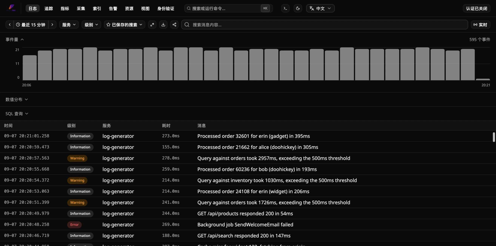

<!-- Translated (zh-CN) from README.md · source-sha256:c7ad91af7c50acda · hand-translated by Claude, not generated by scripts/translate-docs.py - edit the source file and retranslate if it changes, don't machine-retranslate over this. -->

<p align="center">
  
</p>

<!-- logo.png 被打包到两个 NuGet 包中 (Flare.Aspire/Flare.Hosting.Aspire csproj
     PackageIcon + 此 README 作为 PackageReadmeFile)，两者都位于包根目录 - 一个普通的
     相对“logo.png”引用在 GitHub（存储库根）和
     nuget.org-rendered README（包根目录）没有任何路径差异。 -->

# Flare.Net

[](https://github.com/aminparsa18/Flare.Net/actions/workflows/ci.yml)
[](https://github.com/aminparsa18/Flare.Net/actions/workflows/docker-publish.yml)
[](https://github.com/aminparsa18/Flare.Net/actions/workflows/docs-links.yml)
[](LICENSE)
[](https://www.nuget.org/packages/Flare.Hosting.Aspire)
[](https://www.nuget.org/packages/Flare.Cli)

**语言：** [English](README.md) &nbsp;|&nbsp; [简体中文](README.zh-CN.md) &nbsp;|&nbsp; [Русский](README.ru.md) &nbsp;|&nbsp; [Français](README.fr.md)

.NET 的自托管、OpenTelemetry 原生可观察性平台 — 将日志、跟踪和指标作为一等公民，在一个位置关联，并具有基于阈值/查询的警报规则，通知 Webhook/Slack、Telegram 或违规电子邮件。

**想想 Seq 或 Datadog — 但完全开源 (MIT)、自托管和 OTLP 直接安装，无需安装专有代理或 SDK。**

## OpenTelemetry 第一

您的申请 → **OTLP** → Flare。这就是整个摄取故事——没有专有的有线格式，没有代理守护进程。如果您已经使用 OpenTelemetry 进行检测，Flare 可以直接使用它。



## Flare 提供什么

| | |
|---|---|
| **日志** | 搜索、过滤、实时跟踪、结构化属性 |
| **追踪** | 具有日志/跟踪关联的分布式跟踪 |
| **指标** | 探索 OpenTelemetry 指标以及日志和跟踪 |
| **警报** | 使用 webhook、Slack、Telegram 和电子邮件的基于阈值/查询的规则 |
| **摄入** | OTLP 接收器和管道健康状况 |
| **索引** | ClickHouse 索引和查询/存储诊断 |
| **身份验证** | 本地帐户、Entra ID、Active Directory/LDAP、OIDC 和反向代理可信标头 |
| **视图** | 保存的搜索和可重复使用的视图 |

## 为什么是Flare？

- **OpenTelemetry-native** — 无专有摄取协议；直接发送标准 OTLP 遥测数据。
- **自托管** — 您的遥测数据保留在您的基础设施中。
- **专为 .NET** — 一流的 .NET/Aspire 集成，无需单独的代理生态系统。
- **一处遥测** — 日志、跟踪和指标是相关的，而不是被视为单独的产品。
- **简单部署** — 通过 Aspire、Docker Compose 或 Flare CLI 运行它。

## 入门

不同之处在于运行 Flare 本身的方式。选择一项：

- **已经在使用 .NET Aspire 了吗？**
  ```csharp
  // AppHost
  var flare = builder.AddFlare("flare");
  builder.AddProject<Projects.MyApi>("myapi").WithReference(flare).WaitForFlare(flare);
  ```
  `dotnet add package Flare.Hosting.Aspire` — Flare 作为资源加入您的 AppHost，因此它启动、停止并被其他资源发现，就像图表中其他所有内容一样。详细信息：[docs/how-to/run-with-aspire.md](docs/how-to/run-with-aspire.zh-CN.md)。

- **不使用 Aspire，想要它独立运行吗？**
  ```sh
  docker compose up
  ```
  在存储库根目录中，每个端口和凭据都有工作默认值（将 [.env.example](.env.example) 复制到 `.env` 以进行更改）。详细信息：[docs/how-to/run-standalone.md](docs/how-to/run-standalone.zh-CN.md)。

- **只是想评估一下 — 没有克隆仓库，也没有安装 .NET SDK？**
  ```sh
  curl -fsSL https://raw.githubusercontent.com/aminparsa18/Flare.Net/main/scripts/install.sh | bash
  ```
  如果缺少 Docker 会自动安装，然后从已发布的镜像拉取并启动相同的独立堆栈。详细信息：[docs/how-to/run-standalone.md](docs/how-to/run-standalone.zh-CN.md#零前提快速安装)。

- **想要在多个不相关的本地项目之间共享一个常设实例吗？**
  ```sh
  dotnet tool install --global Flare.Cli
  flare start
  ```
  全局 CLI，可以从任何地方管理相同的 Docker 堆栈，无需回购检查。详细信息：[docs/how-to/run-with-cli.md](docs/how-to/run-with-cli.zh-CN.md)。

无论您选择哪条路径，仪表板都会出现在 [http://localhost:7777](http://localhost:7777) 处。身份验证**默认关闭** - 日志页面在启动时即打开。准备好后，即可从 `/auth` 页面打开登录（本地帐户、Microsoft Entra ID、Active Directory、OpenID Connect 或反向代理可信标头）；参见[docs/how-to/configure-authentication.md](docs/how-to/configure-authentication.zh-CN.md)。

然后将记录器指向它 — 将 Serilog、NLog、ZLogger 和 `Microsoft.Extensions.Logging` 的 OTLP 片段复制粘贴到 [docs/how-to/run-standalone.md](docs/how-to/run-standalone.zh-CN.md#将记录器指向它)（或 Aspire 上的 [docs/how-to/run-with-aspire.md](docs/how-to/run-with-aspire.zh-CN.md#2-将记录器指向它)）中。对于其他情况 — Python、Node.js、Java、Go、Kubernetes、DevOps 流水线、日志转发工具或 Prometheus 抓取 — 仪表板自带的**数据源**页面（导航栏下拉菜单，或日志页面的空状态）有同类的复制粘贴片段；预览见[架构之旅](docs/explanation/architecture.zh-CN.md#数据源)。

单个 ClickHouse 节点的增长是否超出了限制？有一个选择加入的多节点集群设置 - 请参阅 [docs/how-to/run-cluster-mode.md](docs/how-to/run-cluster-mode.zh-CN.md)。

## 本地开发

独立的 Docker 不是开发内循环的故事 - 请参阅 [Flare.AppHost](src/Flare.AppHost) (.NET Aspire) 以及每个项目自己的自述文件（例如 [src/dashboard/README.md](src/dashboard/README.md)）以单独运行它。

## 当前状态

Flare正在积极开发中，目前提供：

- 日志
- 追踪
- 指标
- 警报
- OTLP 摄入
- 管道健康
- 索引诊断
- 保存的搜索
- 身份验证
- Aspire 集成
- Docker部署
- Flare CLI

### 接下来

见[docs-internal/planning/roadmap.md](docs-internal/planning/roadmap.md)
当前开放的内容 — 保留/冷存储至 S3 兼容
对象存储就是其中的佼佼者。

完整架构：[docs/explanation/architecture.md](docs/explanation/architecture.zh-CN.md)。设计决策：[docs-internal/adr/](docs-internal/adr/)。

## 贡献

参见 [CONTRIBUTING.md](CONTRIBUTING.md)。

## 许可证

[MIT](LICENSE)
