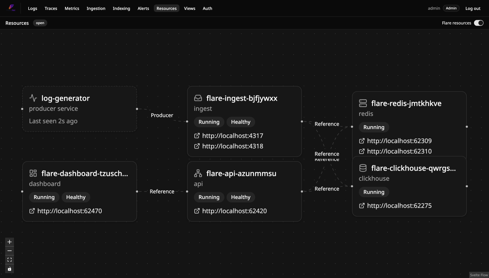

# Using Flare from your own .NET Aspire app

If your own app is already orchestrated with .NET Aspire, `Flare.Hosting.Aspire`
(`src/Aspire.Hosting.Flare` - package ID `Flare.Hosting.Aspire`, not `Aspire.Hosting.Flare`;
that prefix is reserved on nuget.org for Microsoft's own official integrations) adds the
whole Flare stack — ClickHouse, Redis, the OTLP ingest receiver, the query API, and the
dashboard — to your AppHost with one call, pulling Flare's published Docker Hub images
rather than anything you build yourself.

> **Status:** published on nuget.org as `Flare.Hosting.Aspire` (currently `0.3.1`) —
> `dotnet add package Flare.Hosting.Aspire` works today. See
> [`examples/`](../examples) for a full runnable demo, which references the package
> as a `ProjectReference` instead (useful for trying Flare's `main` before a release).

## 1. Add Flare to your AppHost

```csharp
var builder = DistributedApplication.CreateBuilder(args);

var flare = builder.AddFlare("flare");

builder.Build().Run();
```

That's it — no `docker compose up`, no separate services to run. `AddFlare` mirrors
Flare's own `Flare.AppHost/Program.cs` resource graph: ClickHouse (with the same
`db/clickhouse/*.sql` schema, embedded in the package and materialized to a temp
directory so your repo doesn't need a copy of it), Redis (the same durable batched-
insert buffer), and the three `xracer007/flare-ingest`/`flare-api`/`flare-dashboard`
containers.

### Parameters

```csharp
IResourceBuilder<FlareResource> AddFlare(
    this IDistributedApplicationBuilder builder,
    string name = "flare",
    string imageTag = "0.2.0",
    int? ingestGrpcPort = null,
    int? ingestHttpPort = null,
    int? apiPort = null,
    int? dashboardPort = null,
    string? ingestImage = null,
    string? apiImage = null,
    string? dashboardImage = null,
    IResourceBuilder<ParameterResource>? apiKey = null,
    bool enableResourceGraph = false,
    IResourceBuilder<ParameterResource>? publicApiUrl = null,
    IResourceBuilder<ParameterResource>? publicDashboardUrl = null)
```

- **`name`** — the Flare resource group's name in the Aspire dashboard.
- **`imageTag`** — defaults to the latest stable Flare release this package version was
  tested against (currently `"0.2.0"`), pulled from Docker Hub's immutable `v*.*.*`
  tags (`.github/workflows/docker-publish.yml` in Flare's own repo). Deliberately not
  the floating `latest`/`edge` tags, so a given `Flare.Hosting.Aspire` NuGet version
  keeps pulling the same images forever — this default only moves forward when a new
  `Flare.Hosting.Aspire` release bumps it, not automatically. Pass `imageTag: "edge"`
  yourself to track Flare's unreleased `main` branch instead (what
  [`examples/`](../examples) does, since it runs against local, unreleased source).
- **`ingestGrpcPort` / `ingestHttpPort`** — override the OTLP receiver's host ports.
  Left unset, these default to the conventional `4317`/`4318`. They're always
  unproxied, so external OTLP clients (your own app's logger) can point at them
  directly — the same fixed-port story as `docker-compose.yml`.
- **`apiPort` / `dashboardPort`** — override the query API / dashboard host ports.
  Normal proxied Aspire HTTP endpoints, left unset if you don't care what port you get.
- **`ingestImage` / `apiImage` / `dashboardImage`** — override an image name/registry
  (not tag — `imageTag` still supplies that) for local-dev use against images built
  with `docker compose build` instead of Docker Hub.
- **`apiKey`** — optional `secret: true` `AddParameter` result requiring OTLP callers
  to present an ingest API key. Left unset (the default), ingest stays anonymous.
  There's no automatic flow-through to consumers: a project calling
  `AddFlareOtlpExporter` still needs the same raw value passed to its own
  `configureSettings: s => s.ApiKey = ...` delegate, or its OTLP calls get rejected
  once this is set.
- **`enableResourceGraph`** — turns on the dashboard's Resources page for this Flare
  instance. Off by default — see
  [Resources page (optional Docker access)](#resources-page-optional-docker-access)
  below.
- **`publicApiUrl` / `publicDashboardUrl`** — override the `localhost`-pinned
  browser-facing URLs (`PUBLIC_API_URL`/`ORIGIN`/`Cors__AllowedOrigins__0`). Left
  unset (the default), `aspire run` behavior is unchanged. Only needed once actually
  publishing/deploying — see
  [Publishing / deploying via `aspire publish`](#publishing--deploying-via-aspire-publish)
  below.

## 2. Point your logger at it

The recommended way is `Flare.Aspire` (`builder.AddFlareOtlpExporter("flare")`), a
client-side package that reads the connection info `.WithReference(flare)` injects and
registers named OTLP log, trace, and metrics exporters pointed at it — additive
alongside whatever OpenTelemetry setup your project already has (e.g. the Aspire
dashboard collector via `AddServiceDefaults()`/`UseOtlpExporter()`), not a replacement
for it:

```csharp
// AppHost
var flare = builder.AddFlare("flare");

builder.AddProject<Projects.MyApp_Web>("web")
    .WithReference(flare) // injects ConnectionStrings__flare -> Flare.Ingest's OTLP/gRPC endpoint
    .WaitForFlare(flare);
```

```csharp
// MyApp.Web
builder.AddFlareOtlpExporter("flare");
```

```sh
dotnet add package Flare.Aspire
```

`AddFlareOtlpExporter` requires `Flare.ServiceDefaults.ConfigureOpenTelemetry()` (or
whatever else you layer it on) to use the signal-specific `AddOtlpExporter` family, not
the cross-cutting `UseOtlpExporter()` — the OTel SDK throws at startup if both land in
the same `IServiceCollection`.

### Without the `Flare.Aspire` package

`FlareResource` also exposes its OTLP endpoint as a plain environment variable via
`WithOtlpEndpoint(flare)`, if you'd rather wire your project's own `OpenTelemetry` SDK
call directly instead of taking the `Flare.Aspire` dependency:

```csharp
var flare = builder.AddFlare("flare");

builder.AddProject<Projects.MyApp_Web>("web")
    .WithOtlpEndpoint(flare) // OTEL_EXPORTER_OTLP_ENDPOINT -> Flare.Ingest's OTLP/gRPC endpoint
    .WaitForFlare(flare);
```

Pass `useHttp: true` for the OTLP/HTTP endpoint (`:4318`) instead of gRPC.

See [`docs/standalone.md`](standalone.md#point-your-logger-at-it) for the same
copy-paste snippet per logger (Serilog, NLog, ZLogger, `Microsoft.Extensions.Logging`)
if your project isn't wired through Aspire's own `AddServiceDefaults()` pattern at all —
just set `OTEL_EXPORTER_OTLP_ENDPOINT` from `WithOtlpEndpoint` above instead of a
hardcoded `http://localhost:4317`.

## Resources page (optional Docker access)

The dashboard's **Resources** page shows Flare's own containers as a live graph —
state, health, URLs, and the relationships between them — sourced from the Docker
Engine API, not from Aspire's own resource service (Aspire's resource-service gRPC API
only ever describes an AppHost's *own* process — nothing your AppHost consumers would
ever see once Flare is packaged as containers, which is why this page exists as a
separate Docker-backed feature at all). It's off by default:



```csharp
var flare = builder.AddFlare("flare", enableResourceGraph: true);
```

Passing `enableResourceGraph: true` adds one more sidecar container —
[`tecnativa/docker-socket-proxy`](https://github.com/Tecnativa/docker-socket-proxy),
the same image and scoping `docker-compose.yml`'s standalone mode uses (see
[`docs/standalone.md`](standalone.md#resources-page-optional-docker-access) for the
full security rationale) — with `/var/run/docker.sock` bind-mounted **read-only** into
it, configured with `CONTAINERS=1` and `POST=0` so it only ever answers container
list/inspect calls (no exec, no start/stop, no image/volume/network management), and
points `flare-api`'s `DockerResources__ProxyUrl` at it. `flare-api` itself never mounts
or touches the real Docker socket — only this proxy's scoped endpoint.

Leave it unset (the default) and no proxy container is added at all — `flare-api` never
gains any form of Docker access, and the Resources page shows a clean "not enabled"
state instead of an error.

This is specifically the `aspire run`/local-dev-loop story, always backed by real Docker
containers regardless of what deployment-target resources happen to be registered. Once
you actually publish/deploy to a Kubernetes target, `enableResourceGraph` wires up a
different, Kubernetes-native provider instead — see the
[Kubernetes](#kubernetes) section below.

## Installing

```sh
dotnet add package Flare.Hosting.Aspire
```

Published on nuget.org (currently `0.2.0`). To build against Flare's `main` instead of
a release, reference the project directly the way
[`examples/ExampleApp.AppHost`](../examples/ExampleApp.AppHost) does:

```xml
<ProjectReference Include="path\to\Flare.Net\src\Aspire.Hosting.Flare\Aspire.Hosting.Flare.csproj"
                  IsAspireProjectResource="false" />
```

`IsAspireProjectResource="false"` tells Aspire's tooling this is a plain class-library
reference, not a project resource to orchestrate.

## If Aspire's own dashboard shows an SSL/certificate error

You may see `RemoteCertificateNameMismatch` errors in the AppHost console, and the
**Aspire orchestration dashboard** (the Resources/Console/Traces UI at the AppHost's
own dashboard URL) fail to load its resource list. This is an
[upstream Aspire 13.4.6 bug](https://aspire.dev/app-host/certificate-configuration/),
not caused by `Flare.Hosting.Aspire` or anything in your AppHost: an internal Aspire
component (`Aspire.Hosting.Dashboard.ServiceClient.DashboardClient`) connects to its
own resource service over the loopback IP literal `127.0.0.1`, but the ASP.NET Core
dev certificate only carries DNS-name SANs (`localhost`, `*.dev.internal`, etc.) — no
IP SAN — so strict TLS hostname validation rejects it. Confirmed reproducible with a
clean `bin`/`obj`, cleared Aspire cache, and no background processes; the documented
`ASPIRE_DCP_USE_DEVELOPER_CERTIFICATE=false` opt-out does not fix it on every machine
(it broke DCP startup entirely when tried here) — check current Aspire GitHub issues
before trying it yourself.

**This does not affect Flare.** Flare's own dashboard - the actual product, at
`flare-dashboard`'s URL - is a separate app (SvelteKit talking to `flare-api` over
plain HTTP, no gRPC/TLS involved) and works independently of this bug. If you hit
this, use `aspire ps` / `aspire describe` / `aspire logs` for orchestration visibility
instead of the broken dashboard UI, and open Flare's own dashboard directly.

## Publishing / deploying via `aspire publish`

`Flare.Hosting.Aspire` doesn't add a deployment target itself — a consuming
AppHost opts in the same way any other Aspire app does, by adding a
deployment environment resource. Docker Compose and Kubernetes are both
verified as of `0.2.3`; Azure/AWS targets are unverified.

### Docker Compose

```csharp
var builder = DistributedApplication.CreateBuilder(args);

builder.AddDockerComposeEnvironment("env");

var flare = builder.AddFlare("flare");
// ...
builder.Build().Run();
```

This has no effect on the normal `aspire run`/`dotnet run` inner loop —
`AddDockerComposeEnvironment` only matters once you actually run
`aspire publish`, `aspire do prepare-compose`, or `aspire deploy`, which
generate a `docker-compose.yaml` (plus `.env`/`.env.{environment}` files) for
the whole AppHost, Flare included. See
[aspire.dev/deployment](https://aspire.dev/deployment/) and
[aspire.dev/deployment/docker-compose](https://aspire.dev/deployment/docker-compose/)
for the full publish/deploy workflow. `examples/ExampleApp.AppHost` wires this
in as a worked example.

Two things to know before deploying (not `aspire run`) a consumer app that
brings up Flare this way:

- **`publicApiUrl`/`publicDashboardUrl`.** `aspire run` assumes the browser
  viewing the dashboard is on the same machine as the stack itself, and
  points `PUBLIC_API_URL`/`ORIGIN`/`Cors__AllowedOrigins__0` at `localhost`
  accordingly. That stops being true once actually deployed — the browser
  reaches the stack by a real hostname/IP. Pass `AddFlare`'s
  `publicApiUrl`/`publicDashboardUrl` parameters (left unset, so Aspire
  captures them as `.env.{environment}` placeholders you fill in with the
  real deployed URLs per environment, the same way `AddFlare`'s `apiKey`
  parameter already works) to override this — see their doc comments on
  `AddFlare`. Leaving them unset for `aspire run` needs no change.
- **ClickHouse init now builds a small custom image.** The
  `db/clickhouse/*.sql` init scripts used to be bind-mounted from a temp
  directory this package's own process extracted them to at `aspire run`
  time — that path only exists on whatever machine ran `aspire publish`, not
  on the actual Docker Compose deploy target, so it's now baked into a
  generated image (`FROM` whatever image `AddClickHouse` itself resolves to,
  plus the init scripts `COPY`-ed in) instead. This means local `aspire
  run`/`aspire start` now needs `docker build` capability too, not just
  pull/run — typically already true wherever Docker itself is already
  required.
- **`enableResourceGraph`'s docker-socket-proxy still needs a real Docker
  host.** Its `/var/run/docker.sock` bind mount requires the machine
  actually running `docker compose up` to be a Docker host with that socket
  present — same requirement `aspire run`/local dev already has, just now
  also true of wherever the deployment target ends up.

### Kubernetes

Same `AddFlare` call, just registering
[`AddKubernetesEnvironment`](https://aspire.dev/integrations/compute/kubernetes/)
(from the `Aspire.Hosting.Kubernetes` package — add it to *your own* AppHost,
not `Flare.Hosting.Aspire` itself, which stays deployment-target-agnostic)
instead of `AddDockerComposeEnvironment`:

```csharp
var builder = DistributedApplication.CreateBuilder(args);

var registry = builder.AddContainerRegistry("registry", "your-registry.example.com:5000");
builder.AddKubernetesEnvironment("k8s").WithContainerRegistry(registry);

var flare = builder.AddFlare("flare");
// ...
builder.Build().Run();
```

`aspire publish -o k8s-artifacts` generates a full Helm chart (`Chart.yaml`,
`values.yaml`, `templates/`) for the whole AppHost, Flare included; `aspire
deploy` installs it against your current `kubectl` context. Existing/external
clusters only for now — Azure Kubernetes Service (AKS,
`AddAzureKubernetesEnvironment`) is untested. See
[aspire.dev/deployment/kubernetes](https://aspire.dev/deployment/kubernetes/clusters/)
for the full workflow.

**Verified live end-to-end as of `0.2.3`** (2026-08-29): a local
[k3s](https://aspire.dev/integrations/compute/k3s/) cluster running in Docker,
a local insecure registry mirror for the ClickHouse-init image, `aspire
deploy` against it — the full stack (ClickHouse and Redis `StatefulSet`s
included) reached `Running 1/1`, ClickHouse ran its init SQL, ingest/api
connected to Redis and started listening, and `flare-api`'s `/health`
returned `200` through a real Kubernetes `Service`. Not just artifact
generation this time — an actual `helm upgrade --install --wait` against a
live cluster.

Things to know before deploying to Kubernetes:

- **Before `0.2.3`, this could never work at all, for any consumer using the
  standard Aspire AppHost naming convention.** Aspire's Kubernetes publisher
  builds `WithDataVolume()`'s *default* volume name from the AppHost
  project's own name without sanitizing it for Kubernetes' DNS-1123 naming
  rules — a `.AppHost`-suffixed project name (the standard template
  convention; `examples/ExampleApp.AppHost` and this repo's own
  `Flare.AppHost` both use it) produces a volume name containing a dot,
  which Kubernetes rejects outright (`must not contain dots`). ClickHouse's
  and Redis's `StatefulSet`s could never create a pod — confirmed live, this
  failed every time until fixed. `AddFlare` now passes an explicit,
  dot-free name to both (`{name}-clickhouse-data`/`{name}-redis-data`),
  the same pattern the identity volume already used. Nothing to do on the
  consumer side — this was purely an `Aspire.Hosting.Flare` bug.
- **A container registry is required, but only because of the ClickHouse-init
  image.** A vanilla Kubernetes cluster has no local-build-and-run path the
  way `docker compose build`/`up` does — any *locally-built* image has to be
  pushed somewhere the cluster can pull it from. Confirmed live
  (`aspire publish` against a Kubernetes target): `flare-ingest`/`flare-api`/
  `flare-dashboard` need no registry at all (they're Flare's own pre-published
  Docker Hub images, referenced directly); only the generated ClickHouse-init
  image (see `WriteClickHouseInitDockerContext`) shows up in `values.yaml` as
  a registry-relative placeholder (`flare_clickhouse_image`) that `aspire
  deploy` builds and pushes to the registry you configure via
  `AddContainerRegistry`/`WithContainerRegistry`. The container registry APIs
  are still preview in Aspire itself (`ASPIRECOMPUTE003`).
- **ClickHouse/Redis/identity data does NOT survive a pod restart by
  default.** Confirmed live: `AddFlare`'s `WithDataVolume()`/`WithVolume()`
  calls render as plain `emptyDir: {}` volumes in the generated
  `StatefulSet`/`Deployment` specs, not `PersistentVolumeClaim`s, unless the
  consumer explicitly binds a real
  [`AddPersistentVolume`](https://aspire.dev/deployment/kubernetes/persistent-volumes/)
  resource to the matching volume name (`{name}-clickhouse-data`,
  `{name}-redis-data`, `{name}-identity-data`) themselves — `AddFlare` has no
  way to do this on the consumer's behalf without deciding a storage
  class/capacity/access-mode policy for them, which isn't this package's call
  to make (it does now take a real `Aspire.Hosting.Kubernetes` package
  dependency as of `0.3.0`, for `PublishAsKubernetesService` - see the
  Resources-page bullet below - but that's a different thing from
  provisioning storage on a consumer's behalf). For anything beyond a
  disposable smoke-test deploy, wire persistent volumes for these three
  before deploying for real — silently losing all logs and the identity/auth
  database on the next pod reschedule is the actual failure mode, not an
  error.
- **`publicApiUrl`/`publicDashboardUrl` are just as required as they are for
  Docker Compose** (see above) — left unset, the dashboard's
  `PUBLIC_API_URL`/`ORIGIN`/`api`'s `Cors__AllowedOrigins__0` resolve to
  Kubernetes' own in-cluster Service DNS names (confirmed live, e.g.
  `http://flare-api-service:8080`), unreachable from an external browser.
  Pass real deployed URLs the same way as the Compose case.
- **`ImagePullPolicy.Always`** (set on the ingest/api/dashboard images to
  combat the mutable `"edge"` tag going stale — see `AddFlare`'s `imageTag`
  doc comment) did not show up as `imagePullPolicy: Always` in the generated
  manifests during this verification (`IfNotPresent` throughout) - not yet
  root-caused whether that's an Aspire Kubernetes-publisher gap or something
  else. Only matters if you're running `imageTag: "edge"` against a
  Kubernetes target in the first place, which a real deployment normally
  wouldn't (the pinned stable default tag is immutable, so staleness isn't a
  concern there).
- **The Resources page's topology graph works on Kubernetes too, as of
  `0.3.0`** — a real, separate provider from the Docker one described in
  [Resources page (optional Docker access)](#resources-page-optional-docker-access)
  above, not the same Docker-socket-proxy sidecar reused (there's no
  `/var/run/docker.sock` equivalent inside a Kubernetes pod, so that was never
  going to be possible - see `docs/prompts/docker-resources-graph-prompt.md`
  for the original design notes this superseded). `enableResourceGraph: true`
  on a Kubernetes target instead attaches a namespace-scoped, read-only RBAC
  `ServiceAccount`/`Role`/`RoleBinding` (`get`/`list`/`watch` on `pods` and
  `services` only - no `deployments`/`replicasets` permission at all) to
  `api`'s Deployment, and sets `api`'s `KubernetesResources__Enabled=true`.
  `flare-api`'s `KubernetesResourcePoller` then lists Flare-labeled Pods
  (`flare.role`, stamped onto the Deployment's/StatefulSet's pod-template
  labels - the Kubernetes counterpart to the Docker container labels) plus
  every Service in the namespace, and renders a **hierarchical** graph —
  Namespace → synthesized "Deployment" groups (grouped by `flare.role` label,
  not a live read of the real Deployments API - a deliberate RBAC-minimizing
  trade-off, so a Deployment node's replica count/rollout status isn't real
  data) → Pod, plus Service nodes with `Selects` edges into the Pods they
  actually route to - genuinely richer than the Docker provider's flat
  container graph. Off by default, same "absent config = off" story as
  Docker's own opt-in.

  **Verified live end-to-end as of `0.3.1`** (2026-08-30, this feature's own
  live e2e pass against the same local k3s cluster used for the Kubernetes
  publish verification above): `enableResourceGraph: true`, real RBAC
  applied, a real `KubernetesResourcePoller` running inside a locally-built
  `flare-api` image (the published `xracer007/flare-api:edge` tag lagged
  behind these fixes at verification time) correctly listed all five
  Flare-labeled Pods plus their five Services, and `GET /api/resources/snapshot`
  returned the complete real graph - 16 nodes (1 Namespace, 5 synthesized
  Deployment groups, 5 Pods, 5 Services), all 5 `Selects` edges, and all 5
  `Reference` edges from `flare.relationships`. Three real bugs were found
  and fixed along the way, none of which the unit tests alone could have
  caught (all three are specifically about what Aspire's Kubernetes publisher
  and a real API server do with the generated objects, not about this
  package's own mapping logic):
  1. **A Kubernetes label VALUE has a strict charset** (roughly
     alphanumeric/`-`/`_`/`.` only) that a
     `"clickhouse:Reference,redis:Reference"`-shaped `flare.relationships`
     value violates outright - `helm upgrade --install` rejected the whole
     Deployment as invalid. Docker labels have no such restriction, so this
     never surfaced there. **Fixed**: `flare.relationships` goes onto
     pod-template *annotations* instead of labels on the Kubernetes side
     only (annotations have no charset restriction, and this value was never
     selected on anyway).
  2. **The generated RBAC `ServiceAccount`/`Role`/`RoleBinding` all shared
     the same `Metadata.Name`, and Aspire's per-object Helm-chart-template-file
     naming keys purely off that name, not name+kind** - each
     `AdditionalResources.Add` call silently overwrote the previous one's
     template file, so only the last one added (`RoleBinding`) actually made
     it into the chart. `flare-api`'s own `ReplicaSet` couldn't create pods
     at all ("serviceaccount ... not found"). **Fixed**: each of the three
     now gets a distinct name.
  3. **ClickHouse/Redis got zero `flare.*` labels at all under Kubernetes,
     making them invisible to the topology graph entirely** - their
     `WithDataVolume()` calls promote them to a `StatefulSet` (see the
     persistent-volumes bullet above), which the original
     `resource.Workload is Deployment` pattern match silently skipped.
     **Fixed**: reads the common `Workload.PodTemplate` instead, covering
     both `Deployment` and `StatefulSet`.

  No bugs found in the `aspire run`-safety `IsPublishMode` check or the
  `RoleBinding` subject's `{{ .Release.Namespace }}` Helm templating - both
  confirmed working exactly as designed.

