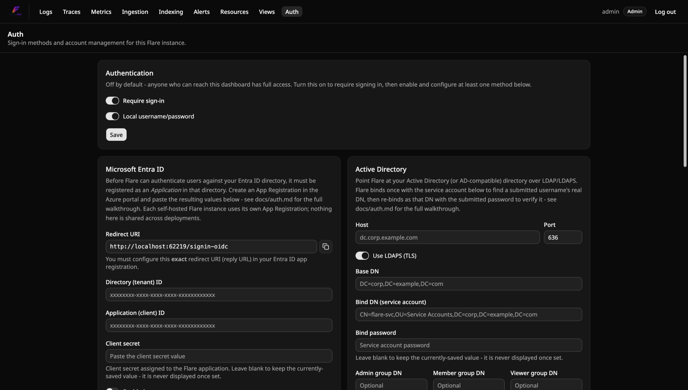

# Auth + multi-user / roles

Flare ships with local username/password accounts, Microsoft Entra ID (SSO), Active
Directory (LDAP), generic OpenID Connect, and reverse-proxy (trusted header) sign-in,
plus three fixed roles. This is **multi-user RBAC on one
shared self-hosted instance** — everyone logged into a given Flare deployment sees the
same logs/traces/metrics/alert rules/saved views, just with different permission levels.
It is **not** multi-tenant SaaS isolation: there's no per-user data ownership anywhere,
and `alert_rules`/`saved_views` stay exactly as global/shared as they always were.

## Authentication is off by default

A fresh Flare instance has **no login requirement at all** — anyone who can reach the
dashboard sees the Logs page immediately, with full access. There's no forced `/setup`
step blocking you before you can look at anything. This is a deliberate default for a
self-hosted, often-single-user or internal-network tool: requiring an account before
you've even decided you want one is friction nobody asked for.

Turning authentication on is a single switch, in the dashboard, on one consolidated
**`/auth`** page (see "The `/auth` page" below) — no separate `/setup`/`/security`/
`/users` pages. Flipping "Require sign-in" on reveals the five method sections
(Local / Microsoft Entra ID / Active Directory / OpenID Connect / Reverse proxy), each
with its own enable toggle and inline configuration, plus a Users table underneath for
managing accounts once any method is enabled.

**Upgrading an existing deployment stays protected.** The opt-in default only applies to
a genuinely *fresh* database with zero users in it. If you're upgrading a Flare instance
that already has accounts, the migration that introduces this switch seeds it as
`Enabled = true` for you — auth stays required exactly as it already was; nothing opens
up silently on upgrade.

### How this is enforced

A single global flag, `AuthSettings.Enabled`, is read by
`ConditionalAuthorizationMiddlewareResultHandler` (`Flare.Api/Auth/`) — a thin wrapper
around ASP.NET Core's own `AuthorizationMiddlewareResultHandler`. When the flag is
`false`, it short-circuits *every* authorization check in the app (all of
`RequireAuthorization()`/`RequireMember`/`RequireAdmin` across every endpoint group) to
succeed unconditionally. When `true`, it delegates to the framework's default handler
exactly as before. This is the one choke point that makes "off by default" possible
without touching any of the individual endpoint files.

Within that, **Local sign-in has its own enable flag** (`LocalEnabled`), independent of
the four method-specific ones described below — so all five methods (Local / Entra /
Active Directory / OpenID Connect / Reverse proxy) are turned on and configured the
same, symmetrical way. An org fully migrated to SSO can eventually turn local password
login off entirely, same as any other method.

**Methods coexist, not exclusive.** Local, Entra ID, Active Directory, OpenID Connect,
and reverse-proxy auth can all be enabled at once. This is a deliberate choice, not an
accident of implementation: an exclusive single-method design risks a real lockout — if
an Entra/AD/OIDC/proxy group→role mapping is misconfigured and nobody ends up `Admin`,
there's no way in — while coexistence keeps a local "break-glass" Admin path available
even when SSO/AD/proxy is the day-to-day method.

## The `/auth` page

Everything auth-related lives on one Admin-only page (reachable to anyone while
authentication is off, same as every other page):

1. **Authentication** — the umbrella "Require sign-in" switch and the `Local
   username/password` toggle sit together at the top. Off → an explanatory blurb, and
   everything below is inert. On → the four method sections below become the live
   configuration surface.
2. **Microsoft Entra ID**, **Active Directory**, **OpenID Connect**, and **Reverse
   proxy** — each section's own enable toggle plus inline configuration form (see their
   dedicated sections below). Settings save independently per section.
3. **Users** — every account (Local, Entra, Active Directory, OpenID Connect, and
   reverse-proxy alike), with role and enable/disable controls, shown once any method is
   on. This is the same table that used to live at a separate `/users` route — it's just
   folded into this page now.

`/setup`, `/security`, and `/users` no longer exist as separate routes; `/auth` replaces
all three.

## First run

The **first** Local account you create — from the "Local" section on `/auth` once you've
turned authentication on — is always `Admin`, whether that happens on a brand-new
instance or one that's had auth on from the start. There's no separate "setup mode"
beyond that: once at least one Local account exists, sign-in works the normal way.

## Roles

| Role | Can do |
|---|---|
| `Viewer` | Read logs, traces, metrics, saved views, ingestion/pipeline/indexing status. |
| `Member` | Everything `Viewer` can, plus create/edit/delete/test-fire alert rules. |
| `Admin` | Everything `Member` can, plus manage users and ingest API keys. |

Roles are a fixed three-value enum, not a custom/configurable permission system — see
[`Flare.Identity.Users.UserRole`](../src/Flare.Identity/Users/UserRole.cs).

## How sessions work

Logging in sets an httpOnly session cookie (`flare_session` by default) — not a JWT.
The cookie's value is an opaque, server-side-tracked token; deleting the corresponding
row (logout, or an admin disabling the account) revokes it immediately, which a
self-contained JWT can't do without a denylist. This also means the live-tail
WebSocket "just works" once you're logged in: the browser sends the same cookie on the
WebSocket upgrade request as any other same-site request, no separate token needed.

Sessions default to a 14-day fixed expiry (`Auth:SessionLifetime`), no sliding window.

## Where accounts live

Users, sessions, ingest API keys, and all auth settings (the global switch, Entra config,
LDAP config, OpenID Connect config, reverse-proxy config) are stored in an **embedded
SQLite file** — not a separate database
container. This was a deliberate choice: Flare already runs ClickHouse (log storage) and
Redis (the ingest buffer) as backing services, and adding a third database container for
what's a handful of small, low-write tables wasn't worth the extra resource footprint.
Seq (a similar self-hosted, single-binary tool) is the reference point — it keeps its own
config/identity out of a separate database server too.

**Trade-off, stated plainly:** this means `Flare.Api` can only run as a single replica.
SQLite doesn't support multiple processes writing to the same file across a network
filesystem safely, and Flare's SQLite file lives on a local volume (`identity-data` in
`docker-compose.yml`, `.data/identity/` for local Aspire dev), not something horizontally
scaled replicas could safely share. This is a real constraint if the (currently
unscheduled) Kubernetes/Helm roadmap item ever lands and you want to run more than one
`Flare.Api` pod. If that day comes, migrating the tables here (`Users`/`Sessions`/
`IngestApiKeys`/`AuthSettings`/`EntraSettings`/`LdapSettings`/`OidcSettings`/
`ProxyAuthSettings`/`schema_migrations`) to Postgres is a contained, mechanical
follow-up — not a rewrite of anything in this document.

`Flare.Ingest` shares the same SQLite file (read-mostly, just checking ingest API key
hashes) — both processes point at it via `Identity__DbPath`.

## Ingest API keys

Separate from user accounts on purpose: an ingest API key authenticates a *machine* (an
app's OTLP exporter), not a *person*. Tying it to a `Users` row would force every
telemetry-emitting app to be linked to someone's login, which doesn't match how
collectors/exporters are actually operated (one or a few shared keys per environment).

- **Creating a key:** `Admin` only, via `POST /api/ingest-keys` (name it something like
  `"prod-collector"`). The raw key is shown **exactly once**, in that response — Flare
  never stores or displays it again, only its hash. Copy it somewhere safe immediately.
- **Using a key:** send `Authorization: Bearer <key>` on your OTLP exporter (gRPC or
  HTTP — both are checked the same way).
- **Revoking a key:** `DELETE /api/ingest-keys/{id}`. Takes effect within 30 seconds —
  `Flare.Ingest` caches the active-key set in memory and refreshes it on a timer rather
  than hitting SQLite on every ingest request, so a revoked key isn't rejected
  *instantly*, just quickly.
- **Enforcement is opt-in:** `Auth:IngestKeyRequired` defaults to `false`, so upgrading
  an existing deployment doesn't suddenly reject every logger pointed at it. Create at
  least one key, update your exporters to send it, *then* flip
  `Auth:IngestKeyRequired=true` once you're ready to stop accepting anonymous ingest.
  This flag is independent of the dashboard's own "Require sign-in" switch above —
  ingest enforcement and dashboard/API-user auth are two separate gates.
- **A second, config-driven mechanism exists for automation:** `Auth:StaticIngestApiKey`
  is a fixed key set via configuration instead of the dashboard, valid alongside (not
  instead of) any keys created through the UI. This is what `Flare.AppHost` (local dev)
  and `Aspire.Hosting.Flare`'s `AddFlare(..., apiKey: ...)` use — "create a key by
  clicking a button in the dashboard" doesn't fit an automated resource-graph-wiring use
  case, where the AppHost itself needs to hand the same value to both `Flare.Ingest` (to
  accept it) and your app's own OTLP exporter (to send it), before either process has
  even started.

## Microsoft Entra ID (SSO)

Local username/password, Entra ID, and Active Directory all coexist — no deployment is
forced to choose. Authentication is wired through ASP.NET Core's standard multi-scheme
`AddAuthentication()` model: the cookie scheme
(`Flare.Identity.Auth.SessionAuthenticationHandler`, registered as `FlareSession`) stays
the *only* scheme any endpoint's `RequireAuthorization()` ever actually resolves a
principal through. Entra ID is a second, separate front door that ends in exactly the
same kind of session — `RequireMember`/`RequireAdmin` and every existing endpoint needed
zero changes to support it.

**Single-tenant only.** Flare validates against one specific Entra directory, not
`common`/`organizations` — letting any Entra org's users reach a self-hosted internal
tool's login is the wrong default.

**Configured per-instance, through the dashboard — not config files.** Each self-hosted
Flare operator creates their own Entra App Registration (see "App Registration setup"
below) and pastes the resulting Tenant ID/Client ID/client secret into the Admin-only
**`/auth`** page's Microsoft Entra ID section, the same way Seq's own Security settings
page works. There's no `Auth:Entra:TenantId`/`ClientId`/`ClientSecret` in
config/`.env`/docker-compose to set — the database is the only place these live.
Settings changes take effect after restarting `Flare.Api` (`docker compose restart api`,
or an `aspire resource restart` in local dev) — not live, by design; see
`EntraOpenIdConnectOptionsConfigurator`'s remarks in `Flare.Api/Auth/` for why that's a
deliberate simplicity/risk trade-off, not a limitation anyone's expected to work around.

### How it works

1. The dashboard's "Sign in with Microsoft" button (shown only when
   `GET /api/auth/bootstrap/status` reports `entraEnabled: true`) navigates the browser
   to `GET /api/auth/entra/login`, which challenges the `Entra` OpenIdConnect scheme.
2. You sign in at Microsoft's own page. Entra redirects back to `/signin-oidc` (the OIDC
   handler's default callback path, handled by framework middleware), which validates
   the token and hands off to `GET /api/auth/entra/complete`.
3. `complete` looks up the account by the token's `oid` claim
   (`Users.AuthProvider = 'Entra'`, `Users.ExternalId = <oid>`). **First-ever login for
   that identity** creates the row — see "Role provisioning" below for how its role is
   picked. **Every login after that** just signs in as the existing row, role unchanged.
4. A normal `flare_session` cookie is minted — same mechanism, same cookie, same
   14-day-fixed-expiry behavior as a password login. From here on an Entra-provisioned
   session is indistinguishable from a local one to every other endpoint in the app.

### Role provisioning

Entra ID **App Roles** are the role source, matched by name against Flare's own
`Admin`/`Member`/`Viewer` enum:

1. In the Entra App Registration's manifest, add three `appRoles` entries with
   `"value"` set to exactly `Admin`, `Member`, and `Viewer` (case-insensitive match, but
   keep them exact) and `"allowedMemberTypes": ["User"]`.
2. In **Enterprise applications → your app → Users and groups**, assign each person (or
   group) the one App Role that should become their Flare role.
3. On that person's **first** sign-in, Flare reads the token's `roles` claim and picks
   the highest-privilege match (`Admin` > `Member` > `Viewer`). No App Role assigned (or
   App Roles not configured on the registration at all) provisions
   `Auth:Entra:DefaultRole` instead (still config-bound, unlike the four values above —
   the `/auth` page doesn't configure a role-mapping fallback either) — `Viewer`
   unless you've overridden it.
4. **Role changes after that live in Flare, not Entra.** Continuously re-reading the
   `roles` claim on every login would make the Users table's own role control
   meaningless for SSO accounts — see "Managing users" below to promote/demote an
   Entra-provisioned account exactly like a local one.

A disabled account (any provider) can't sign in — an Entra sign-in for a disabled
account bounces back to `/login?error=account-disabled` instead of getting a session.

### App Registration setup (Azure Portal)

1. **Entra ID → App registrations → New registration.** Single tenant
   ("Accounts in this organizational directory only").
2. **Redirect URI**: platform "Web". No chicken-and-egg problem here — sign in to Flare
   with your existing local username/password Admin account (see "First run" above) and
   open `/auth`; it displays the *exact* redirect URI to paste here, computed from
   whatever host/port you're actually reaching Flare.Api on, so you don't have to work it
   out by hand. For a local `docker compose up` this is
   `http://localhost:8080/signin-oidc` by default; use `https://` once this is reachable
   beyond your own machine, see the caveat below.
3. **Certificates & secrets → New client secret.** Copy the value immediately — like an
   ingest API key's raw value, Azure only shows it once.
4. **App roles** (see "Role provisioning" above) and, if you want anyone to actually be
   assigned one, **Enterprise applications → your app → Users and groups**.
5. Note the **Application (client) ID** and **Directory (tenant) ID** from the
   registration's Overview page.
6. Back in Flare's `/auth` page, Microsoft Entra ID section: paste the Directory (tenant)
   ID, Application (client) ID, and client secret, flip **Enabled** on, and Save. Restart
   `Flare.Api` (`docker compose restart api`) for it to take effect.

**HTTPS caveat:** the correlation cookies ASP.NET Core's OIDC handler sets during the
redirect round-trip to Microsoft need to survive a cross-site navigation, which browsers
only reliably allow over HTTPS (Chrome/Edge special-case plain `http://localhost` for
this, which is why local dev works). Any real deployment reachable beyond your own
machine needs to be behind HTTPS for Entra ID sign-in to work, same as it already should
be for `Auth:CookieSecure`.

## Active Directory (LDAP)

Sign in against an existing Active Directory (or AD-compatible — e.g. Samba AD, or a
generic LDAP directory laid out similarly) domain, without Flare or its container being
domain-joined. This uses **LDAP/LDAPS bind from Flare's own login form** — not Windows
Integrated Auth/Kerberos SSO, which would require the `Flare.Api` container itself to be
domain-joined and only works for domain-joined Windows clients reaching Flare on the same
network. A network-reachable LDAP/LDAPS endpoint on your domain controller is all this
needs.

**Configured per-instance, through the dashboard**, same as Entra ID above — the
Active Directory section on `/auth`, Admin-only. No `Auth:Ldap:*` configuration keys
exist; `Host`/`Port`/`BaseDn`/`BindDn`/`BindPassword`/the three group DNs/`DefaultRole`
all live in the database, set via that form.

**No restart required, unlike Entra ID.** LDAP auth registers no ASP.NET Core
authentication *scheme* — each login attempt reads the current LDAP settings fresh from
SQLite and opens a plain LDAP connection imperatively. Settings changes (including
flipping Enabled) apply on the very next login attempt.

### How it works

1. The dashboard's login page shows a segmented **Local / Active Directory** toggle
   (shown only when both are enabled — see "The `/auth` page" above) sharing one
   username/password form; switching just changes which endpoint the form submits to.
2. `POST /api/auth/ldap/login` first binds to the directory as the configured **service
   account** (`BindDn`/`BindPassword`). A bind/connection failure here — wrong service
   account credentials, unreachable server, network/firewall issue — returns **`502`**,
   distinct from a wrong-password `401`, so a broken Flare-side LDAP config isn't
   mistaken for "everyone's password is suddenly wrong."
3. Still bound as the service account, Flare searches `BaseDn` using
   `UserSearchFilter` with the submitted username substituted in (default
   `(&(objectClass=user)(sAMAccountName={0}))` — AD's own convention; override this in
   the Advanced section for a differently-shaped directory, e.g. OpenLDAP's
   `(&(objectClass=inetOrgPerson)(uid={0}))`). The username is escaped per RFC 4515
   before being interpolated into the filter — the LDAP-injection equivalent of this
   repo's parameterized SQL/ClickHouse queries elsewhere. No match → a generic **`401`**
   (Flare deliberately doesn't distinguish "no such user" from "wrong password," same
   anti-enumeration stance as local login).
4. Flare **re-binds as the found user's DN** with the password actually submitted at
   login, on a fresh connection — this, not the service-account bind, is what actually
   verifies the password. Failure → `401`.
5. On success, Flare reads `UniqueIdAttribute` (default `objectGUID`, AD's own binary
   unique identifier — override to `entryUUID` for OpenLDAP-style directories, which use
   a string instead) as the account's stable `ExternalId`, and `memberOf` to resolve a
   role (see "Role provisioning" below). `Users.AuthProvider = 'ActiveDirectory'`,
   `Users.ExternalId = <that id>` — first-ever login for that identity creates the row;
   every login after that signs in as the existing row, role unchanged, exactly like
   Entra ID's provisioning above.
6. A disabled account gets the same generic `401` as a wrong password — no special-case
   redirect banner is needed here, unlike Entra ID's OIDC redirect flow, since this is a
   plain POST/JSON form.
7. A normal `flare_session` cookie is minted — same mechanism as any other sign-in
   method.

### Role provisioning

Unlike Entra ID's App Roles, AD's native concept is **group membership** — so role
mapping is three optional group DNs configured directly in the Active Directory section:
**Admin group DN**, **Member group DN**, **Viewer group DN**. On first sign-in, Flare
checks the directory's `memberOf` attribute against each in turn (`Admin` > `Member` >
`Viewer` — highest-privilege match wins if someone is in more than one). Not a member of
any of the three → **Default role** (configured right below them in the same form,
`Viewer` unless changed).

**Only direct group membership is resolved** — nested group membership (a user in a
group that's itself a member of one of the three configured groups) is *not* resolved.
Real AD supports this via the `LDAP_MATCHING_RULE_IN_CHAIN` matching rule; Flare doesn't
implement it. If your role-mapping groups rely on nested membership today, either flatten
membership for the relevant users/groups, or expect them to land on the Default role
until you do.

**Role changes after first sign-in live in Flare, not AD** — same as Entra ID; promote,
demote, or disable an AD-provisioned account from the Users table on `/auth`, same as any
other account.

### Setup walkthrough

1. On `/auth`, in the Active Directory section, fill in:
   - **Host** / **Port** — your domain controller's address. Defaults to port 636
     (LDAPS).
   - **Use LDAPS (TLS)** — on by default; leave it on for anything beyond a throwaway
     test directory (see the TLS caveat below).
   - **Pinned server certificate** (optional) — paste a PEM-encoded certificate to pin
     TLS trust for this connection to exactly that certificate, bypassing the OS trust
     store. Use your internal CA's root certificate if the DC's certificate is signed by
     a private CA, or the DC's own certificate if it's self-signed. Get it with, e.g.,
     `openssl s_client -connect dc.corp.example.com:636 -showcerts`. Leave blank to keep
     relying on the OS/container trust store (the default, and the only option before
     this field existed).
   - **Base DN** — the search root, e.g. `DC=corp,DC=example,DC=com`.
   - **Bind DN (service account)** / **Bind password** — a directory account with
     read access to search for users under the Base DN. Doesn't need to be an Admin
     account in AD itself, just read access.
   - **Admin / Member / Viewer group DN** (optional) and **Default role** — see "Role
     provisioning" above.
   - **Advanced** (collapsed by default) — override **User search filter** or **Unique
     ID attribute** only if you're pointing this at something other than a standard AD
     layout (e.g. OpenLDAP).
2. Flip **Enabled** on and **Save**. The bind password is never echoed back once saved —
   leave that field blank on a later edit to keep the currently-saved value, same
   convention as the Entra ID client secret field.
3. Sign out and confirm the "Active Directory" option now appears next to "Local" on the
   login page; sign in with a real directory account to confirm end-to-end.

### Known limitations, stated plainly

- **TLS certificate validation defaults to the container/host's own OS trust store, with
  an optional pin.** If your domain controller's certificate is signed by a
  private/internal CA — or is self-signed — paste that CA's root certificate (or the
  DC's own certificate, if self-signed) into the **Pinned server certificate** field
  under **Use LDAPS (TLS)**. Once set, Flare trusts *only* that certificate for LDAP
  connections and stops relying on the OS trust store entirely; leave it blank to keep
  today's OS-trust-store behavior unchanged.
- **Nested AD group membership isn't resolved** (see "Role provisioning" above).
- **Built and named for Microsoft AD / AD-compatible directories**, not generic
  arbitrary-LDAP-server support — though the Advanced overrides (search filter, unique ID
  attribute) are flexible enough to point this at a plain OpenLDAP directory too, as this
  feature's own verification testing did.
- **Linux containers need the native LDAP client library installed.**
  `System.DirectoryServices.Protocols` (the .NET LDAP client Flare uses) is a P/Invoke
  wrapper over the OS's own OpenLDAP client on Linux, not a pure-managed implementation —
  Flare's own `Flare.Api` Docker image already installs this (`libldap2`), but a
  custom/non-Docker deployment on Linux needs it present too, or every LDAP login attempt
  fails with an unhandled error instead of a clean 401/502.

## OpenID Connect

Sign in against any standards-compliant OpenID Connect provider — Okta, Auth0, Keycloak,
Authentik, and the like — not just Microsoft Entra ID. Architecturally this is a close
cousin of Entra ID: Entra is already just a named `AddOpenIdConnect()` scheme with a
hardcoded Microsoft authority URL pattern (`EntraOpenIdConnectOptionsConfigurator`); the
generic `Oidc` scheme is a second, independent `AddOpenIdConnect()` registration that
applies `Authority` as-is instead of interpolating a tenant id — everything else
(paired short-lived external cookie, `IConfigureNamedOptions<OpenIdConnectOptions>`
lazily loading settings from the database, restart-required semantics) is the same
mechanism.

**v1 is sign-in only** — unlike some providers' dashboards (Seq's, for instance), Flare
doesn't yet propagate logout to the provider's own end-session endpoint. `/api/auth/logout`
just clears the local session cookie for OIDC-provisioned accounts, same as every other
method today.

**Configured per-instance, through the dashboard — not config files**, same as Entra ID
and Active Directory above — the OpenID Connect section on `/auth`, Admin-only. No
`Auth:Oidc:*` configuration keys exist; `Authority`/`ClientId`/`ClientSecret`/`Scopes`/
`RoleClaimName`/`DefaultRole` all live in the database, set via that form. Settings
changes take effect after restarting `Flare.Api`, same reason and same trade-off as
Entra ID's own restart requirement — see `OidcOpenIdConnectOptionsConfigurator`'s remarks
in `Flare.Api/Auth/`.

### How it works

1. The dashboard's "Sign in with {Display name}" button (shown only when
   `GET /api/auth/bootstrap/status` reports `oidcEnabled: true`, labeled from that same
   response's `oidcDisplayName`) navigates the browser to `GET /api/auth/oidc/login`,
   which challenges the `Oidc` OpenIdConnect scheme.
2. You sign in at the provider's own page. It redirects back to
   `/signin-oidc-generic` (a fixed callback path distinct from Entra's own
   `/signin-oidc` default — both schemes are registered in the same app, so they can't
   share a callback path), which validates the token and hands off to
   `GET /api/auth/oidc/complete`.
3. `complete` looks up the account by the token's `sub` claim — the portable, standard
   OIDC identifier (`Users.AuthProvider = 'Oidc'`, `Users.ExternalId = `), unlike
   Entra's Microsoft-specific `oid` preference. **First-ever login for that identity**
   creates the row — see "Role provisioning" below for how its role is picked. **Every
   login after that** just signs in as the existing row, role unchanged.
4. A normal `flare_session` cookie is minted — same mechanism, same cookie, same
   14-day-fixed-expiry behavior as a password login.

### Role provisioning

Unlike Entra ID's fixed `roles` App Role claim, arbitrary OIDC providers vary widely in
what claim (if any) carries role/group information — so the claim name itself is
dashboard-configurable:

1. **Role claim name** (default `roles`) — the token claim Flare inspects, matched by
   name against Flare's own `Admin`/`Member`/`Viewer` enum (case-insensitive, highest
   privilege wins if more than one value is present). Set this to whatever your provider
   actually issues — Okta's default is `groups`, for instance.
2. No recognized value under that claim (or the claim absent entirely) provisions
   **Default role** instead — a dashboard-configured field (unlike Entra's still
   config-bound `Auth:Entra:DefaultRole`), `Viewer` unless you've changed it.
3. **Role changes after that live in Flare, not the provider** — same as Entra ID and
   Active Directory; promote, demote, or disable an OIDC-provisioned account from the
   Users table on `/auth`, same as any other account.

A disabled account (any provider) can't sign in — an OIDC sign-in for a disabled account
bounces back to `/login?error=account-disabled`, same redirect Entra ID uses.

### Provider setup walkthrough

1. Register Flare as an application/client with your OIDC provider. The exact steps vary
   by provider, but every one of them needs:
   - **Redirect/callback URI** — sign in to Flare with your existing local username/
     password Admin account (see "First run" above) and open `/auth`; the OpenID Connect
     section displays the *exact* callback URL to paste in, computed from whatever host/
     port you're actually reaching Flare.Api on.
   - A **client secret** — copy the value immediately; most providers only show it once.
2. Back in Flare's `/auth` page, OpenID Connect section: fill in
   - **Display name** — shown on the sign-in page as "Sign in with {Display name}".
   - **Authority** — your provider's issuer URL, e.g. `https://your-tenant.okta.com`.
     Flare fetches `{Authority}/.well-known/openid-configuration` for the rest of the
     provider's endpoints.
   - **Client ID** / **Client secret**.
   - **Scopes** — defaults to `openid profile email`.
   - **Role claim name** / **Default role** — see "Role provisioning" above.
3. Flip **Enabled** on and **Save**, then restart `Flare.Api`
   (`docker compose restart api`, or an `aspire resource restart` in local dev) for it to
   take effect.
4. Sign out and confirm the "Sign in with {Display name}" button now appears on the login
   page; sign in with a real account at your provider to confirm end-to-end.

**HTTPS caveat:** same as Entra ID — the correlation cookies ASP.NET Core's OIDC handler
sets during the redirect round-trip need to survive a cross-site navigation, which
browsers only reliably allow over HTTPS beyond `http://localhost`.

## Reverse proxy (trusted header)

Trust an identity header a reverse proxy sitting in front of Flare already sets, once
*it's* authenticated the request — Authelia, Authentik, oauth2-proxy, Cloudflare Access,
Tailscale Serve, or anything else that terminates its own login flow and forwards
requests on. Flare never talks to an IdP itself for this method; it just reads a header.

**The lightest-weight method, and the one with the sharpest edge.** A header is nothing
more than text on an HTTP request — any client that can reach `Flare.Api` directly (not
through the trusted proxy) can set it to anything, including `Admin`'s own username.
Every other design decision below exists to make that mistake hard to make by accident:

- **A trusted-network allowlist is mandatory, not optional.** Enabling this method
  without at least one valid CIDR configured is refused server-side (`400`) — there is no
  "trust everyone" default. The header is only honored when the *caller's own* TCP
  connection (`HttpContext.Connection.RemoteIpAddress`, not a forwarded/spoofable header)
  falls inside one of the configured ranges - `TrustedProxyNetworks`
  (`Flare.Api/Auth/`) does the matching. In a typical docker-compose deployment this is
  the reverse proxy container's own address on the shared Docker network, e.g.
  `172.18.0.0/16` for the default bridge subnet - check your actual subnet with
  `docker network inspect`, don't guess.
- **No `X-Forwarded-For` trust chain.** Flare deliberately does not call
  `UseForwardedHeaders()` or read `X-Forwarded-For` to determine the "real" client -
  trusting one spoofable header to establish trust for a *different* spoofable header
  would defeat the entire point. The direct TCP peer is the only thing checked.
- **Corollary: `Flare.Api` must not be reachable except through the proxy.** If your
  compose/network setup exposes `Flare.Api`'s port directly (not just the proxy's), this
  method is not safe to enable — anyone who can reach that exposed port can set the
  header themselves from an address that happens to be in your trusted range, or, if
  your compose network puts every container's own address inside the "trusted" subnet,
  from any other container on that same network. Keep `Flare.Api` off any
  publicly-routable port and put only the proxy in front of it.

**Dashboard-triggered, not ambient.** Unlike Entra/LDAP/OIDC, there's no button — the
`/login` page calls `POST /api/auth/proxy/login` automatically (no credentials, no
request body) as soon as it learns this method is enabled, since identity is already
established by the time the request arrives. A script or automation client calling
`Flare.Api` directly (through the same proxy, never having loaded the dashboard) needs
to hit that same endpoint once itself to obtain a `flare_session` cookie - this method
doesn't authenticate every request ambiently the way some reverse-proxy-auth
integrations do.

**No restart required** - like Active Directory, this registers no ASP.NET Core
authentication scheme; settings are read fresh from SQLite on every login attempt.

### How it works

1. `/login` fetches `GET /api/auth/bootstrap/status`. If it reports
   `proxyAuthEnabled: true`, the page immediately calls `POST /api/auth/proxy/login` -
   no user action, no form.
2. That endpoint checks, in order: is the method enabled (`404` if not); is the caller's
   own address inside a trusted CIDR (`403` if not); is the configured header
   (`Remote-User` by default) present and non-blank on this request (`401` if not).
3. On success, Flare looks up the account by the header's value
   (`Users.AuthProvider = 'ReverseProxy'`, `Users.ExternalId = <header value>`) -
   **first-ever login for that identity** creates the row (see "Role provisioning"
   below), **every login after that** signs in as the existing row, role unchanged. The
   header value itself doubles as the seed username - there's no separate display-name
   claim the way Entra/OIDC have.
4. A normal `flare_session` cookie is minted - same mechanism as any other method. A
   disabled account gets the same generic `401` LDAP's own login already uses.

### Role provisioning

An optional second header carries group membership, matched against three configurable
group names - the same shape Active Directory's three group DNs already establish, just
header values instead of directory attributes:

1. **Groups header name** (e.g. `X-Forwarded-Groups`) - if left blank, every new account
   gets **Default role** below and nothing else is inspected.
2. If configured, Flare splits that header's value on commas and matches (case
   insensitive) against **Admin group** / **Member group** / **Viewer group** -
   highest-privilege match wins. No match → **Default role**.
3. **Role changes after first sign-in live in Flare, not the proxy** - same as every
   other method; promote, demote, or disable a reverse-proxy-provisioned account from
   the Users table on `/auth`.

### Setup walkthrough

1. Configure your reverse proxy to authenticate requests and forward the signed-in
   identity as a header - the exact steps vary by proxy. Authelia/oauth2-proxy-style
   setups typically call this `Remote-User` (Flare's own default) or
   `X-Forwarded-User`; check your proxy's own docs for the exact header name and
   whether it also emits a groups header.
2. Find your Docker network's actual subnet (`docker network inspect <network>` -
   don't guess `172.18.0.0/16`, confirm it) or the specific address(es) your proxy
   connects from.
3. On `/auth`, in the Reverse proxy section, fill in **Header name** (matching whatever
   your proxy actually sends) and **Trusted proxy CIDRs** (one per line - required). Set
   **Groups header name** / group fields / **Default role** if you want group-based role
   mapping (see "Role provisioning" above).
4. Flip **Enabled** on and **Save** - takes effect immediately, no restart.
5. Reach Flare **through the proxy** (not directly) and confirm `/login` signs you in
   silently. Then confirm hitting `Flare.Api` directly (bypassing the proxy, if that's
   even reachable in your setup) with a hand-set header gets a `403`, not a session.

### Known limitations, stated plainly

- **Logout doesn't propagate to the proxy/IdP.** As long as the proxy keeps sending the
  header, `/login` will silently re-establish a session again right after a manual
  logout - true logout has to happen at the proxy/IdP layer. Same class of limitation
  OIDC's own logout scope already documents.
- **A misconfigured or over-broad trusted-CIDR range is a real security hole**, not a
  theoretical one - see the bulleted warnings above. Get this right before relying on
  this method for anything beyond a throwaway/internal deployment.
- **Direct API/script callers need to call the login endpoint once themselves** - this
  method doesn't authenticate every request ambiently; see "Dashboard-triggered, not
  ambient" above.

## Managing users

`Admin`-only, in the Users section of the `/auth` page (`GET`/`PATCH /api/users/*` in
the API) — list every account (Local, Entra, Active Directory, OpenID Connect, and
reverse-proxy alike), change a role, or enable/disable an account. This is also where
you promote a newly-auto-provisioned Entra, Active Directory, OpenID Connect, or
reverse-proxy account past its initial role, or disable one without waiting for someone
to remove their group/role assignment upstream. Flare refuses to demote or disable the
**last enabled Admin** — that would be a lockout recoverable only by editing the SQLite
file directly.

## Configuration reference

| Key | Default | What it does |
|---|---|---|
| `Identity:DbPath` | `flare-identity.db` | Path to the shared SQLite file. Set to a volume-backed absolute path in any real deployment — `docker-compose.yml` and `Flare.AppHost` already do this for you. |
| `Auth:CookieName` | `flare_session` | Session cookie name. |
| `Auth:SessionLifetime` | `14.00:00:00` (14 days) | Fixed session expiry, set at login. |
| `Auth:CookieSecure` | `true` | Set `false` only for local plain-HTTP dev. |
| `Auth:CookieSameSite` | `Lax` | `None` (with `CookieSecure=true`) if your dashboard and API are ever split across genuinely different domains, not just different ports on `localhost`. |
| `Auth:IngestKeyRequired` | `false` | Whether `Flare.Ingest` rejects OTLP requests with no valid API key. |
| `Auth:StaticIngestApiKey` | unset | A fixed ingest key set via config instead of the dashboard — see "Ingest API keys" above. |
| `Cors:AllowedOrigins:0`, `:1`, … | none | Origin(s) allowed to call `Flare.Api` with credentials (i.e. the dashboard's own origin). Required — `Flare.Api` no longer defaults to `AllowAnyOrigin()`. Also doubles as the Entra login `returnUrl` allow-list. |
| `Auth:Entra:DefaultRole` | `Viewer` | Role assigned on first login when the token carries no recognized `roles` claim entry. The one Entra-related setting that's still config-bound — `Enabled`/`TenantId`/`ClientId`/`ClientSecret` live in the database instead, set via the `/auth` page (Admin-only, `GET`/`PUT /api/settings/entra`) — see "Configured per-instance, through the dashboard" above. |

Note that the global "Require sign-in" switch, `LocalEnabled`, every Active Directory
setting (`Host`/`Port`/`BaseDn`/`BindDn`/`BindPassword`/group DNs/`DefaultRole`/etc.),
every OpenID Connect setting (`Authority`/`ClientId`/`ClientSecret`/`Scopes`/
`RoleClaimName`/`DefaultRole`), and every reverse-proxy setting (`HeaderName`/
`TrustedProxyCidrs`/`GroupsHeaderName`/group names/`DefaultRole`) have **no
configuration-file equivalent at all** — they're exclusively set through `/auth`
(`GET`/`PUT /api/settings/auth`, `GET`/`PUT /api/settings/ldap`,
`GET`/`PUT /api/settings/oidc`, `GET`/`PUT /api/settings/proxyauth`), same reasoning as
Entra ID's per-instance dashboard configuration above.

## Backups

The identity SQLite file isn't backed up by any special tooling — include the
`identity-data` volume (docker-compose) or `.data/identity/` directory (local Aspire dev)
in whatever backup story you already have for the `clickhouse-data`/`redis-data`
volumes.
