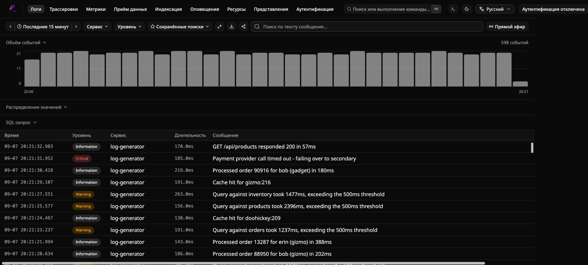
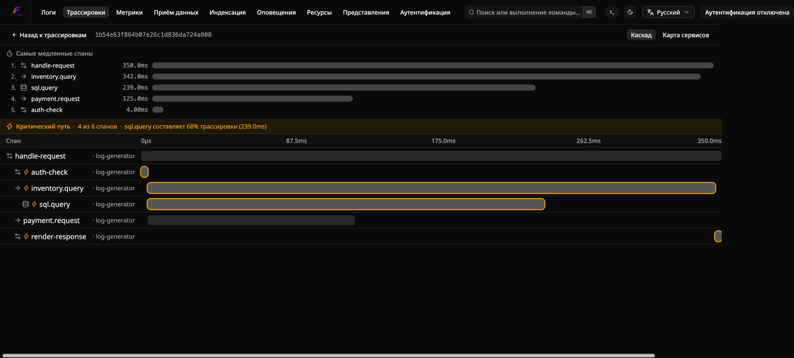
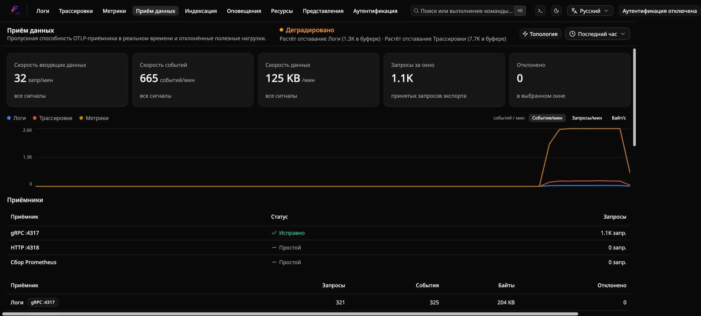
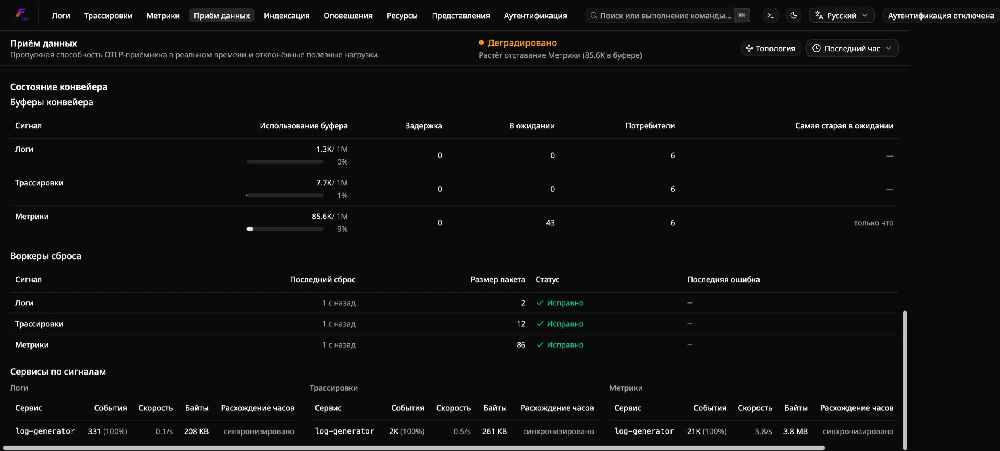
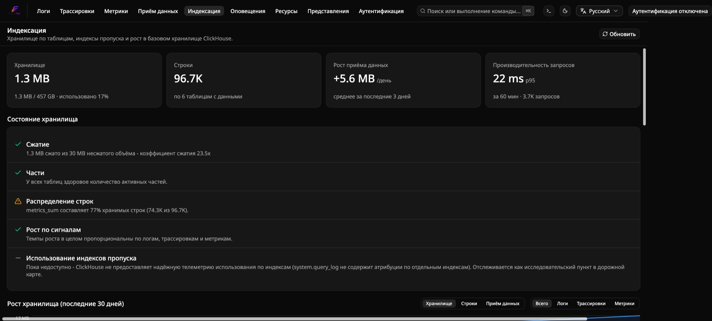
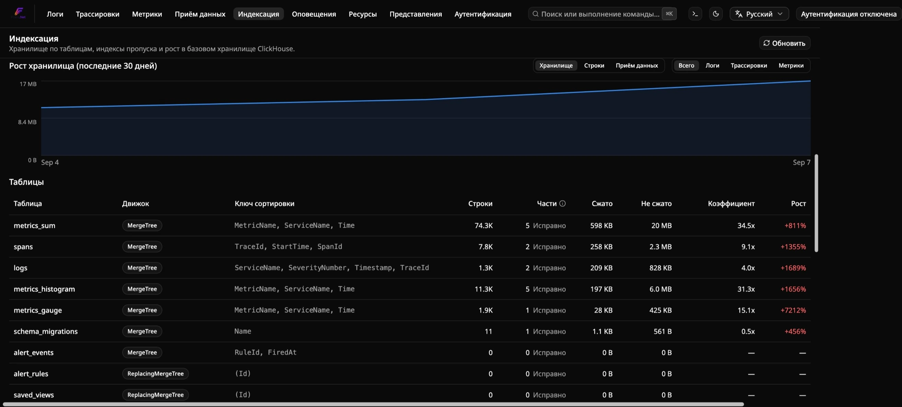
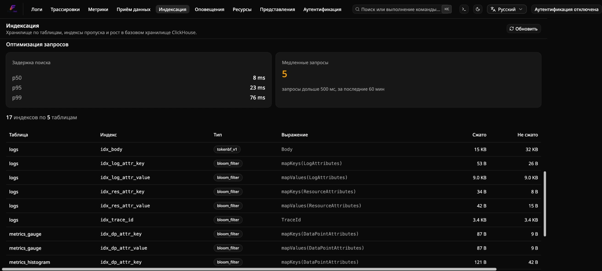
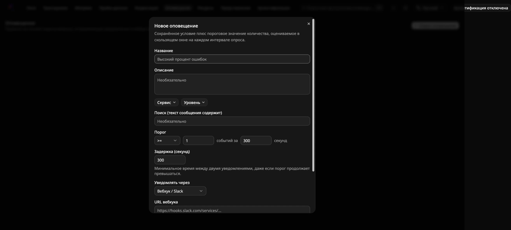
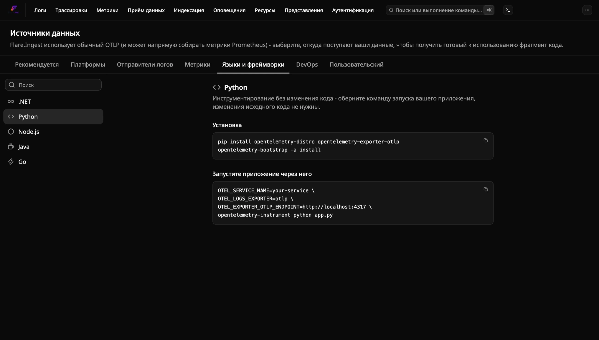

<!-- Translated (ru) from docs/explanation/architecture.md · source-sha256:e80bc201a239175a · hand-translated by Claude, not generated by scripts/translate-docs.py - edit the source file and retranslate if it changes, don't machine-retranslate over this. -->

# Архитектура

Flare — это самостоятельно размещаемая платформа наблюдаемости для .NET
на основе OpenTelemetry — логи, трассировки и метрики как полноценные
сущности, объединённые в одном месте, с правилами оповещений на основе
порогов/запросов. Эта страница объясняет, почему она устроена именно так;
см. [`../reference/`](../reference/) для точных значений и
[`../how-to/`](../how-to/) для пошаговых инструкций.

## Почему существует Flare

Ландшафт самостоятельно размещаемых инструментов логирования для
разработчиков на .NET — это выбор между двумя разочарованиями: **Seq** —
надёжный движок, но устаревший интерфейс и бесплатный тариф только для
одного пользователя — и **Grafana / SigNoz / OpenObserve** — мощные и
нативно поддерживающие OTel, но тяжёлые в эксплуатации, универсальные для
OTel, а не заточенные под опыт разработчика на .NET, и созданные для
инфраструктурных/SRE-команд, а не для разработчика, который просто хочет
красиво читать телеметрию своего приложения.

Ставка Flare: **проблема хранения/запросов уже решена ClickHouse (см.
[ADR-0013](../../docs-internal/adr/0013-clickhouse-as-storage-engine.md)).
Отличие — это отличная панель управления и настройка за две минуты.**
Именно туда направлены усилия — Flare не гонится за паритетом функций с
полноценным пакетом инструментов наблюдаемости; см. [Что не входит в цели](#нецели)
ниже.

## Принципы проектирования

1. **Единственный протокол на входе: OTLP.** Никаких адаптеров приёма для
   каждой библиотеки логирования — каждый поддерживаемый логгер достигает
   Flare через протокол OpenTelemetry. См.
   [ADR-0012](../../docs-internal/adr/0012-otlp-only-ingestion.md).
2. **Хранение — решённая проблема.** ClickHouse служит бэкендом, хорошо
   обёрнутым, а не изобретённым заново. См.
   [ADR-0013](../../docs-internal/adr/0013-clickhouse-as-storage-engine.md).
3. **Панель управления — это продукт.** Фронтенду уделяется первоклассное
   внимание — он должен выглядеть и ощущаться не так, как Seq или панель
   Grafana. См. [ADR-0001](../../docs-internal/adr/0001-sveltekit-dashboard.md)
   про стек, лежащий в основе.
4. **Минимум затрат на пробу.** `docker compose up` для автономного пути;
   CLI `flare` для постоянно работающего экземпляра. Если попробовать
   Flare занимает больше двух минут — это баг в опыте первого запуска.
5. **DX в первую очередь для .NET, но не только для .NET.** Опыт первого
   запуска ориентирован на логгеры .NET, но поскольку приём данных — это
   чистый OTLP, полиглотные команды не остаются за бортом.
6. **Дисциплина в рамках объёма.** Поставляйте узкий, сфокусированный
   набор функций. Спекулятивные идеи попадают в
   [дорожную карту](../../docs-internal/planning/roadmap.md), а не в то,
   что поставляется прямо сейчас.

## Конвейер от приёма данных до панели управления

```
  ┌─────────────────────────────────────────────┐
  │  Ваши приложения / сервисы                    │
  │  Serilog · NLog · ZLogger · MS ILogger · любой│
  │  источник OTLP (Go, Node, Python, ...)       │
  └───────────────────────┬─────────────────────┘
                          │  OTLP  (gRPC :4317 / HTTP :4318)
                          ▼
  ┌─────────────────────────────────────────────┐
  │  Flare.Ingest  (ASP.NET Core)                │
  │  • Приёмник OTLP (логи, трассировки, метрики) │
  │  • Нормализация → внутренняя модель событий   │
  │  • Буферизация + пакетирование (Redis Streams)│
  └───────────────────────┬─────────────────────┘
                          │  пакетные вставки
                          ▼
  ┌─────────────────────────────────────────────┐
  │  ClickHouse   (колоночное хранилище)         │
  └───────────────────────┬─────────────────────┘
                          │  SQL
                          ▼
  ┌─────────────────────────────────────────────┐
  │  Flare.Api  (ASP.NET Core query API)         │
  │  • Поиск / фильтрация / агрегация            │
  │  • Поток живого просмотра (WebSocket)        │
  └───────────────────────┬─────────────────────┘
                          │  HTTP / WS
                          ▼
  ┌─────────────────────────────────────────────┐
  │  Flare.Dashboard  (SPA)                      │
  │  • Логи, трассировки, метрики, оповещения и др.│
  │  • Живой просмотр · сохранённые поиски · графики│
  └─────────────────────────────────────────────┘
```

| Компонент | Технология | Ответственность |
|---|---|---|
| `Flare.Ingest` | ASP.NET Core | Принимает OTLP (gRPC + HTTP), преобразует во внутреннюю модель событий, буферизует, пакетно вставляет в ClickHouse |
| Redis | контейнер | Устойчивый буфер между приёмом данных и ClickHouse — см. [ADR-0002](../../docs-internal/adr/0002-redis-streams-buffering.md) |
| ClickHouse | контейнер | Хранение логов/трассировок/метрик и движок запросов — см. [ADR-0013](../../docs-internal/adr/0013-clickhouse-as-storage-engine.md) |
| `Flare.Api` | ASP.NET Core | Запросы/поиск/агрегация по ClickHouse; конечная точка потоковой передачи живого просмотра |
| `Flare.Dashboard` | SvelteKit (Svelte 5, runes) + Tailwind + shadcn-svelte | Интерфейс — то, ради чего сюда приходят. См. [ADR-0001](../../docs-internal/adr/0001-sveltekit-dashboard.md). |
| `Flare.AppHost` | .NET Aspire | Локальная оркестрация всего вышеперечисленного |

Каждый OTLP-совместимый логгер .NET достигает приёмника Flare одинаковым
способом — см. [`../how-to/run-standalone.md`](../how-to/run-standalone.ru.md)
для готового фрагмента кода по каждому логгеру
(`Microsoft.Extensions.Logging`/ZLogger через `OpenTelemetry.Exporter.OpenTelemetryProtocol`,
Serilog через `Serilog.Sinks.OpenTelemetry`, NLog через
`NLog.Targets.OpenTelemetryProtocol`) и
[`../reference/otlp-logger-versions.md`](../reference/otlp-logger-versions.ru.md)
для проверенных версий пакетов.

## Нецели

- Не полноценный APM (нет профилирования на уровне кода или отслеживания
  развёртываний), хотя распределённая трассировка есть.
- Не SIEM.
- Не инструмент для отчётов о сбоях — это другая задача (символизация,
  дедупликация); используйте для этого Sentry/GlitchTip.
- Не гонится за паритетом функций с Datadog/Grafana/SigNoz. Другая
  ставка — см. [Почему существует Flare](#почему-существует-flare) выше.

## Построен на

.NET/ASP.NET Core, .NET Aspire, ClickHouse, Redis, OpenTelemetry/OTLP,
SvelteKit (Svelte 5) + Tailwind + shadcn-svelte, Docker Compose. RustFS —
запланированный (ещё не реализованный) бэкенд для холодного хранения —
см. [дорожную карту](../../docs-internal/planning/roadmap.md).

## Три способа запустить Flare и почему существует каждый из них

У Flare есть три законных пути установки, каждый решает свою задачу, а не
дублирует остальные:

- **[.NET Aspire](../how-to/run-with-aspire.ru.md)** (`Flare.Hosting.Aspire`) —
  для приложения, у которого уже есть AppHost. Flare присоединяется к
  графу ресурсов; `aspire start` уже оркестрирует его жизненный цикл
  наряду со всем остальным.
- **[Автономный Docker Compose](../how-to/run-standalone.ru.md)** — для
  разовой, локальной для репозитория оценки. `docker compose up` в корне
  репозитория — самый быстрый способ просто взглянуть на Flare один раз.
- **[CLI `flare`](../how-to/run-with-cli.ru.md)** (`Flare.Cli`) — для
  постоянно работающего экземпляра, который вы запускаете один раз и
  забываете о нём, из любого каталога, общего для нескольких независимых
  локальных проектов, независимо от жизненного цикла какого-либо
  отдельного AppHost. Это тот случай, который два других пути структурно
  не могут покрыть: режим Aspire привязывает жизненный цикл Flare к
  одному AppHost, а локальный для репозитория стек Compose не
  предназначен для работы неделями в фоновом режиме, обслуживая
  несвязанные проекты.

## Обзор панели управления

Какой бы путь установки вы ни выбрали, вы попадёте в одно и то же место:
`Flare.Dashboard` — единое SvelteKit SPA-приложение с семью страницами за
одной панелью навигации, все они общаются с `Flare.Api` по HTTP/WebSocket,
без отдельных инструментов для логов, трассировок, метрик или
оповещений. При первом визите создаётся учётная запись администратора
(см. [`../how-to/configure-authentication.md`](../how-to/configure-authentication.ru.md));
после этого — обычный вход.

### Логи

Вид по умолчанию (`/`). Плотная, виртуализированная таблица логов с живым
просмотром (потоковая передача в реальном времени, пауза/возобновление),
графиком объёма событий и фильтрами по сервису, уровню и полнотекстовому
поиску по телу сообщения. Кликните по любой строке, чтобы развернуть её
полную структурированную полезную нагрузку, области видимости и детали
исключения.



### Трассировки

`/traces` — каждая OTLP-трассировка, полученная Flare, с фильтрацией по
сервису и временному диапазону. Автоматически инструментированные спаны
(ASP.NET Core, HttpClient, …) и всё, что излучает ваш собственный код
через `ActivitySource`, отображаются рядом друг с другом.


Кликните по трассировке, чтобы открыть каскадный вид (waterfall) —
родительские/дочерние спаны, расположенные по времени начала и
длительности, та же форма, что у Jaeger/Zipkin, но встроенная прямо в
остальную часть панели управления.



### Метрики

`/metrics` — каждый OTLP-инструмент метрик (Sum, Gauge, Histogram),
передаваемый вашими сервисами, доступный для просмотра в боковой панели с
поиском и отображаемый как график временного ряда для каждого
инструмента. Охватывает как бесплатные данные
`AddAspNetCoreInstrumentation()`/`AddRuntimeInstrumentation()` (GC .NET,
пул потоков, Kestrel, HTTP-клиент/сервер), так и всё, что излучает ваш
собственный `Meter`.


### Приём данных

`/ingestion` — операционная видимость самого приёмника OTLP: текущие
показатели поступления/приёма данных, разбивка запросов, событий и байтов
по каждому сигналу (логи/трассировки/метрики) × по каждому протоколу
(gRPC/HTTP), а также журнал приёма данных со всем, что Flare отклонил
(некорректные полезные нагрузки, неподдерживаемые типы данных) и почему.
Это первая страница, которую стоит проверить, если «мои логи не
отображаются».





### Индексация

`/indexing` — сделанное видимым внутреннее хранилище ClickHouse: общий
объём хранения (сжатый/несжатый), количество строк, разбивка по таблицам
(`logs`, `spans`, `metrics_sum`, `metrics_histogram`, `metrics_gauge`, …)
с коэффициентами сжатия, ростом за последние 30 дней и индексами
пропуска (skip indexes), обеспечивающими быструю фильтрацию. Полезно для
планирования ёмкости или просто чтобы увидеть, куда уходят байты. В
кластерном режиме здесь же находится и панель Cluster — см.
[`clustering.md`](clustering.ru.md#панель-управления-статус-кластера-на-странице-индексации).







### Оповещения

`/alerts` — правила оповещений на основе порогов/запросов: сохранённый
фильтр (сервис, уровень, текст поиска) плюс пороговое значение количества,
оцениваемое на скользящем окне, с периодом остывания и пробным запуском
«проверить на текущих данных» перед сохранением. Срабатывание уведомляет
через webhook/Slack, Telegram или email, в зависимости от канала
«Уведомлять через» правила — см.
[`../../src/Flare.Api/README.md`](../../src/Flare.Api/README.md#alerting)
о том, что нужно настроить на стороне сервера для каждого канала.




### Представления

`/views` — именованные, перезагружаемые фильтры, сохранённые из элемента
управления «Views» на панели инструментов Logs, Traces или Metrics.
Сохраните фильтр один раз (например, «Предупреждения с упоминанием
timeout») и загружайте его отсюда или из выпадающего списка Views этой
же страницы — доступен по ссылке, не привязан к тому, кто его создал.


### Источники данных

Доступна из выпадающего меню навигации или с пустого экрана страницы
Logs («Посмотреть, как отправлять данные») — как раз в тот момент, когда
она действительно нужна. Это каталог с возможностью поиска и готовыми
для копирования фрагментами настройки OTLP, организованный по платформам
(Kubernetes, Docker, Linux, Windows), языкам/SDK (.NET, Python, Node.js,
Java, Go), инструментам пересылки логов (Vector, Fluent Bit, Syslog),
CI/DevOps-инструментам (Jenkins, Ansible, Terraform, GitHub Actions) и
запасному варианту в виде «сырого» HTTP/JSON — плюс один пункт Prometheus
в разделе Metrics для нативного приёмника опроса (scrape) `Flare.Ingest`,
единственной записи здесь, где данные забираются, а не отправляются.
Хост/порт в каждом фрагменте берутся из собственного источника браузера,
поэтому скопированное соответствует вашему реальному развёртыванию, а не
заглушке — это тот же каталог, на который ссылаются «только для .NET»
фрагменты в README применительно ко всем остальным языкам и платформам.



## Почему CLI закрепляет теги образов вместо отслеживания `latest`

Экземпляры, управляемые `Flare.Cli`, по умолчанию используют конкретный,
протестированный тег образа `vX.Y.Z`, а не плавающие теги `edge`/`latest`
(см. [справочник](../reference/cli-commands.ru.md#политика-тегов-образов) для
точных значений по умолчанию и истории версий) — намеренно, чтобы данная
версия `Flare.Cli` навсегда продолжала загружать одни и те же образы, пока
вы явно её не перенастроите. `flare update` (без `--tag`) заново
загружает тот же закреплённый тег, а не автоматически обнаруживает более
новые релизы, и намеренно никогда не будет этого делать: только автор
этого CLI знает, какие более новые образы Flare Docker действительно были
протестированы с данной версией `Flare.Cli` — существование более нового
тега на Docker Hub не равнозначно этому утверждению. Каждый новый релиз
`Flare.Cli` заново закрепляет значение по умолчанию своего собственного
шаблона после тестирования с более новым образом Flare; существующие
установки продолжают отслеживать тот тег, с которым они были созданы,
пока вы явно не перенастроите их с помощью `flare update --tag TAG`.

## Почему управляемые CLI экземпляры получают случайные пароли

Собственный `docker-compose.yml` репозитория поставляется с
задокументированным паролем по умолчанию `flare`/`flare` — это нормально
для стека, который вы поднимаете, оцениваете и уничтожаете. Экземпляр,
управляемый `Flare.Cli`, предназначен для работы неделями с портами,
привязанными на вашей машине всё это время, а не для уничтожения после
быстрой оценки, поэтому повторное использование публичного,
задокументированного пароля по умолчанию для чего-то долгоживущего — это
ловушка, в которую CLI по умолчанию не попадает. Пароли генерируются один
раз при первой инициализации и никогда не ротируются впоследствии (ротация
сломала бы аутентификацию `identity-data`/ClickHouse при следующем
запуске) — файл текстовый, и вы можете вручную отредактировать его, если
хотите задать собственное значение.
