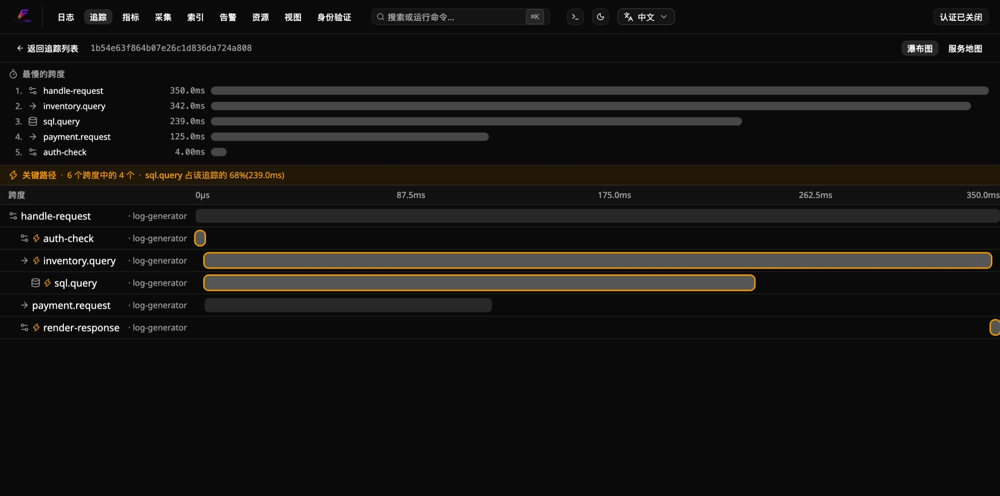
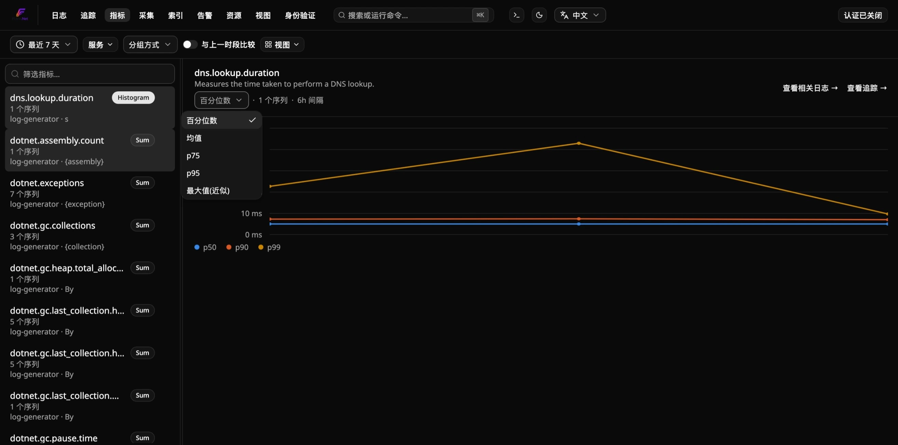
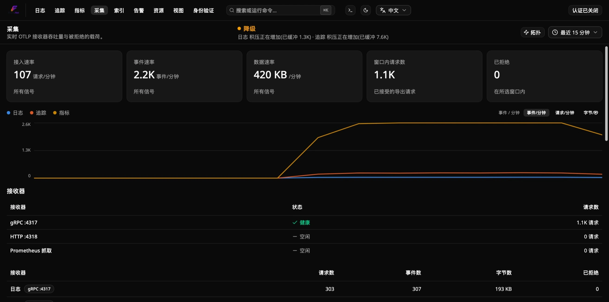
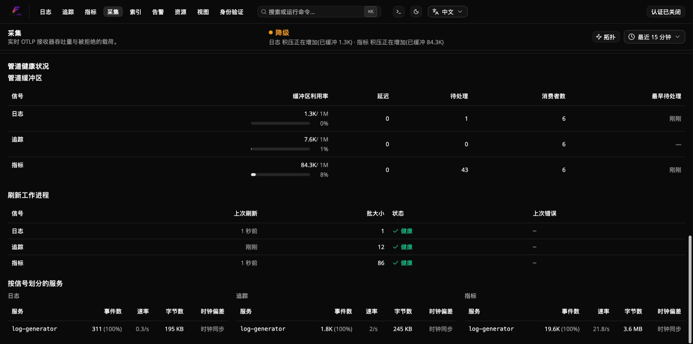
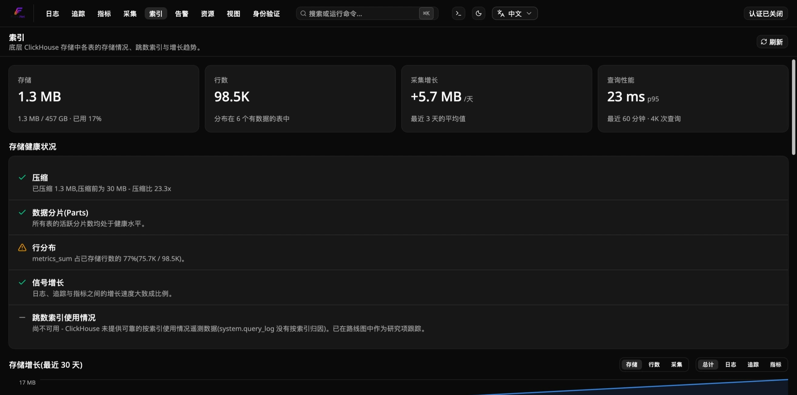
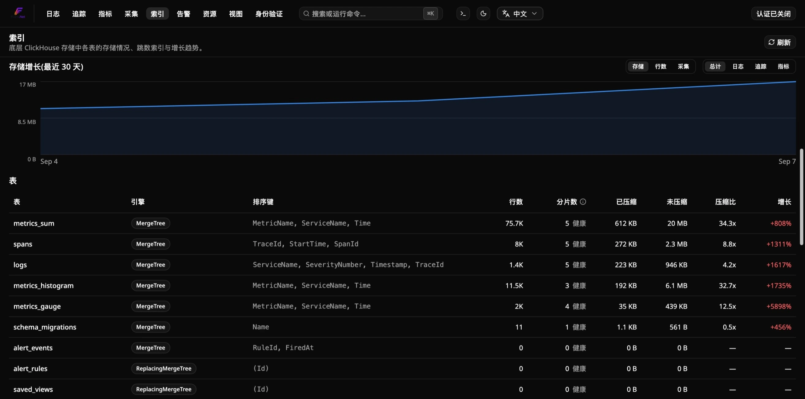
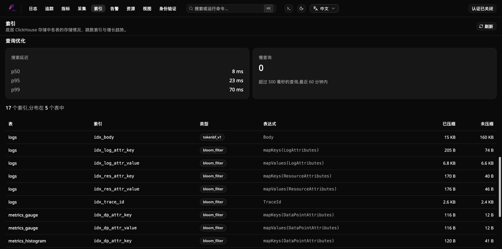
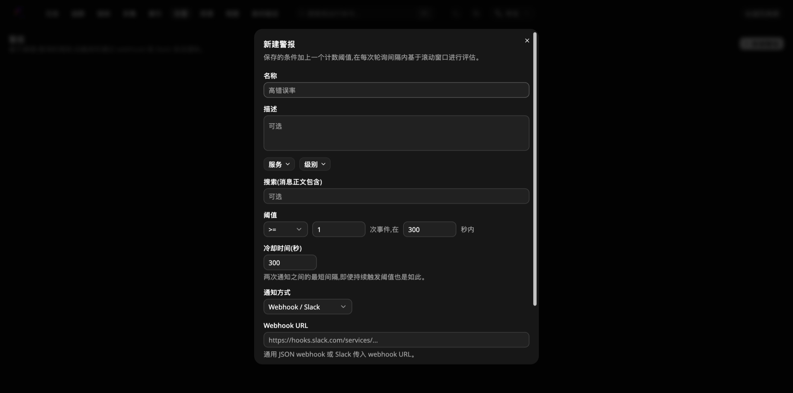
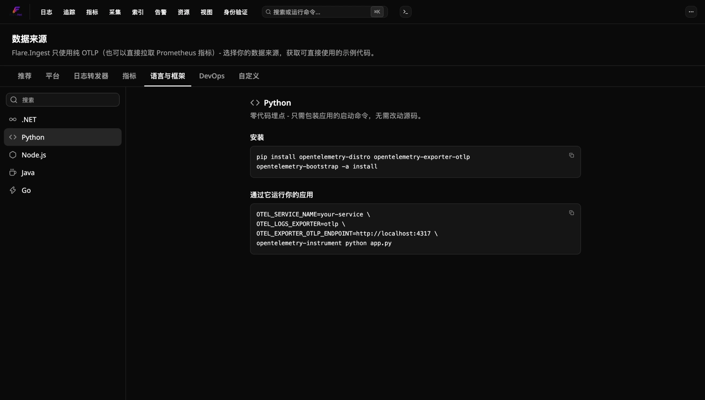

<!-- Translated (zh-CN) from docs/explanation/architecture.md · source-sha256:e80bc201a239175a · hand-translated by Claude, not generated by scripts/translate-docs.py - edit the source file and retranslate if it changes, don't machine-retranslate over this. -->

# 建筑学

Flare 是 .NET 的自托管、OpenTelemetry 原生可观察性平台 — 日志、跟踪和指标作为一等公民，在一个位置关联，与基于阈值/查询的警报规则。本页解释了为什么它是这样构建的；有关确切值，请参阅 [`../reference/`](../reference/)；有关任务指令，请参阅 [`../how-to/`](../how-to/)。

## 为什么 Flare 存在

.NET 开发人员的自托管日志工具环境是在两个挫折之间进行选择：**Seq** - 一个可靠的引擎，但过时的 UI 和单用户免费层 - 和 **Grafana / SigNoz / OpenObserve** - 功能强大且 OTel 原生，但运行繁重，OTel 通用而不是针对 .NET 开发体验进行调整，并且是为基础设施/SRE 团队构建的比只想漂亮地读取应用程序遥测数据的开发人员更重要。

Flare 的赌注：**存储/查询问题已经被 ClickHouse 解决了（参见 [ADR-0013](../../docs-internal/adr/0013-clickhouse-as-storage-engine.md)）。与众不同之处在于出色的仪表板和两分钟的设置。**这就是努力的方向 - Flare 并不追求与完整的可观察性套件同等的功能；而是追求功能平衡。参见下面的 [Non-goals](#非目标)。

## 设计原则

1. **一种协议：OTLP。** 每个日志记录库没有摄取适配器 - 每个受支持的记录器都通过 OpenTelemetry 协议到达 Flare。参见 [ADR-0012](../../docs-internal/adr/0012-otlp-only-ingestion.md)。
2. **存储是一个已解决的问题。** ClickHouse 是后端，包装得很好，而不是重新发明。参见 [ADR-0013](../../docs-internal/adr/0013-clickhouse-as-storage-engine.md)。
3. **仪表板就是产品。** 前端受到一流的关注 - 它的外观和感觉应该与 Seq 或 Grafana 面板不同。请参阅 [ADR-0001](../../docs-internal/adr/0001-sveltekit-dashboard.md) 了解其后面的堆栈。
4. **尝试的开销最小。** `docker compose up` 用于独立路径； `flare` CLI 用于站立实例。如果尝试 Flare 需要超过两分钟，那就是入门体验中的错误。
5. **.NET-第一个 DX，而不是仅 .NET。** 入门体验是为 .NET 记录器量身定制的，但由于摄取是纯粹的 OTLP，因此多语言团队不会被排除在外。
6. **范围规则。** 提供紧凑、集中的功能集。投机性想法属于 [the roadmap](../../docs-internal/planning/roadmap.md)，而不是目前正在发货的任何产品。

## 摄取 → 仪表板管道

```
  ┌─────────────────────────────────────────────┐
  │  Your apps / services                        │
  │  Serilog · NLog · ZLogger · MS ILogger · any │
  │  OTLP source (Go, Node, Python, ...)         │
  └───────────────────────┬─────────────────────┘
                          │  OTLP  (gRPC :4317 / HTTP :4318)
                          ▼
  ┌─────────────────────────────────────────────┐
  │  Flare.Ingest  (ASP.NET Core)                │
  │  • OTLP receiver (logs, traces, metrics)      │
  │  • Normalize → internal event model           │
  │  • Buffer + batch (Redis Streams)             │
  └───────────────────────┬─────────────────────┘
                          │  batched inserts
                          ▼
  ┌─────────────────────────────────────────────┐
  │  ClickHouse   (columnar store)               │
  └───────────────────────┬─────────────────────┘
                          │  SQL
                          ▼
  ┌─────────────────────────────────────────────┐
  │  Flare.Api  (ASP.NET Core query API)         │
  │  • Search / filter / aggregate                │
  │  • Live-tail stream (WebSocket)               │
  └───────────────────────┬─────────────────────┘
                          │  HTTP / WS
                          ▼
  ┌─────────────────────────────────────────────┐
  │  Flare.Dashboard  (SPA)                      │
  │  • Logs, Traces, Metrics, Alerts, and more     │
  │  • Live tail · saved searches · charts        │
  └─────────────────────────────────────────────┘
```

| 成分 | 科技 | 责任 |
|---|---|---|
| `Flare.Ingest` | ASP.NET 核心 | 终止OTLP（gRPC + HTTP），映射到内部事件模型，缓冲区，批量插入到ClickHouse |
| Redis | 容器 | 摄取和 ClickHouse 之间的持久缓冲区 — 请参阅 [ADR-0002](../../docs-internal/adr/0002-redis-streams-buffering.md) |
| ClickHouse | 容器 | 日志/跟踪/指标存储和查询引擎 - 请参阅 [ADR-0013](../../docs-internal/adr/0013-clickhouse-as-storage-engine.md) |
| `Flare.Api` | ASP.NET 核心 | 通过ClickHouse查询/搜索/聚合；直播尾流端点 |
| `Flare.Dashboard` | SvelteKit（Svelte 5，符文）+ Tailwind + shadcn-svelte | 用户界面——人们来这里的目的。参见 [ADR-0001](../../docs-internal/adr/0001-sveltekit-dashboard.md)。 |
| `Flare.AppHost` | .NET Aspire | 上述所有内容的本地编排 |

每个支持 OTLP 的 .NET 记录器都以相同的方式到达 Flare 的摄取接收器 - 请参阅 [`../how-to/run-standalone.md`](../how-to/run-standalone.zh-CN.md) 了解每个记录器的复制粘贴片段（`Microsoft.Extensions.Logging`/ZLogger 通过 `OpenTelemetry.Exporter.OpenTelemetryProtocol`、Serilog 通过 `Serilog.Sinks.OpenTelemetry`、NLog 通过 `NLog.Targets.OpenTelemetryProtocol`）和 [`../reference/otlp-logger-versions.md`](../reference/otlp-logger-versions.zh-CN.md) 了解已知良好的软件包版本。

## 非目标

- 尽管它可以进行分布式跟踪，但它不是完整的 APM（没有代码级分析或部署跟踪）。
- 不是 SIEM。
- 不是崩溃报告工具——这是一个不同的问题（符号、指纹识别）；使用 Sentry/GlitchTip 来实现这一点。
- 不追求与 Datadog/Grafana/SigNoz 的功能对等。不同的赌注——参见上面的 [Why Flare exists](#为什么-flare-存在)。

## 内置

.NET/ASP.NET 核心、.NET Aspire、ClickHouse、Redis、OpenTelemetry/OTLP、SvelteKit (Svelte 5) + Tailwind + shadcn-svelte、Docker 组成。 RustFS 是一个计划中（尚未构建）的冷存储后端 - 请参阅 [the roadmap](../../docs-internal/planning/roadmap.md)。

## 运行 Flare 的三种方法以及每种方法存在的原因

Flare 具有三个合法的安装路径，每个路径解决不同的问题，而不是与其他路径冗余：

- **[.NET Aspire](../how-to/run-with-aspire.zh-CN.md)** (`Flare.Hosting.Aspire`) — 对于已经有 AppHost 的应用程序。 Flare 加入资源图； `aspire start` 已经与其他一切一起协调了它的生命周期。
- **[Standalone Docker Compose](../how-to/run-standalone.zh-CN.md)** — 用于一次性、回购本地评估。存储库根目录中的 `docker compose up` 是查看一次 Flare 的最快方法。
- **[The `flare` CLI](../how-to/run-with-cli.zh-CN.md)** (`Flare.Cli`) — 对于一个常设实例，您从任何目录启动一次，然后就忘记了，在许多不相关的本地项目之间共享，独立于任何单个 AppHost 的生命周期。这是其他两条路径在结构上无法涵盖的情况：Aspire 模式将 Flare 的生命周期与一个 AppHost 联系起来，并且存储库本地 Compose 堆栈并不意味着在后台运行数周来为不相关的项目提供服务。

## 仪表板之旅

无论您选择哪个安装路径，您都会到达同一个地方：`Flare.Dashboard` — 一个 SvelteKit SPA，在一个导航栏后面有七个页面，所有页面都通过 HTTP/WebSocket 与 `Flare.Api` 通信，没有单独的日志、跟踪、指标或警报工具。第一次访问创建管理员帐户（参见[`../how-to/configure-authentication.md`](../how-to/configure-authentication.zh-CN.md)）；之后就可以正常登录了。

### 日志

默认视图 (`/`)。密集的虚拟化日志表，具有实时尾部（实时流、暂停/恢复）、事件量图表以及服务、级别和消息正文上的自由文本搜索过滤器。单击任意行可展开其完整的结构化负载、范围和异常详细信息。


### 追踪

`/traces` — 每个 OTLP 跟踪 Flare 已收到，可按服务和时间范围进行过滤。自动检测跨度（ASP.NET Core、HttpClient，...）以及您自己的代码通过 `ActivitySource` 发出的任何内容并排显示。


单击瀑布视图的跟踪 - 按开始时间和持续时间布置的父/子跨度，与 Jaeger/Zipkin 的形状相同，但直接连接到仪表板的其余部分。



### 指标

`/metrics` — 您的服务报告的每个 OTLP 度量工具（总和、仪表、直方图），可从可搜索侧边栏浏览，并呈现为每个工具的时间序列图表。涵盖免费的 `AddAspNetCoreInstrumentation()`/`AddRuntimeInstrumentation()` 数据（.NET GC、线程池、Kestrel、HTTP 客户端/服务器）以及您自己的 `Meter` 发出的任何内容。



### 食入

`/ingestion` — OTLP 接收器本身的操作可见性：当前到达/摄取速率、每个信号（日志/跟踪/指标）× 每个协议 (gRPC/HTTP) 请求、事件和字节的细分，以及任何 Flare 拒绝的摄取日志（错误的有效负载、不支持的媒体类型）及其原因。如果“我的日志没有显示”，则首先检查的页面。





### 索引

`/indexing` — 底层的 ClickHouse 存储变得可见：总存储（压缩/未压缩）、行数、逐表细分（`logs`、`spans`、`metrics_sum`、`metrics_histogram`、`metrics_gauge` 等）以及压缩率、过去 30 天的增长以及支持快速过滤的跳过索引。对于容量规划或只是查看字节的去向很有用。在集群模式下，这也是集群面板所在的位置 - 请参阅 [`clustering.md`](clustering.zh-CN.md#仪表板索引页面上的集群状态)。







### 警报

`/alerts` — 基于阈值/查询的警报规则：保存的过滤器（服务、级别、搜索文本）加上在滚动窗口上评估的计数阈值，在保存之前有冷却时间和“针对当前数据进行测试”的试运行。触发会通知一个或多个通知渠道，这些渠道在同一页面的“Channels”标签页中管理 —— 可复用的命名目标（webhook/Slack、Telegram、电子邮件或 PagerDuty），规则通过 ID 引用它们而不是直接内联，因此同一个渠道可以在多条规则间复用，一条规则也可以针对同一次告警同时通知多个目标（参见 [ADR-0021](../../docs-internal/adr/0021-reusable-notification-channels.md)）。在此功能上线前创建的规则仍会通过其自身的内联渠道通知，行为不变。请参阅 [`../../src/Flare.Api/README.md`](../../src/Flare.Api/README.md#alerting) 了解每种渠道类型需要在服务器端配置的内容。

 

### 视图

`/views` — 从日志、跟踪或指标工具栏的“视图”控件保存的命名、可重新加载的过滤器。保存过滤器一次（例如“提及超时的警告”），然后从此处或该页面自己的“视图”下拉列表重新加载它 - 可通过链接共享，不与创建它的人绑定。


### 数据源

从导航栏的下拉菜单进入，或者在日志页面为空时点击"查看如何摄取数据"，正好是需要它的时候。这是一个可搜索的、复制粘贴式的 OTLP 配置片段目录，按平台（Kubernetes、Docker、Linux、Windows）、语言/SDK（.NET、Python、Node.js、Java、Go）、日志转发工具（Vector、Fluent Bit、Syslog）、CI/DevOps 工具（Jenkins、Ansible、Terraform、GitHub Actions）分类，另有一个原始 HTTP/JSON 兜底方案 — 加上归类在"指标"下的一个 Prometheus 条目，对应 `Flare.Ingest` 原生的抓取接收器，是此处唯一一个拉取而非推送的条目。每个片段的主机/端口都取自浏览器自身的来源，因此复制出来的内容匹配你的实际部署，而不是占位符 — 这与 README 中".NET 专用"片段所指向的是同一个目录，覆盖了其他所有语言或平台。



## 为什么 CLI 固定图像标签而不是跟踪 `latest`

`Flare.Cli` 托管实例默认使用特定的、经过测试的 `vX.Y.Z` 映像标签，而不是浮动 `edge`/`latest` 标签（请参阅 [the reference](../reference/cli-commands.zh-CN.md#图片标签政策) 了解确切的默认值和版本历史记录） - 故意的，因此给定的 `Flare.Cli` 版本会永远拉取相同的映像，直到您显式移动它。 `flare update`（不是 `--tag`）重新拉动相同的固定标签，而不是自动发现较新的版本，并且故意永远不会这样做：只有这个 CLI 自己的作者知道哪些较新的 Flare Docker 图像实际上已经针对给定的 `Flare.Cli` 版本进行了测试 - Docker Hub 上现有的较新标签并不相同。每个新的 `Flare.Cli` 版本在针对较新的 Flare 映像进行测试后都会重新固定其自己的模板默认值；现有安装会继续跟踪它们生成的任何标签，直到您使用 `flare update --tag TAG` 显式移动它们。

## 为什么 CLI 托管实例获得随机密码

存储库自己的 `docker-compose.yml` 附带了一个记录在案的 `flare`/`flare` 默认密码 - 非常适合您站立、评估和拆卸的堆栈。 `Flare.Cli` 托管实例的端口始终绑定在您的计算机上，可以持续数周，不会在快速评估后被拆除，因此，为长期存在的内容重复使用公开的、记录在案的默认密码是 CLI 不会默认使用的枪。密码在第一次初始化时生成一次，之后不再轮换（轮换会在下次启动时破坏 `identity-data`/ClickHouse 身份验证）——该文件是纯文本，如果您想设置自己的值，则可以手动编辑。