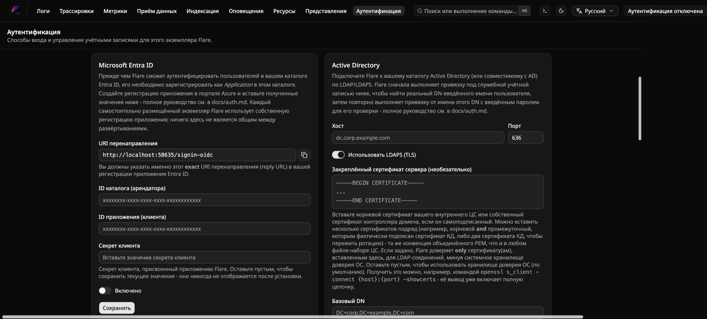
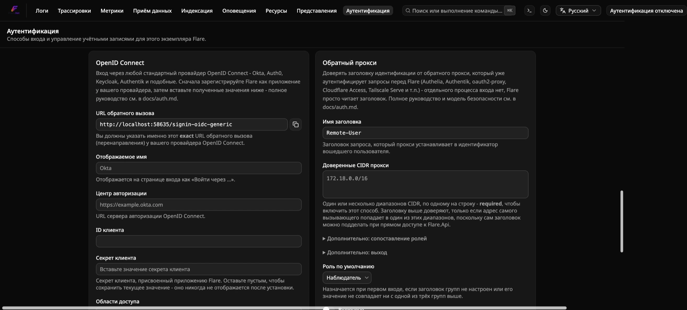

<!-- Translated (ru) from docs/explanation/authentication-model.md · source-sha256:52881483f79d07e4 · hand-translated by Claude, not generated by scripts/translate-docs.py - edit the source file and retranslate if it changes, don't machine-retranslate over this. -->

# Модель аутентификации

Flare поставляется с локальными учётными записями по имени
пользователя/паролю, Microsoft Entra ID (SSO), Active Directory (LDAP),
универсальным OpenID Connect и входом через доверенный заголовок
обратного прокси, а также с тремя фиксированными ролями. Это
**многопользовательский RBAC на одном общем самостоятельно размещаемом
экземпляре** — все, кто вошёл в данное развёртывание Flare, видят одни и
те же логи/трассировки/метрики/правила оповещений/сохранённые
представления, просто с разными уровнями прав. Это **не** изоляция
многопользовательского SaaS: нигде нет владения данными по пользователю, а
`alert_rules`/`saved_views` остаются такими же глобальными/общими, какими
были всегда.

Чтобы всё это настроить, см.
[`../how-to/configure-authentication.md`](../how-to/configure-authentication.md).
Точные ключи конфигурации и таблицу ролей см. в
[`../reference/authentication-config.md`](../reference/authentication-config.md).

## Аутентификация отключена по умолчанию

Свежий экземпляр Flare **вообще не требует входа** — любой, кто может
достучаться до панели управления, сразу видит страницу логов с полным
доступом. Нет никакого принудительного шага настройки, блокирующего
доступ, пока вы на что-либо не посмотрите. Это осознанное значение по
умолчанию для самостоятельно размещаемого, часто однопользовательского
или внутрисетевого инструмента: требовать учётную запись прежде, чем вы
вообще решили, что она вам нужна, — трение, о котором никто не просил.

**Обновление существующего развёртывания остаётся защищённым.** Опциональное
по умолчанию значение применяется только к по-настоящему *свежей* базе
данных с нулём пользователей в ней. Если вы обновляете экземпляр Flare, в
котором уже есть учётные записи, миграция, вводящая этот переключатель,
устанавливает его в `Enabled = true` за вас — аутентификация остаётся
обязательной точно так же, как и была; при обновлении ничего не
открывается незаметно.

### Как это обеспечивается

Единый глобальный флаг, `AuthSettings.Enabled`, читается
`ConditionalAuthorizationMiddlewareResultHandler` (`Flare.Api/Auth/`) —
тонкой обёрткой вокруг собственного
`AuthorizationMiddlewareResultHandler` ASP.NET Core. Когда флаг равен
`false`, он безусловно замыкает *каждую* проверку авторизации в
приложении (все `RequireAuthorization()`/`RequireMember`/`RequireAdmin` во
всех группах конечных точек) на успех. Когда `true`, он делегирует
обработчику фреймворка по умолчанию точно так же, как раньше. Это
единственная точка сужения, которая делает «отключено по умолчанию»
возможным без изменения отдельных файлов конечных точек.

Внутри этого **у локального входа есть собственный флаг включения**
(`LocalEnabled`), независимый от четырёх специфичных для метода флагов —
поэтому все пять методов (локальный / Entra / Active Directory / OpenID
Connect / обратный прокси) включаются и настраиваются одинаковым,
симметричным способом. Организация, полностью перешедшая на SSO, может в
итоге полностью отключить локальный вход по паролю, как и любой другой
метод.

**Методы сосуществуют, а не исключают друг друга.** Все пять могут быть
включены одновременно. Это осознанное решение, а не случайность
реализации: дизайн с единственным исключительным методом рискует
настоящей блокировкой доступа — если сопоставление
группы→роли Entra/AD/OIDC/прокси настроено неверно и никто не оказывается
`Admin`, войти будет невозможно, — тогда как сосуществование сохраняет
доступный локальный путь «аварийного доступа» с правами Admin, даже когда
повседневным методом является SSO/AD/прокси.

## Страница `/auth`

Всё, что связано с аутентификацией, находится на одной странице, доступной
только администратору (доступной всем, пока аутентификация отключена,
как и любая другая страница):

1. **Аутентификация** — общий переключатель «Требовать вход» и
   переключатель «Локальное имя пользователя/пароль» расположены вместе
   наверху. Выключено → пояснительный текст, всё ниже неактивно. Включено
   → четыре секции методов ниже становятся действующей поверхностью
   настройки.
2. **Microsoft Entra ID**, **Active Directory**, **OpenID Connect** и
   **Обратный прокси** — собственный переключатель включения каждой
   секции плюс встроенная форма конфигурации. Настройки сохраняются
   независимо по каждой секции.
3. **Пользователи** — каждая учётная запись (любого поставщика), с
   элементами управления ролью и включением/отключением, отображается,
   как только включён любой метод.

`/setup`, `/security` и `/users` больше не существуют как отдельные
маршруты; `/auth` заменяет все три.

## Как проходят сеансы

Вход устанавливает httpOnly cookie сеанса (`flare_session` по умолчанию) —
не JWT. Значение cookie — это непрозрачный, отслеживаемый на сервере
токен; удаление соответствующей строки (выход или отключение учётной
записи администратором) немедленно отзывает его, чего самодостаточный JWT
не может сделать без списка отзыва. Это также означает, что WebSocket
живого просмотра «просто работает» после того, как вы вошли в систему:
браузер отправляет тот же cookie при запросе апгрейда WebSocket, что и при
любом другом запросе того же сайта, отдельный токен не нужен.

Сеансы по умолчанию истекают через фиксированные 14 дней
(`Auth:SessionLifetime`), без скользящего окна.

## Где живут учётные записи

Пользователи, сеансы, ключи API приёма данных и все настройки
аутентификации хранятся во **встроенном файле SQLite**, а не в отдельном
контейнере базы данных — почему, и какой компромисс это создаёт
(`Flare.Api` ограничен одной репликой), записано в
[ADR-0004](../../docs-internal/adr/0004-embedded-sqlite-for-identity.md).
`Flare.Ingest` использует тот же файл, преимущественно на чтение.

## Ключи API приёма данных

Намеренно отделены от учётных записей пользователей: ключ API приёма
данных аутентифицирует *машину* (экспортёр OTLP приложения), а не
*человека*. Привязка его к строке `Users` заставила бы каждое
телеметрию-излучающее приложение быть связанным с чьим-то входом, что не
соответствует тому, как на самом деле эксплуатируются
коллекторы/экспортёры (один или несколько общих ключей на среду). См.
[практическое руководство](../how-to/configure-authentication.md#ingest-api-keys)
о создании/использовании/отзыве ключа.

## Как работает каждый метод

Все пять методов заканчиваются одним и тем же видом сеанса —
`flare_session`, `RequireMember`/`RequireAdmin`, любая другая конечная
точка — независимо от того, через какую дверь вы вошли. **Самый первый
вход для данной внешней личности создаёт строку `Users`; каждый
последующий вход входит как в существующую строку, с её ролью без
изменений** — изменения роли после этого живут во Flare (таблица Users на
`/auth`), а не у вышестоящего поставщика, для любого нелокального метода.

### Microsoft Entra ID (единый вход)

Подключён через стандартную многосхемную модель `AddAuthentication()`
ASP.NET Core: схема cookie (`SessionAuthenticationHandler`,
зарегистрированная как `FlareSession`) остаётся *единственной* схемой,
через которую `RequireAuthorization()` любой конечной точки когда-либо
фактически разрешает субъекта (principal). Entra ID — это вторая,
отдельная входная дверь, которая заканчивается точно таким же видом
сеанса — ни одной существующей конечной точке не нужно менять, чтобы
поддержать её.

**Только один арендатор (single-tenant)** — Flare проверяет по одному
конкретному каталогу Entra, а не по `common`/`organizations`.
**Настраивается на уровне экземпляра, через панель управления, а не через
файлы конфигурации** — в config/`.env`/docker-compose нет
`Auth:Entra:TenantId`/`ClientId`/`ClientSecret`; база данных — единственное
место, где они хранятся (см.
[ADR-0004](../../docs-internal/adr/0004-embedded-sqlite-for-identity.md)).
Изменения настроек вступают в силу после перезапуска `Flare.Api` — не
динамически, намеренно (см. примечания
`EntraOpenIdConnectOptionsConfigurator` в `Flare.Api/Auth/` о компромиссе
простота/риск).

Поток: кнопка «Войти через Microsoft» на панели управления переходит на
`GET /api/auth/entra/login`, что запускает вызов схемы OpenIdConnect
`Entra`. Microsoft перенаправляет обратно на `/signin-oidc`, который
передаёт управление `GET /api/auth/entra/complete`. Эта конечная точка
ищет учётную запись по claim `oid` токена (`Users.AuthProvider = 'Entra'`,
`Users.ExternalId = <oid>`).

**Источник роли: роли приложения Entra (App Roles)**, сопоставляемые по
имени с собственным перечислением `Admin`/`Member`/`Viewer` Flare — Flare
читает claim `roles` токена при первом входе и выбирает совпадение с
наивысшими привилегиями. Если роль приложения не назначена, вместо этого
применяется `Auth:Entra:DefaultRole` (`Viewer`, если не переопределено) —
единственная связанная с Entra настройка, которая всё ещё привязана к
конфигурации, а не настраивается через панель управления. Отключённая
учётная запись перенаправляется на `/login?error=account-disabled` вместо
получения сеанса.

### Active Directory (LDAP)

Вход по существующему домену Active Directory (или AD-совместимому —
например, Samba AD, или обычному каталогу LDAP, устроенному похожим
образом), без включения самого Flare или его контейнера в домен.
Используется **привязка LDAP/LDAPS из собственной формы входа Flare**, а
не встроенная проверка подлинности Windows/SSO через Kerberos, которая
потребовала бы включения самого контейнера `Flare.Api` в домен. Для этого
нужна лишь сетевая доступность конечной точки LDAP/LDAPS на вашем
контроллере домена.

**В отличие от Entra ID, перезапуск не требуется** — аутентификация LDAP
не регистрирует схему аутентификации ASP.NET Core; каждая попытка входа
заново читает текущие настройки из SQLite и императивно открывает обычное
LDAP-соединение.

Поток: `POST /api/auth/ldap/login` сначала выполняет привязку от имени
настроенной **служебной учётной записи**. Ошибка привязки/соединения
здесь возвращает **`502`**, отличный от `401` при неверном пароле, чтобы
неверно настроенный LDAP на стороне Flare не был принят за «у всех вдруг
неверный пароль». Всё ещё привязанный как служебная учётная запись, Flare
выполняет поиск в `BaseDn`, используя `UserSearchFilter` с подставленным
переданным именем пользователя (экранированным согласно RFC 4515 перед
интерполяцией — эквивалент LDAP-инъекции параметризованных
SQL/ClickHouse-запросов в остальной части этого репозитория). Нет
совпадения → общий `401` (Flare намеренно не различает «такого
пользователя нет» и «неверный пароль», та же позиция против перечисления
пользователей, что и при локальном входе). Затем Flare **повторно
привязывается от имени DN найденного пользователя** с фактически
переданным паролем, по новому соединению — именно это, а не привязка
служебной учётной записи, проверяет пароль.

**Источник роли: три настраиваемых DN групп** (Admin/Member/Viewer),
проверяемых по атрибуту `memberOf` каталога — побеждает совпадение с
наивысшими привилегиями. **Членство во вложенных группах разрешается
только для настоящего Microsoft AD** через `LDAP_MATCHING_RULE_IN_CHAIN`
(OID `1.2.840.113556.1.4.1941`) — расширение, специфичное для AD; для
каталога, не являющегося AD и не понимающего его, такой поиск просто
завершается неудачей и трактуется как «не является вложенным членом»
(прямое членство там по-прежнему разрешается нормально).

**Известные ограничения, прямо и честно:**
- Членство во вложенных группах разрешается только для настоящего
  Microsoft AD.
- Создано и названо для Microsoft AD/AD-совместимых каталогов — хотя
  расширенные переопределения (фильтр поиска, атрибут уникального
  идентификатора) достаточно гибки, чтобы направить это и на обычный
  каталог OpenLDAP, как это и делало собственное проверочное тестирование
  этой функции.
- **В Linux-контейнерах нужна установленная нативная клиентская
  библиотека LDAP.** `System.DirectoryServices.Protocols`
  (LDAP-клиент .NET, который использует Flare) — это обёртка P/Invoke
  поверх собственного клиента OpenLDAP операционной системы на Linux, а
  не чисто управляемая реализация — собственный Docker-образ
  `Flare.Api` от Flare уже устанавливает `libldap2`, но пользовательское/
  недокеровское развёртывание на Linux тоже должно его иметь, иначе
  каждая попытка входа через LDAP завершится необработанной ошибкой
  вместо чистого 401/502.

### OpenID Connect

Вход через любого стандартного поставщика OpenID Connect — Okta, Auth0,
Keycloak, Authentik и подобные, — а не только Microsoft Entra ID.
Архитектурно близкий родственник Entra ID: Entra и так — это просто
именованная схема `AddOpenIdConnect()` с жёстко заданным шаблоном URL
центра авторизации Microsoft; универсальная схема `Oidc` — это вторая,
независимая регистрация `AddOpenIdConnect()`, которая применяет
`Authority` как есть, вместо интерполяции идентификатора арендатора — всё
остальное (парный недолговечный внешний cookie, настройки на основе базы
данных, семантика с требованием перезапуска) — тот же механизм.

**В v1 доступен только вход** — в отличие от панелей управления некоторых
поставщиков (например, у Seq), Flare пока не распространяет выход из
системы на собственную конечную точку завершения сеанса поставщика;
`/api/auth/logout` просто очищает локальный cookie сеанса для учётных
записей, созданных через OIDC, как и любой другой метод сегодня.

Поток: учётная запись ищется по claim `sub` токена — переносимому,
стандартному идентификатору OIDC (`Users.AuthProvider = 'Oidc'`), в
отличие от специфичного для Microsoft предпочтения `oid` у Entra.

**Источник роли: настраиваемое через панель управления имя claim**
(по умолчанию `roles`) — произвольные поставщики OIDC сильно различаются
в том, какой claim (если вообще есть) несёт информацию о роли/группе,
поэтому, в отличие от фиксированного claim у Entra, само имя настраиваемо
(например, у Okta по умолчанию `groups`). Если не распознано ни одно
значение, вместо этого применяется **роль по умолчанию** — здесь, в
отличие от `Auth:Entra:DefaultRole` у Entra, это поле настраивается через
панель управления, а не привязано к конфигурации.

### Обратный прокси (доверенный заголовок)

Доверять заголовку идентичности, который обратный прокси, стоящий перед
Flare, уже устанавливает после того, как *он сам* аутентифицировал
запрос, — Authelia, Authentik, oauth2-proxy, Cloudflare Access, Tailscale
Serve или что угодно ещё, что завершает собственный поток входа и
пересылает запросы дальше. Flare сам никогда не общается с поставщиком
удостоверений (IdP) для этого метода; он просто читает заголовок.

**Самый лёгкий метод и метод с самым острым краем.** Заголовок — это не
более чем текст в HTTP-запросе — любой клиент, способный обратиться к
`Flare.Api` напрямую (не через доверенный прокси), может установить его в
любое значение, включая собственное имя пользователя `Admin`. Каждое
проектное решение ниже существует для того, чтобы эту ошибку было трудно
допустить случайно:

- **Список разрешённых для доверенной сети обязателен, а не
  опционален.** Включение этого метода без хотя бы одного настроенного
  корректного CIDR отклоняется на стороне сервера (`400`) — значения по
  умолчанию «доверять всем» не существует. Заголовок учитывается только
  тогда, когда собственное TCP-соединение *вызывающего*
  (`HttpContext.Connection.RemoteIpAddress`, а не пересылаемый/
  подделываемый заголовок) попадает в настроенный диапазон.
- **Никакой цепочки доверия `X-Forwarded-For`.** Flare намеренно не
  вызывает `UseForwardedHeaders()` и не читает `X-Forwarded-For`, чтобы
  определить «настоящего» клиента — доверие одному подделываемому
  заголовку для установления доверия к *другому* подделываемому
  заголовку свело бы на нет весь смысл.
- **Следствие: `Flare.Api` не должен быть доступен иначе как через
  прокси.** Если ваша настройка compose/сети напрямую открывает порт
  `Flare.Api`, включать этот метод небезопасно.

**Инициируется панелью управления, а не окружением.** В отличие от
Entra/LDAP/OIDC, здесь нет кнопки — `/login` автоматически вызывает
`POST /api/auth/proxy/login`, как только узнаёт, что этот метод включён,
поскольку к моменту прихода запроса личность уже установлена. Скрипт или
клиент автоматизации, обращающийся к `Flare.Api` напрямую, должен сам
однократно обратиться к той же конечной точке. **Перезапуск не
требуется** — как и Active Directory, это не регистрирует схему
аутентификации ASP.NET Core.

**Источник роли: необязательный второй заголовок**, разделяемый по
запятым и сопоставляемый с тремя настраиваемыми именами групп — та же
форма, что устанавливают три DN групп у Active Directory, только значения
заголовков вместо атрибутов каталога. Нет совпадения (или заголовок групп
не настроен) → роль по умолчанию.

**Известные ограничения, прямо и честно:**
- **Выход не распространяется на прокси/IdP автоматически.** Пока прокси
  продолжает отправлять заголовок, `/login` незаметно восстанавливает
  сеанс сразу после ручного выхода. Существует ручной аварийный выход:
  опциональный **URL перенаправления при выходе**, на который
  отправляют вместо `/login` сразу после очистки собственного сеанса
  Flare.
- **Неверно настроенный или слишком широкий доверенный диапазон CIDR —
  реальная, а не теоретическая дыра в безопасности.** Flare напрямую
  отклоняет самый катастрофический случай (`0.0.0.0/0`/`::/0` сохранить
  нельзя), но всё, что менее очевидно, по-прежнему остаётся на совести
  оператора.
