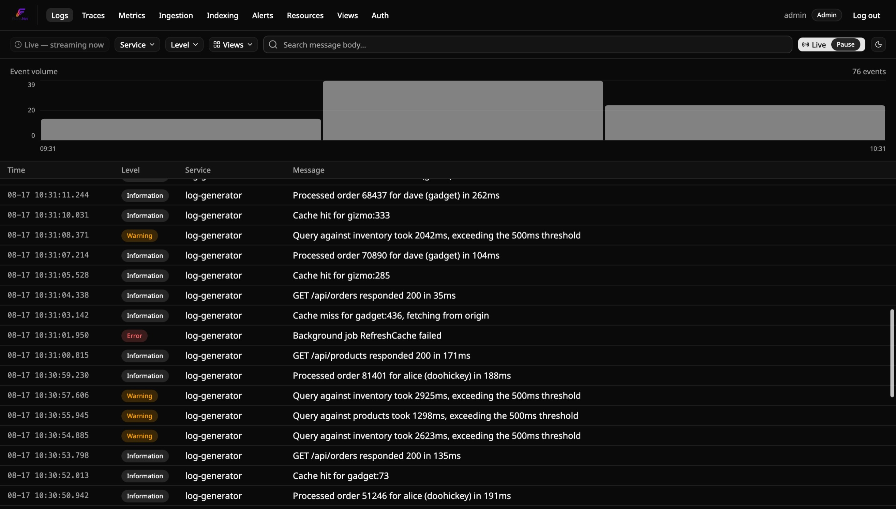
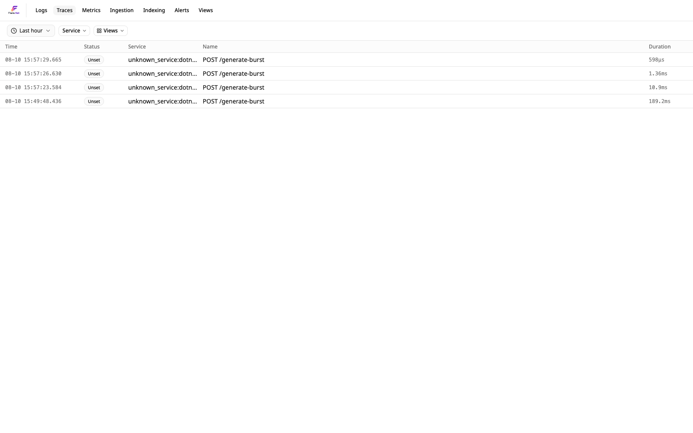
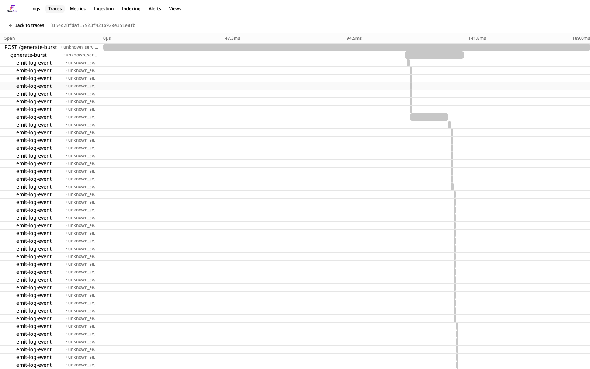
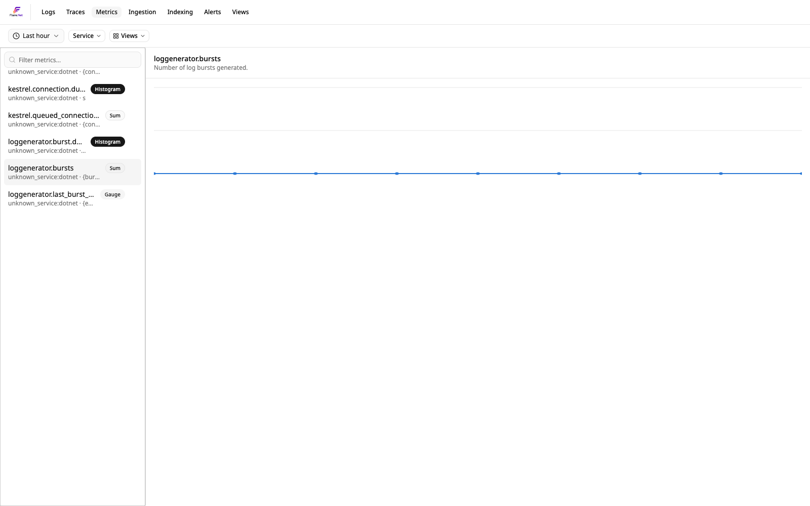
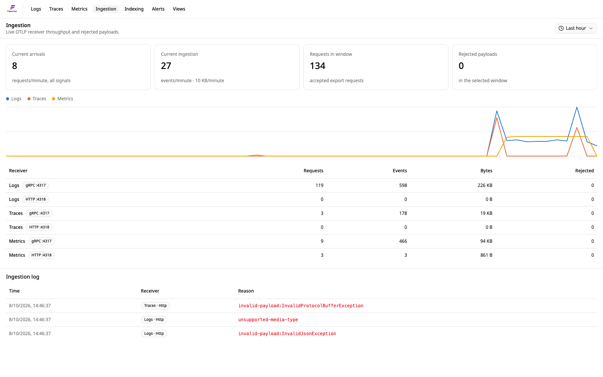
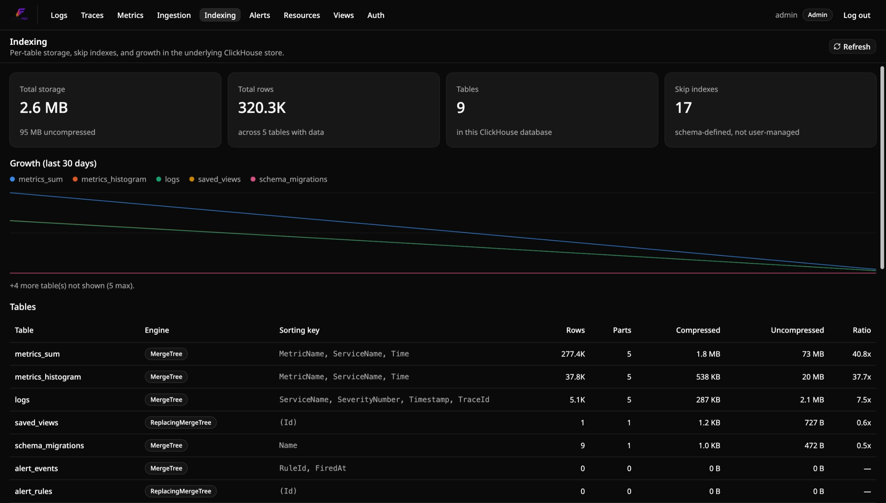
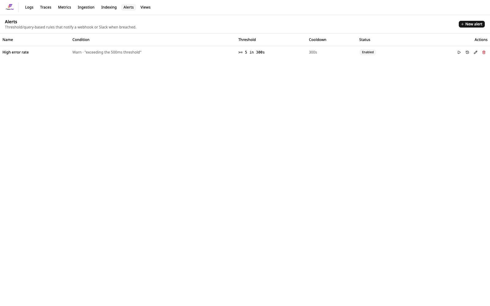
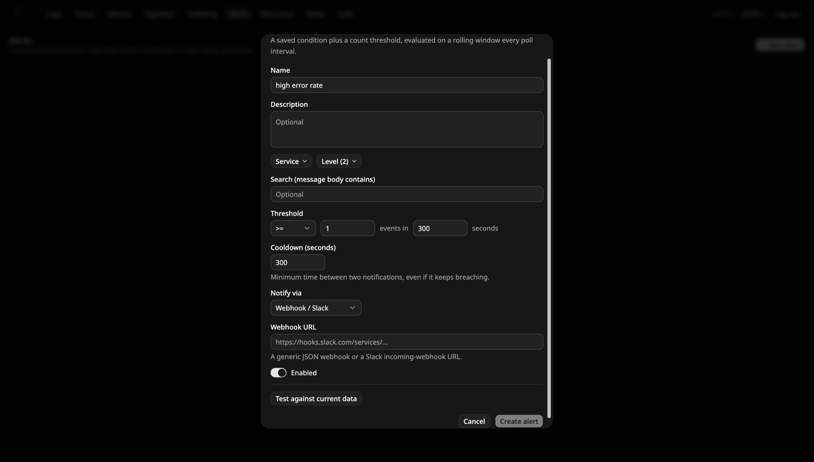
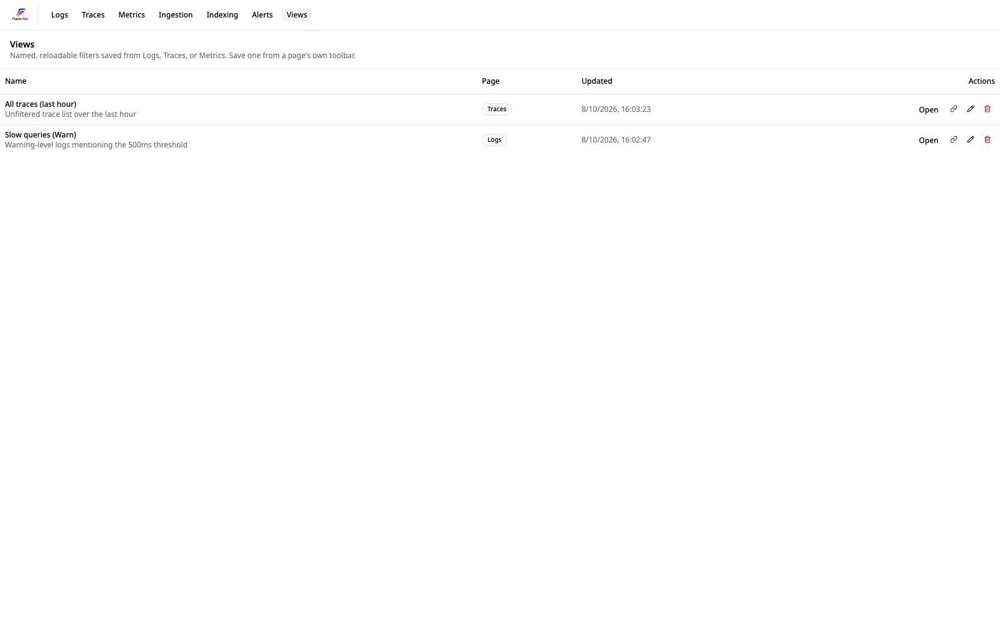

# Getting started

Flare ingests logs over **OTLP** — there's no Flare-specific client library required at
the call site, ever. What differs is how you get Flare itself *running*, and that comes
down to one question: **is the app you want logs from already orchestrated with .NET
Aspire?**

## Using Flare from a .NET Aspire app (recommended)

If your app already has an AppHost, `Flare.Hosting.Aspire` adds the whole Flare stack —
ClickHouse, Redis, the OTLP ingest receiver, the query API, and the dashboard — to it as
one more resource, and `Flare.Aspire` wires your project's logger to it in one line:

```csharp
// AppHost
var flare = builder.AddFlare("flare");

builder.AddProject<Projects.MyApi>("myapi")
    .WithReference(flare)
    .WaitForFlare(flare);
```

```csharp
// MyApi
builder.AddFlareOtlpExporter("flare");
```

No `docker compose up`, no separate services to run or ports to remember — Aspire starts
and stops the whole stack alongside your own app. Both packages are published on
nuget.org (`dotnet add package Flare.Hosting.Aspire` / `Flare.Aspire`).

**See [docs/aspire-hosting.md](aspire-hosting.md)** for the full `AddFlare(...)` API,
and [`examples/`](../examples) for a runnable demo.

## Running Flare standalone (not using Aspire)

Not using .NET Aspire, or want Flare running as its own thing rather than tied to one
app's orchestration? Docker is the only way to run Flare standalone.

**See [docs/standalone.md](standalone.md)** for both — bringing the stack up with
`docker compose up`, and a copy-paste OTLP snippet per logger (Serilog, NLog, ZLogger,
`Microsoft.Extensions.Logging`) once it's running.

## Tour of the dashboard

Either path above lands you in the same place: `Flare.Dashboard` at
[http://localhost:3000](http://localhost:3000) (or wherever `flare-dashboard`'s Aspire
resource URL points). First visit creates the admin account — see
[docs/auth.md](auth.md) — after that it's a normal login. Once you're in, it's a single
SvelteKit SPA with seven pages behind one nav bar, all talking to `Flare.Api` over
HTTP/WebSocket — no separate tools for logs, traces, metrics, or alerting.

### Logs

The default view (`/`). A dense, virtualized log table with live tail (real-time
streaming, pause/resume), an event-volume chart, and filters for service, level, and
free-text search over the message body. Click any row to expand its full structured
payload, scopes, and exception details.



### Traces

`/traces` — every OTLP trace Flare has received, filterable by service and time range.
Auto-instrumented spans (ASP.NET Core, HttpClient, …) and anything your own code emits
via `ActivitySource` show up side by side.



Click into a trace for the waterfall view — parent/child spans laid out by start time
and duration, the same shape as Jaeger/Zipkin but wired straight into the rest of the
dashboard.



### Metrics

`/metrics` — every OTLP metric instrument (Sum, Gauge, Histogram) reported by your
services, browsable from a searchable sidebar and rendered as a time-series chart per
instrument. Covers both the free `AddAspNetCoreInstrumentation()`/
`AddRuntimeInstrumentation()` data (.NET GC, thread pool, Kestrel, HTTP client/server)
and anything your own `Meter` emits.



### Ingestion

`/ingestion` — operational visibility into the OTLP receiver itself: current
arrival/ingestion rates, a per-signal (logs/traces/metrics) × per-protocol (gRPC/HTTP)
breakdown of requests, events, and bytes, plus an ingestion log of anything Flare
rejected (bad payloads, unsupported media types) and why. The page to check first if
"my logs aren't showing up."



### Indexing

`/indexing` — the underlying ClickHouse store made visible: total storage
(compressed/uncompressed), row counts, table-by-table breakdown (`logs`, `spans`,
`metrics_sum`, `metrics_histogram`, `metrics_gauge`, …) with compression ratios, growth
over the last 30 days, and the skip indexes backing fast filtering. Useful for
capacity planning or just seeing where the bytes go.



### Alerts

`/alerts` — threshold/query-based alert rules: a saved filter (service, level, search
text) plus a count threshold evaluated on a rolling window, with a cooldown and a
"test against current data" dry-run before saving. Firing notifies one of webhook/Slack,
Telegram, or email, depending on the rule's "Notify via" channel — see
[`src/Flare.Api/README.md`](../src/Flare.Api/README.md#alerting) for what each channel
needs configured server-side.




### Views

`/views` — named, reloadable filters saved from the Logs, Traces, or Metrics toolbar's
"Views" control. Save a filter once (e.g. "Warnings mentioning timeout"), and reload it
from here or from that page's own Views dropdown — shareable by link, not tied to
whoever created it.


