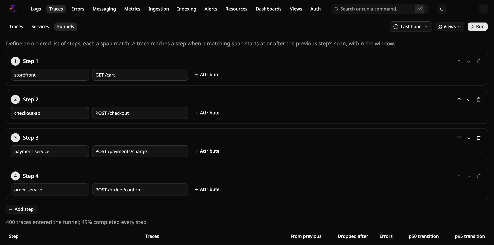
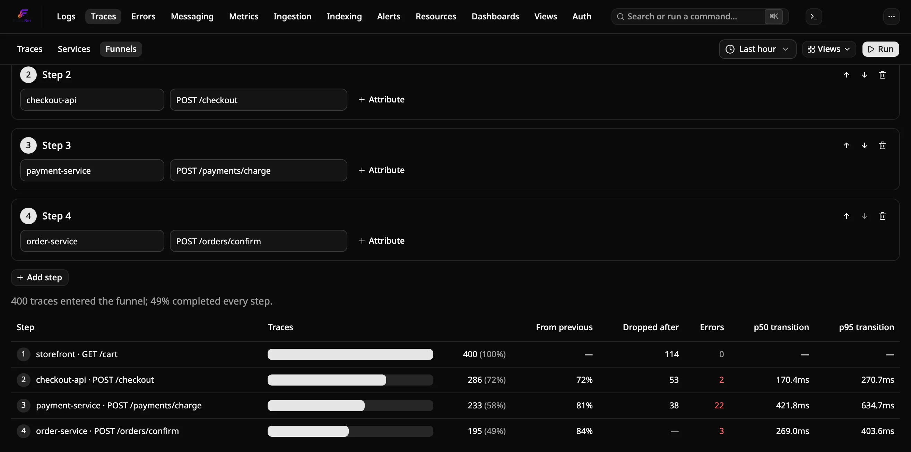
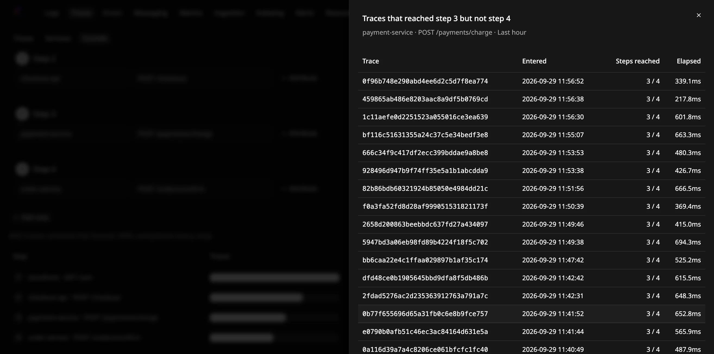

# How to find where requests drop off with trace funnels

A trace funnel follows requests through an ordered list of steps, for
example checkout → payment → confirmation. For each step it shows how many
traces reached it, how many dropped off before the next step, how many
errored there, and how long the transition from the previous step took.

Funnels use the spans Flare already stores. You don't need to change your
instrumentation, and a funnel works on spans stored before you defined it.

## Prerequisites

- A running Flare instance receiving traces from your applications.
- The steps you want to follow must happen inside **one trace**. The services
  involved need to propagate trace context to each other, which the
  OpenTelemetry HTTP, gRPC and messaging instrumentations do by default.

## Define the steps

1. Open **Traces** in the top nav, then the **Funnels** tab.
2. For each step, set any of:
   - **Service**: the exact `service.name` of the span.
   - **Span name**: the exact span name (the operation), for example
     `POST /checkout`.
   - **Attribute** filters: a span, resource or scope attribute, with the
     same operators as the Traces explorer (equals, regex, one of, exists,
     and so on).

   A span matches the step when all of the step's conditions hold. Each step
   needs at least one condition. Both pickers suggest values seen in the
   selected window.
3. Use **Add step** for up to six steps, and the arrows to reorder them.
4. Pick a window (5 minutes to 24 hours) and click **Run**.

## Read the results

| Column | Meaning |
|---|---|
| Traces | Traces that reached this step and every earlier one, in order, with the share of those that entered at step 1 |
| From previous | Share of the previous step's traces that reached this one |
| Dropped after | Traces that reached this step but not the next |
| Errors | Traces whose span for this step has an error status |
| p50 / p95 transition | Time from the start of the previous step's span to the start of this step's span. Hover for the average and p99 |

Click a number under **Traces**, **Dropped after** or **Errors** to list
those traces, most recent first (up to 100). Click a trace ID to open its
waterfall.

The funnel doesn't re-run as you edit the steps. Click **Run** again after
changing them. Changing the window re-runs it.

### How steps are matched

A trace enters the funnel at its earliest span matching step 1. Each later
step then uses the earliest matching span that starts at or after the
previous step's span:

- A step that only happened *before* the previous one doesn't count.
- When several spans after the previous step match, the first one counts.
  If a payment fails and a retry succeeds, the trace reaches the payment step
  and counts as an error there, and the latency is measured to the failed
  attempt.
- One span can't satisfy two consecutive steps.

Only spans that start inside the window take part. A trace that is still
running at the end of the window can show up as dropped off.

## Save and share a funnel

Use **Views** → **Save current view** to save the steps and window. Saved
funnels appear in the Views menu on this page and on the **Views** page.
Their **Copy shareable link** URL opens the funnel and runs it. The page reopens the
funnel you last picked.

## Troubleshooting

**No traces reached step 1.** Check the service and span name against a
trace in the Traces explorer. Both must match exactly, including case.

**Everything drops off at one step, but the traces look complete.** The two
services may start separate traces instead of one. Open a trace from the
drill-down list and check that the next step's span is in it.

**The funnel is slow over a long window.** A funnel groups every span that
matches any step in the window. Name a service on every step so Flare can
skip data from other services, or use a shorter window.
