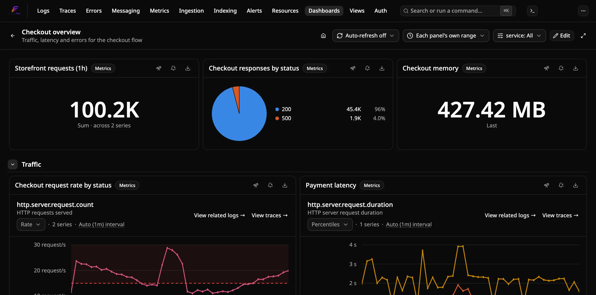
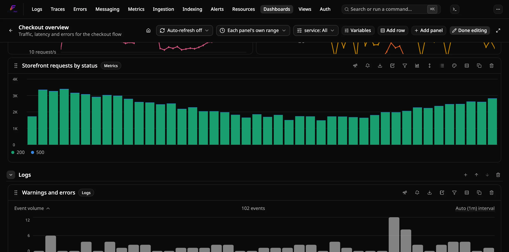
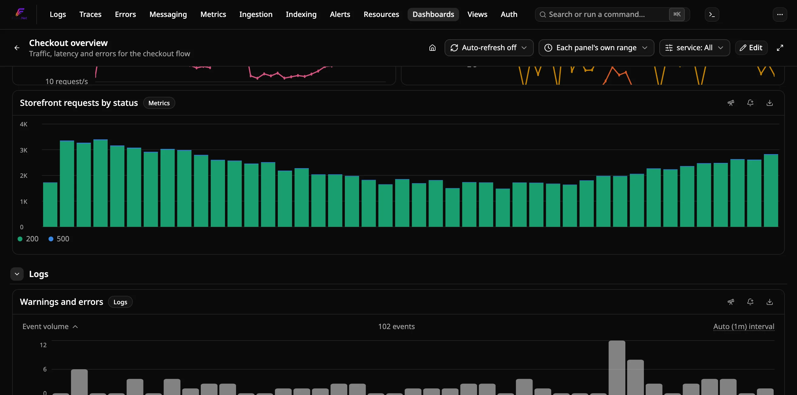
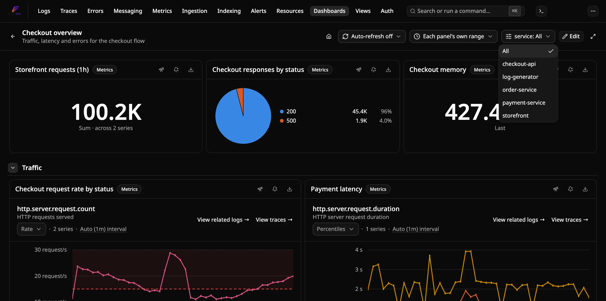

# How to build a custom dashboard

Compose a **multi-panel dashboard** out of queries you already built on the
Logs, Traces, and Metrics pages — one saved object with several widgets on
it, instead of several separate saved searches you have to open one at a
time. For the storage/execution design behind this, see
[the original ADR](../../docs-internal/adr/0023-custom-dashboards.md),
[the editor follow-up](../../docs-internal/adr/0024-custom-dashboards-phase2-editor.md),
and [the variables follow-up](../../docs-internal/adr/0025-dashboard-variables.md);
for the single-page equivalent (one saved filter, no panels), see
[Saved searches](#saved-searches-vs-dashboards) below.

## Prerequisites

- A running Flare instance you can reach in a browser (any of
  [standalone](run-standalone.md), [Aspire](run-with-aspire.md), or the
  [CLI](run-with-cli.md)) with some data already flowing in.

## Steps

There are two ways to get a panel onto a dashboard:

**From an Explorer page** (Logs, Traces, or Metrics):

1. Build the query you want as a panel — a search term, service filter, time
   range, or (on Metrics) a specific selected metric, or a Formula-mode
   expression combining several named metric queries (e.g. `A / B`).
2. Click **Pin to dashboard** in that page's toolbar.
3. Pick an existing dashboard from the **Dashboard** dropdown, or leave
   **New dashboard…** selected to create one on the spot (name it there).
4. Give the panel a title (it's pre-filled with something sensible — the
   page name, the selected metric's name, or the formula expression itself
   on Metrics) and click **Pin**.

**From the dashboard itself**, once it exists:

1. Open the dashboard and click **Edit**.
2. Click **Add panel**, pick a panel type (Logs, Traces, or Metrics), build
   the query using the same filter controls as that page's own toolbar —
   including the Single metric/Formula mode toggle on Metrics — and
   confirm — the live preview underneath shows exactly what will be added.
   Closing the dialog after changing the query or title asks before
   discarding the unsaved panel.

Repeat from either flow, into the same or a different dashboard, for as many
panels as you want.

Open **Dashboards** in the top nav to see every dashboard you've created,
and click **Open** on one to view all its panels together, each showing
live data.

## Editing a dashboard's layout

Click **Edit** on a dashboard to:

- **Drag** a panel (by its grip handle) to reposition it, and **resize** it
  from its corner/edge, on a 12-column grid.
- **Rename** a panel — click its title and type a new one.
- **Describe** a panel (the notebook icon in its header) — optional plain
  text explaining what the panel shows. Once set, an info icon appears next
  to the title in both view and edit mode; hover it to read the text. You
  can also enter a description when adding a panel.
- **Duplicate** a panel (the copy icon in its header) — adds an independent
  copy, named "*(copy)*", below the rest of the dashboard's panels, that you
  can then edit or reposition separately.
- **Remove** a panel (the trash icon in its header).
- **Add** a new panel in place, per the steps above.

Independent of edit mode, every panel also has an **export** icon in its
header that downloads that one panel's type, title, description, size, and query as a
JSON file — the per-panel equivalent of the whole-dashboard Export described
under "Managing dashboards" below, useful as a smaller snapshot when you
only care about one panel's definition. There's no per-panel import — bring
the query back by hand (Add panel, same type, matching filters).

Every change saves immediately — there's no separate "Save" step. Click
**Done editing** to leave edit mode and lock the layout again (view mode
never risks an accidental drag).

## Adding a text panel

A **Text** panel holds Markdown notes instead of a query: a runbook link, a
section header, or a reminder of who owns the service. Pick **Text** in the
Add panel dialog and write the Markdown. In edit mode, the pencil icon in
the panel's header changes it later.

Supported Markdown: headings, paragraphs, bulleted and numbered lists, block
quotes, horizontal rules, fenced code, **bold**, *italic*, `inline code`, and
links. Links must be `http://` or `https://`, and they open in a new tab.
Raw HTML is never rendered, so `<b>x</b>` shows up as literal text. `$name` /
`${name}` references are filled in from the dashboard's variables, the same
way they are in panel titles. A text panel never runs a query, so refresh,
time-range overrides and variable opt-outs don't apply to it, and it renders
immediately instead of waiting to scroll into view. It also has no "Open in
explorer" or "Create alert" action.

## Grouping panels into rows

A row is a named, collapsible section that holds a group of panels, which
helps keep a large dashboard navigable. In edit mode:

- **Add row** (in the header) appends an empty row at the bottom. Click
  its title to rename it.
- The **+** icon on a row's header adds a new panel directly into that row.
- Each panel's **Move to row** menu (the rows icon in its header) moves it
  into any row, or back to the top of the dashboard ("No row"). Panels
  can't be dragged from one row into another. Each row is its own grid, so
  use this menu instead.
- The **arrow** icons on a row's header move it up or down.
- The **trash** icon removes the row. Its panels are kept and moved to the
  top of the dashboard.

Click a row's chevron (or its title, outside edit mode) to collapse or
expand it. A collapsed row shows how many panels it holds, and **none of
its panels load or run a query** until you expand it. That makes collapsing
rarely used sections a cheap way to speed up a heavy dashboard.

Collapsing a row outside edit mode lasts only for your session and doesn't
change the dashboard for anyone else. Collapsing or expanding a row *in*
edit mode saves that as the row's default, which is how everyone sees it
when they open the dashboard.

## Choosing a Metrics panel's visualization

A Metrics panel draws its query as a line chart by default. In edit mode,
its header has a **chart** icon that switches how the same result is drawn,
without touching the query:

| Visualization | Shows |
|---|---|
| **Time series** | One line per series over time (the default). |
| **Bar chart** | One bar per series in each time bucket, side by side. |
| **Value** | One big number for the whole query. |
| **Pie chart** | Each series' share of the total. |
| **Table** | One row per series, with its last, min, average and max (plus sum for a Sum metric). |
| **Histogram** | How often the query's values fell in each range: value ranges along the bottom, number of readings up the side. |
| **Heatmap** | How a Histogram metric's distribution moves over time: time along the bottom, value ranges up the side, color for how many observations fell there. |

A **Time series** or **Bar chart** panel's **Stacking** setting (in the same menu)
changes how its series combine in each bucket (a time series stacks as filled
areas; log scale and the histogram/comparison views don't stack): **None** puts them side by side, **Stacked** piles
them into one bar whose height is the bucket's total, and **Stacked (100%)**
rescales every bucket to fill 0-100% so each series shows its share. Hovering
a 100% bar still shows the real values. Soft Y-axis bounds and thresholds are
in the metric's unit, so they don't apply to a 100% chart.

Bar charts show at most five series, the five largest; the legend says how
many are hidden. A pie chart shows the four largest series and folds the
rest into **Other**.

Value, Pie and Table reduce each series to one number. Pick how under
**Calculate** in the same menu: **Last**, **Average**, **Sum**, **Min** or
**Max**. **Auto** uses **Sum** for a Sum metric (its buckets are counts, so
adding them up gives the total for the range) and **Average** for everything
else. A Value panel on a query with several series adds the series together
in each bucket first, so the number covers the whole query.

Two things differ from the line chart:

- A Sum metric's bars and numbers are raw per-bucket counts, not the
  per-second **Rate** the line chart shows by default.
- A Histogram metric (explicit-bucket or exponential) uses each bucket's **mean** (sum ÷ count). Percentiles
  can't be averaged across buckets, so they aren't used here.

In a table, click a column header to sort by it (click again to reverse),
type in the search box to filter series by name, and use the **download**
icon to save what's shown as CSV. The CSV holds raw values in the metric's
own unit, with no unit suffix, so a spreadsheet can do arithmetic on them.

A table column shows the metric's own unit unless you override it. In edit
mode, a Table panel's header has a **ruler** icon: type a unit for any
column (for example `ms`, `s`, `By` or `By/s`) and click **Apply**. The unit
says what the raw number is in, and Flare scales it from there, so `ms`
reads 1500 as "1.5 s". This is how you give units to a Formula panel, whose
result has none, or fix a metric that doesn't declare one. An unrecognized
unit is shown as a plain suffix. Leave a column blank (or click **Clear**)
to go back to the metric's unit.

A histogram pools every time-bucket reading of every series into one
distribution (each reading is the same one-number-per-bucket value the other
visualizations use, so a Histogram metric contributes its bucket means). The
value ranges are round numbers ("0 / 50 / 100 ms"), with fewer, wider ranges
when there are only a few readings. Hover a bar to see its range and count.

A heatmap needs a Histogram metric (explicit-bucket or exponential); on any other metric it says so. It draws the
observations themselves, not the per-bucket means the other visualizations use, with every series pooled. A
classic explicit-bucket histogram gets one row per bucket; a histogram with many distinct bucket edges (an
exponential one) is cut into 40 rows, log-spaced when all values are positive. Color is logarithmic by default,
so a quiet row stays visible next to a busy one; click the scale label under the chart to switch to linear (the
choice isn't saved with the panel). Hover a cell for its time, range and count. The first bucket of an
explicit histogram is drawn from 0 and the last open-ended one is closed at one bucket-width past the final bound.

[Visual thresholds](#adding-visual-thresholds-to-a-metrics-panel) work on
every visualization except Pie. On a Value panel they color the number, in
a table they color matching cells, and on a histogram they color the bars
whose range matches (a "> 300 ms" rule turns the slow tail red). The
[Y-axis range](#setting-a-y-axis-range-on-a-metrics-panel) only applies to
the line and bar charts. Bars always start at zero, so a range can lower the
floor below zero but not raise it.

Logs and Traces panels have one fixed visualization each (the event-volume
chart and the trace list), so they don't have this menu.

## Setting a Y-axis range on a Metrics panel

In edit mode, a Metrics panel's header also has an **up-down arrow** icon —
set a **min** and/or **max** to pin the chart's Y-axis instead of letting it
auto-range to the data's own peak (useful to keep a mostly-flat metric, like
CPU pinned near 0%, from looking noisier than it is, or to align two panels
charting the same unit on the same scale). Leave either field blank to keep
that side auto-ranged. This is a *soft* bound: the axis still expands past a
set value if the data actually goes further — it narrows the default view,
it never clips a real point off the chart. Like the rest of a panel's
definition, it's saved with the dashboard.

The same popover has a **Linear / Log** scale switch for line charts. Pick
**Log** when series of very different sizes share one panel (a 10 ms and a
10 s latency, say): each power of ten gets the same height, so the small
series no longer lies flat along the bottom. Zero and negative values can't
be placed on a log axis, so they're left out and the line breaks there. A
min set while on **Log** has to be above 0. On the Metrics page, the same
choice is the **Linear axis** / **Log axis** label under the chart title. It's
saved with a saved view, and a panel pinned from that view starts on the
same scale.

## Choosing a chart's bucket interval

By default, a Logs panel's event-volume chart and a Metrics panel's chart
pick their own bucket width (the query step) from the time range, aiming
for roughly 75 points. The label under the chart title shows it, e.g.
**Auto (1h) interval**. Click that label to choose a fixed interval instead
(1s up to 1d). For example, force **1m** buckets over the last 24 hours to
see short spikes, or **1h** for a smoother trend. **Auto** goes back to
the default. The same control is on the Logs and Metrics pages, and the
choice is saved with a saved search or a panel.

A fixed interval is capped at 1,500 buckets for the current range, so
intervals that would go over it are greyed out in the menu. If a saved
interval is too fine for a range you switch to later (1m over 7 days, say),
the chart uses the smallest interval that fits and the label says
**raised to fit range**.

## Adding visual thresholds to a Metrics panel

In edit mode, a Metrics panel's header also has a **palette** icon. Use it
to add ordered threshold rules, each an operator (`>`, `>=`, `<`, `<=`), a
value and a color, for example "`> 500` red, `> 200` orange". Each rule draws a
dashed line at its value and faintly shades the side of the chart its
operator points at. When you hover the chart, any value that matches a rule
shows in that rule's color. If several rules match the same value, the
**topmost** rule wins, so put the most severe rule first and use the arrows
to reorder. Values are in the metric's own unit, the same unit as the
Y-axis range above.

Thresholds are purely visual. They don't notify anyone; for that, use
[an alert rule](#creating-an-alert-from-a-panel). They also never widen the
chart's axis: if a threshold's value falls outside the visible range, its
line isn't drawn. Set a Y-axis range to bring it into view. Like the rest of
a panel's definition, thresholds are saved with the dashboard.

## Fixing the decimal places on a Metrics panel

In edit mode, a Metrics panel has a **Decimal places** button (the `#` icon).
By default Flare picks the precision by magnitude, which can't show a ratio
like 0.0042 usefully. Enter a number from 0 to 6 to pin the decimals on axis
ticks, tooltips and values, for every visualization. Leave it blank (or
**Clear**) to go back to automatic. It's saved with the dashboard.

## Downloading a chart's data as CSV

Time-series charts (Metrics, Formula and the Logs event-volume chart) have a
**CSV** link in the row under the chart title, on dashboard panels and on the
Logs and Metrics pages alike. It saves exactly what the chart is plotting, so
the current Sum/Histogram mode, comparison overlay or group-by is reflected.
There is one row per bucket: a UTC ISO timestamp, the same instant in your
display time zone, then one column per series, named like the legend. A series
with no point in a bucket leaves that cell empty. Values are raw, without unit
scaling. The file is named after the panel's title (or the metric/formula on
the explorer pages).

## Placing the legend and pinning series colors

In edit mode, a Metrics panel whose visualization draws a legend (time
series, bar, stacked bar, or pie) has a **list** icon in its header. Use it
to set where the legend sits: **Bottom**, **Right** (a scrollable column
beside the chart), or **Hidden**. **Default** keeps the visualization's
usual place, which is below the chart for lines and bars and beside it for
a pie.

The same popover lists the series the panel is currently showing, so you
can pin any of them to a fixed color (red, orange, yellow, green, blue, or
purple). For example, you can always draw the `/checkout` route in red. Series
you leave on **Default** keep their automatic palette color. An override
is keyed by the series' full label (service name plus every attribute), so
it applies in every visualization of that panel. If a series with an
override drops out of the result, the popover shows it struck through so
you can reset it. **Reset** clears both the position and every color
override.

### Custom series labels

The same popover has a **Label template** field. Write `{{service}}` for the
service name and `{{key}}` for any attribute value, for example
`{{service}} {{http.route}} {{http.response.status_code}}`. A key the series
doesn't carry renders empty. Leave the field blank to keep the automatic
labels. The template changes only the text shown (legend, tooltip, bar and
pie labels, table and CSV column names); colors stay pinned to the series'
full identity, so renaming a label never resets an override.

## Overriding the time range for a session

The **time range** picker in a dashboard's header (next to Edit) lets you
temporarily view every panel over the same fixed window — "Last 1 hour",
"Last 24 hours", and so on — regardless of what each panel was individually
pinned/added with. Set it back to **Each panel's own range** (or just reload
the page) to go back to each panel showing whatever range it was saved
with. This override is per-browser-session only: it's never saved to the
dashboard, so it never changes what anyone else sees when they open it.

## Setting a default time range

By default a dashboard opens with each panel's own saved range. To open it at one
range instead (a "last 7 days" capacity dashboard, say), click **Edit**, pick the
range in the time-range selector, and click **Save range as default**. Dashboard
owners and Members can do this; it's saved with the dashboard, so it applies to
every viewer. A `?range=` in the link overrides it. To remove it, switch the
selector to **Each panel's own range** and click **Clear default range**.

## Sharing a dashboard view

The time-range override and every variable selection are mirrored into the page URL
(for example `/dashboards/<id>?range=1h&var-<variableId>=checkout`), so copying the
address bar shares exactly what you're looking at. Opening the link applies those
values over the dashboard's own defaults; an empty `var-<variableId>=` means an
explicit "All". Only values that differ from the defaults are written, and the URL is
updated in place, so Back doesn't step through every change.

## Auto-refreshing a dashboard

The **refresh** picker in a dashboard's header (next to the time-range
override) re-runs every panel's query on a fixed interval — 15s, 30s, 1m, or
5m — instead of you reloading the page to see newer data. Set it back to
**Auto-refresh off** to stop. Like the time-range override, this is
per-browser-session only: it resets when you leave the page, and it's never
saved to the dashboard.

## Setting a dashboard as your home page

Click the **home** icon in a dashboard's header to make it the page you land
on instead of the Logs Explorer whenever you open Flare at its root URL (or
click the Flare logo). Click it again to unset it. This is a per-browser
preference (not saved to the dashboard object, so it doesn't affect what
anyone else sees) — if the dashboard is later deleted, Flare falls back to
the Logs Explorer next time rather than showing a broken page.

## Dashboard variables

Click **Variables** in a dashboard's header (in edit mode) to define
dropdowns that temporarily narrow every panel that can use them, for this
browser session — regardless of what each panel was individually
pinned/added with. Unlike the time-range/auto-refresh/service overrides,
which are fixed built-in controls, a variable is something you define
yourself, and any number of them can exist on one dashboard:

1. Click **Add variable** and give it a **name** (shown as its dropdown's
   label in the header) and, optionally, a **description** (shown as a
   tooltip when hovering over that dropdown).
2. Choose what it **backs**:
   - **Service** — narrows every Logs/Traces/Metrics panel's service
     filter, the same thing Phase 4's old fixed Service override did.
   - **Attribute** — narrows Logs and/or Traces panels (Metrics has no
     attribute filter to narrow) to one attribute value. Pick an
     **attribute type** — Log attribute (Logs panels only), Span attribute
     (Traces panels only), or Resource/Scope attribute (both, since those
     are the same ingest-time-correlated bag either way) — and type the
     **attribute key** (e.g. `http.method`).
3. Choose where its **values** come from:
   - **From query** — every distinct value observed over the last 7 days,
     resolved automatically (the same lookup Logs'/Traces' own attribute
     filter builders already use for autocomplete).
   - **Custom list** — a fixed, comma-separated list you type in yourself.
   - **Free text** — no list at all: viewers type a value (a user ID, an
     order ID, a tenant) into a box in the dashboard header, applied on
     Enter or when the box loses focus. An empty box means "All". Always
     single-valued, so **Allow multiple values** doesn't apply.
4. Optionally tick **Allow multiple values** to let viewers pick several
   values at once (for example, two services) instead of just one — see
   "Multi-value variables" below.
5. Optionally set a **default value**, preselected whenever the dashboard
   is opened. Leave it blank for "All" (the variable doesn't narrow
   anything until you pick a value). For a multi-value variable, enter
   several defaults separated by commas.
6. Optionally set **Depends on** (only shown for "From query" variables) to
   chain this variable off another one already defined on the dashboard —
   see "Variable chaining" below.

Each variable then gets its own dropdown next to the time-range/refresh
controls. Selecting a value narrows every panel its target/attribute type
applies to; more than one Service-backed variable combines as "any of
these services" rather than one replacing another. An attribute variable's
value is *added to* a panel's own saved filters, not a replacement — a
panel that already filters on, say, an error level keeps that filter too.
Like the time-range override, a variable's *selected value* is
per-browser-session only and never saved to the dashboard — only its
*definition* (name, target, source) is, via **Variables**, so everyone who
opens the dashboard sees the same dropdowns but can pick their own values.

Each panel can also individually opt out of a variable — see "Per-panel
opt-out" below.

### Variables in panel titles

A panel title can reference a variable by name, and the title then shows
that variable's current selection: `Latency – $service` reads
"Latency – checkout" while `checkout` is selected. Write `$name` for a
name made of letters, digits and underscores, or `${name}` for a name
with spaces or other characters (`${Deployment env}`). Several selected
values are joined with commas, and no selection shows as "All". Names
match case-insensitively. A reference that names no variable on the
dashboard (`Cost in $USD`) stays as typed.

While renaming a panel, type `$` to get a list of the dashboard's
variables; pick one with the mouse, or with the arrow keys and
Enter/Tab, to insert its reference. The saved title keeps the
references, so hovering over the title in edit mode shows the title as
you wrote it.

### Multi-value variables

A variable with **Allow multiple values** ticked shows a checkbox list
instead of a single-value dropdown. Tick as many values as you like: panels
then match *any* of them (a Service variable filters on all the selected
services, an attribute variable matches events whose attribute is any of
the selected values). **All** clears the selection, and hovering a value
shows an **Only** shortcut that selects just that one. The header shows the
first selected value plus how many more are selected (for example,
`Service: checkout +2`).

### Filtering a variable's values with a regex

A "From query" or "Custom list" variable has an optional **Filter values
(regex)** field. Only values matching the expression are offered (and
"All" covers just those), e.g. `^prod-` for "only `prod-*` namespaces". If
the expression has a capture group, its text becomes the *displayed* label:
`^prod-(.*)$` offers only `prod-` values and shows `prod-api` as `api`. The
selected value is still the original one, so panel filters keep matching
real data. An invalid expression is rejected in the form.

### Variable chaining

A "From query" variable can optionally **depend on** another variable
already defined on the dashboard: pick one in its **Depends on** dropdown
(only offered for other variables that wouldn't create a dependency
cycle). Once chained, its own value list is resolved narrowed by whichever
value its parent is *currently* set to (or, for a multi-value parent, any
of its selected values), instead of the unfiltered 7-day
window every independent variable's values are drawn from — for example, a
"Host" variable backing a Resource attribute can depend on a "Service"
variable, so its dropdown only offers hosts actually seen for the
currently-selected service, not every host across every service. Picking
"All" on the parent (or leaving a chained variable's own "Depends on" one
without ever picking a parent value) falls back to the same unfiltered
window a variable with no dependency uses. Changing a parent's selected
value re-resolves every variable chained off it (and, transitively,
anything chained off *those*) automatically; any value in a dependent's
own current selection that's no longer among its freshly-resolved options
is dropped (a single-value dependent resets to "All") rather than silently
keep narrowing panels by a value that's no longer actually offered. Like every other variable relationship, only the
*chain itself* (which variable depends on which) is part of the saved
dashboard — which values are currently selected stays session-only, same
as an unchained variable's own selection.

### Per-panel opt-out

A variable narrows every panel its target/attribute type applies to by
default. To exclude one specific panel from one specific variable, open
**Edit** mode and click the **filter** icon in that panel's own header
(only shown once the dashboard has at least one variable) — it lists
every variable with a checkbox, checked meaning "this variable narrows
this panel." Uncheck one to stop it narrowing that panel; every other
panel keeps being narrowed by it as normal. Like the rest of a panel's
definition (title, size, query), which variables a panel opts out of is
saved with the dashboard — unlike a variable's own *selected value*,
which stays session-only.

### Repeating a panel per variable value

To get one panel per selected value (say, one latency chart per service),
open **Edit** mode and click the **repeat** icon in the panel's header (only
shown once the dashboard has a multi-value variable). Pick the variable under
**Repeat for** and choose **Side by side** or **Stacked**. With two or more
values selected, the panel shows one copy per value, each narrowed to just
that value and labelled with it; clicking a chart or the "Open in" button in
a copy opens that value's data. With **All** or a single value selected, the
panel renders normally. Copies are derived when the dashboard is displayed,
so only the repeat setting is saved, not the copies.

## Creating an alert from a panel

Click the **bell** icon in a Logs or Metrics panel's header to open the
**Create alert** dialog on the Alerts page, pre-filled with that panel's
condition — a Logs panel's service/severity/search filter, or a Metrics
panel's selected metric. Adjust the threshold, window, and notification
channel, then save as usual. Traces panels don't offer this — there's no
trace-based alert condition today (alert rules only support log-count,
metric-threshold, and exception-count conditions).

## Opening a panel in its explorer

Click the **telescope** icon in any panel's header to open that panel's
query in the full Logs, Traces, or Metrics explorer, as the panel
currently shows it. The dashboard's time-range override and the current
variable selections are applied (except for variables the panel
[opts out of](#per-panel-opt-out)). From there you can narrow the query,
save it as a view, or pin it back to a dashboard.

You can also click a point on a panel's chart:

- **Logs** — clicking a bar opens the Logs explorer on that bar's time
  bucket. If the chart is grouped by an attribute, clicking a coloured
  segment also filters to that value. A "(not set)" segment filters to
  events that don't have the attribute. The rolled-up "Other" segment
  adds no filter.
- **Metrics** (line charts) — clicking a point opens the Metrics
  explorer on a window of five buckets either side of it, clamped to the
  range the panel queried. The explorer picks a finer interval for the
  narrower window. There's no per-series narrowing, because the Metrics
  explorer has no attribute filter to carry it.

Formula panels and non-line visualizations (bar, pie, table, and so on)
only offer the header button. Traces panels are a list, so they have
nothing to click.

## Full-screen / TV mode

Click the **full screen** icon in a dashboard's header (next to Edit) to
hide Flare's navigation bar and fill the browser window with just the
dashboard's panels — useful for a wall-mounted display or a TV in a team
space. Click the icon again, or press **Escape**, to exit. This uses your
browser's own full-screen mode, so it's per-browser/per-session like the
time-range override and auto-refresh above — nothing about it is saved to
the dashboard.

## Managing dashboards

Renaming, editing, or deleting a dashboard requires being that dashboard's
own creator or an Admin — anyone else with Member access can still view,
duplicate, or export it, just not change it in place (the "Pin to
dashboard" action on a Logs/Traces/Metrics panel only offers dashboards you
can actually update, for the same reason — pick "New dashboard" instead to
pin into one of your own). A dashboard created before this rule existed (or
on an instance with auth disabled entirely) has no owner recorded, so any
Member can still change it, same as before.

From the **Dashboards** page you can:

- **Create** a blank dashboard (then add panels to it, per the steps above).
- **Create from template** — start from a built-in dashboard for what
  common OpenTelemetry sources emit: **ASP.NET Core** (`http.server.*`,
  `kestrel.*`), **HttpClient** (`http.client.*`), **.NET runtime**
  (`dotnet.*`: GC, thread pool, exceptions, process), **Host metrics**
  (the collector's hostmetrics receiver, `system.*`), **Kubernetes**
  (`k8s.*`) and **Web vitals** (`browser.web_vital.*`, see
  [Send browser telemetry](send-browser-telemetry.md)). Each is a set of Metrics panels with a **Service** variable
  that picks which service's metrics they show. Installing creates an
  ordinary dashboard — edit, rename or delete it like any other. A panel
  stays empty until a service actually emits its metric, so a template
  only fills in for the instrumentation you have enabled.
- **Rename** a dashboard's name or description.
  Names are unique (case-insensitive) within a project, with instance-wide
  dashboards sharing one namespace; a name already in use is rejected with a
  409. Duplicating a dashboard twice names the second copy "*(copy) 2*".
- **Duplicate** a dashboard — creates an independent copy with the same
  panels, named "*(copy)*", that you can then edit separately.
- **Export** a dashboard — downloads its name, description, and panel
  definitions as a JSON file, a readable backup/snapshot you can also use
  to move a dashboard to another Flare instance (see **Import** below).
- **Import** a dashboard — pick a JSON file to create a new dashboard from
  it. Two shapes are recognized from the same file picker:
  - A Flare export (previously produced by Export, on this instance or
    another one) — panels come back exactly as exported, queries included.
  - A Grafana dashboard export ("Export as JSON" from Grafana's own UI, or
    the `dashboard` field of its `GET /api/dashboards/uid/:uid` response) —
    layout (panel position/size) and titles carry over, and each panel's
    type maps to the closest of Flare's three (time-series/stat/gauge-style
    panels → Metrics, logs/table panels → Logs, trace panels → Traces). A
    Metrics panel also keeps the nearest visualization: stat, gauge and bar
    gauge panels become **Value**, bar charts become **Bar chart**, pie
    charts become **Pie chart**, and histogram panels become **Histogram**, and heatmap panels become **Heatmap**.
    **Queries don't** — a Grafana panel's query is written against whatever
    datasource it points at (PromQL, LogQL, ...), which has no equivalent in
    Flare's own log/trace/metric query shapes, so every imported panel's
    query is reset to a blank default and needs configuring afterward (open
    the panel and set what it shows, same as a brand-new panel). A panel
    type with no Flare equivalent (text, heatmap, node graph, ...) is
    skipped rather than guessed at; the import summary says how many panels
    came in and how many were skipped, and why.

  An invalid or unrelated file (neither shape) is rejected with an inline
  error rather than partially imported.
- **Tag and pin** dashboards to keep a long list manageable. Add free-form
  tags (up to 10 per dashboard, 32 characters each, stored in lowercase)
  from the create/rename dialog; the Dashboards page then shows a search box
  (matching name, description and tags) and a chip per tag in use — click
  chips to filter, and a dashboard must carry every selected tag. The pin
  icon on a row floats that dashboard to the top of *your* list, most
  recently pinned first. Pins are per user and any signed-in user, Viewers
  included, can set them; with auth disabled they are shared. Tags belong to
  the dashboard, so anyone who may rename it may change them.
- **Delete** a dashboard. This only removes the dashboard object itself —
  it never touches the underlying Logs/Traces/Metrics data.

## Verification

Open a dashboard with at least one panel on it and confirm each panel is
showing real, current data (not stuck loading or empty) — a Logs panel
shows its usual event-volume chart, a Metrics panel its usual line/
percentile chart, and a Traces panel its usual trace list, exactly as they
look on their own page. Then click **Edit** and confirm a drag/resize
sticks after leaving edit mode and reloading the page.

## Saved searches vs. dashboards

Both start from the same place — a query you built on Logs/Traces/Metrics —
but they solve different problems:

| | Saved search (**Views**) | Dashboard |
|---|---|---|
| Scope | One page's filter state | Several panels, any mix of pages |
| Reopening it | Replaces the current page's filter | Shows every panel side by side |
| Best for | "Get back to this exact search fast" | "See several things at a glance" |

Nothing stops you from having both a saved search and a dashboard panel for
the same query — pinning/adding a panel doesn't consume or remove a saved
search.

Each page also remembers the saved search you last opened (or saved) from
its **Views** menu, and reopens it the next time you visit that page
without a link. The memory is per browser, not per account. **Clear
filters** on Logs/Traces forgets it, and so does deleting that saved search.
A shared `?view=` link, a deep link from another page, or a home dashboard
always takes priority over it.

## Known gaps, stated plainly

- **Grafana import is structural only** — layout and panel type come over,
  queries don't (see "Managing dashboards" above for why). There's no plan
  to build real query translation; the datasources don't correspond.
  Grafana rows are flattened too: their panels come over, but not as Flare
  rows. Regroup them after importing (see "Grouping panels into rows").
- **Visualizations are Metrics-only** — Logs and Traces panels can't switch
  visualization. The histogram pools all series into one distribution;
  there's no per-series breakdown.
- **No per-panel import** — duplicate and export work per-panel (see
  "Editing a dashboard's layout" above), but a panel's exported JSON can't
  be read back in; only a whole dashboard's export/import round-trips.
- **Dashboards are visible to every signed-in user**, the same as saved
  searches and alert rules — there's no private/shared-only dashboards yet.
  (The "set as home page" preference above is per-browser, not per-user,
  and doesn't change who can see the dashboard itself.) *Who may change* a
  given dashboard is narrower, though — see "Managing dashboards" below.

None of these are permanent limits, just not built yet.
