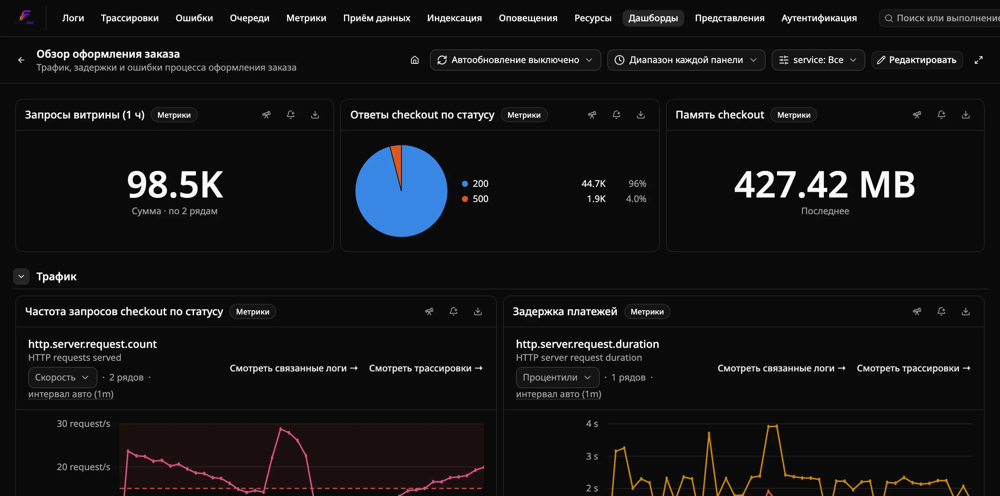
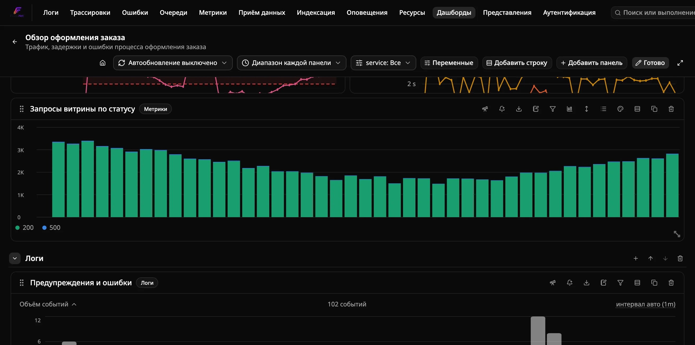
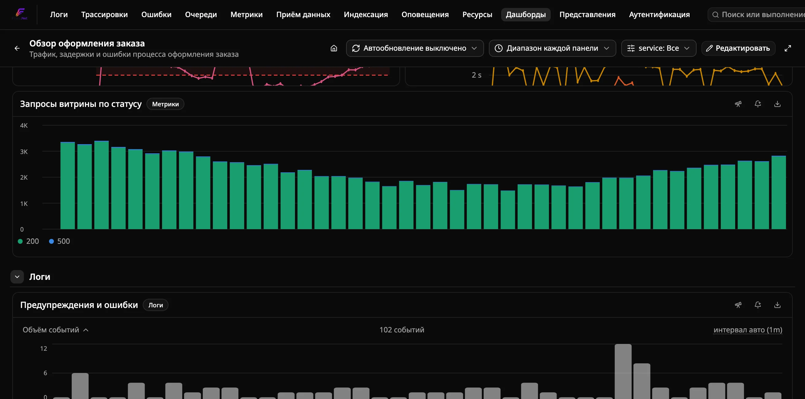
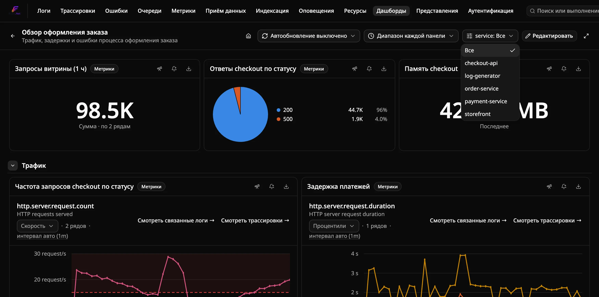

<!-- Translated (ru) from docs/how-to/build-custom-dashboards.md · source-sha256:c125406669807623 · hand-translated by Claude, not generated by scripts/translate-docs.py - edit the source file and retranslate if it changes, don't machine-retranslate over this. -->

# Как создать пользовательский дашборд

Соберите **многопанельный дашборд** из запросов, которые вы уже
сформировали на страницах Logs, Traces и Metrics — один сохранённый объект
с несколькими виджетами вместо нескольких отдельных сохранённых поисков,
которые приходится открывать по одному. Дизайн хранения и выполнения,
стоящий за этой функцией, описан [в исходном ADR](../../docs-internal/adr/0023-custom-dashboards.md),
[в дополнении про редактор](../../docs-internal/adr/0024-custom-dashboards-phase2-editor.md)
и [в дополнении про переменные](../../docs-internal/adr/0025-dashboard-variables.md);
про эквивалент для одной страницы (один сохранённый фильтр, без панелей)
см. [«Сохранённые поиски» и дашборды](#сохранённые-поиски-и-дашборды) ниже.

## Требования

- Работающий экземпляр Flare, доступный в браузере (подойдёт любой из
  вариантов: [автономный](run-standalone.ru.md), [Aspire](run-with-aspire.ru.md)
  или [через CLI](run-with-cli.ru.md)) с уже поступающими данными.

## Шаги

Добавить панель на дашборд можно двумя способами:

**Со страницы Explorer** (Logs, Traces или Metrics):

1. Постройте запрос, который хотите превратить в панель — поисковый термин,
   фильтр по сервису, временной диапазон, (на странице Metrics) конкретную
   выбранную метрику, либо выражение в режиме Formula, объединяющее
   несколько именованных запросов (например, `A / B`).
2. Нажмите **Pin to dashboard** на панели инструментов этой страницы.
3. Выберите существующий дашборд в выпадающем списке **Dashboard** либо
   оставьте выбранным **New dashboard…**, чтобы создать новый прямо здесь
   (название задаётся тут же).
4. Задайте название панели (оно уже предзаполнено чем-то осмысленным —
   названием страницы, именем выбранной метрики или самим выражением
   формулы на странице Metrics) и нажмите **Pin**.

**Прямо с самого дашборда**, когда он уже создан:

1. Откройте дашборд и нажмите **Edit**.
2. Нажмите **Add panel**, выберите тип панели (Logs, Traces или Metrics),
   постройте запрос теми же элементами фильтра, что и на панели
   инструментов соответствующей страницы — включая переключатель режима
   Single metric/Formula на странице Metrics — и подтвердите — живой
   предпросмотр внизу покажет именно то, что будет добавлено. Если закрыть
   диалог после изменения запроса или названия, появится запрос
   подтверждения, прежде чем несохранённая панель будет отброшена.

Повторите любым из способов, в тот же или другой дашборд, столько раз,
сколько нужно панелей.

Откройте **Dashboards** в верхней навигации, чтобы увидеть все созданные
вами дашборды, и нажмите **Open** на одном из них, чтобы увидеть все его
панели вместе — каждая с живыми данными.

## Редактирование компоновки дашборда

Нажмите **Edit** на дашборде, чтобы:

- **Перетащить** панель (за её ручку) для изменения положения и
  **изменить размер** за угол/край на сетке из 12 колонок.
- **Переименовать** панель — нажмите на её заголовок и введите новый.
- **Описать** панель (значок блокнота в её заголовке) — необязательный
  обычный текст о том, что показывает панель. Если описание задано, рядом с
  заголовком появляется значок информации — и в обычном режиме, и в режиме
  редактирования; наведите на него, чтобы прочитать текст. Описание можно
  также указать при добавлении панели.
- **Дублировать** панель (значок копирования в её заголовке) — добавляет
  независимую копию с названием «*(копия)*» под остальными панелями
  дашборда, которую затем можно редактировать или перемещать отдельно.
- **Удалить** панель (значок корзины в её заголовке).
- **Добавить** новую панель прямо здесь, как описано выше.

Независимо от режима редактирования, у каждой панели также есть значок
**экспорта** в заголовке, который скачивает тип, название, описание, размер и запрос
этой одной панели в виде JSON-файла — аналог экспорта всего дашборда,
описанного ниже в «Управление дашбордами», для случаев, когда нужен снимок
только одной панели. Импорта отдельной панели нет — восстановите запрос
вручную (Добавить панель, тот же тип, те же фильтры).

Каждое изменение сохраняется немедленно — отдельного шага «Save» нет.
Нажмите **Done editing**, чтобы выйти из режима редактирования и снова
заблокировать компоновку (в обычном режиме случайное перетаскивание
исключено).

## Добавление текстовой панели

Панель **Text** хранит заметки в Markdown вместо запроса: ссылку на ранбук,
заголовок раздела или напоминание о владельце сервиса. Выберите **Text** в
диалоге добавления панели и напишите Markdown. В режиме редактирования
текст можно изменить позже значком карандаша в заголовке панели.

Поддерживается: заголовки, абзацы, маркированные и нумерованные списки,
цитаты, горизонтальные линии, блоки кода, **жирный**, *курсив*, `код в
строке` и ссылки. Ссылки должны начинаться с `http://` или `https://` и
открываются в новой вкладке. Сырой HTML не отображается: `<b>x</b>`
показывается как обычный текст. Ссылки `$name` / `${name}` подставляются
из переменных дашборда так же, как в заголовках панелей. Текстовая панель
не выполняет запросов, поэтому обновление, переопределение диапазона
времени и исключение переменных к ней не применяются, а отображается она
сразу, не дожидаясь прокрутки. Действий «Открыть в обозревателе» и
«Создать оповещение» у неё нет.

## Группировка панелей в строки

Строка — это именованная сворачиваемая секция с группой панелей. Она
помогает не теряться в большом дашборде. В режиме редактирования:

- **Добавить строку** (в заголовке) добавляет пустую строку в конец.
  Нажмите на её название, чтобы переименовать.
- Значок **+** в заголовке строки добавляет новую панель прямо в эту
  строку.
- Меню панели **Переместить в строку** (значок строк в её заголовке)
  переносит панель в любую строку или обратно в верх дашборда («Без
  строки»). Перетащить панель из одной строки в другую нельзя: каждая
  строка — отдельная сетка, поэтому используйте это меню.
- Значки **стрелок** в заголовке строки перемещают её вверх или вниз.
- Значок **корзины** удаляет строку. Её панели сохраняются и переносятся
  в верх дашборда.

Нажмите на шеврон строки (или на её название вне режима редактирования),
чтобы свернуть или развернуть её. Свёрнутая строка показывает, сколько в
ней панелей, и **ни одна из её панелей не загружается и не выполняет
запрос**, пока строку не развернут. Поэтому сворачивать редко нужные
секции — дешёвый способ ускорить тяжёлый дашборд.

Сворачивание строки вне режима редактирования действует только в вашей
сессии и ничего не меняет для других. Сворачивание или разворачивание
строки *в* режиме редактирования сохраняется как состояние строки по
умолчанию — именно так её увидят все при открытии дашборда.

## Выбор визуализации панели Metrics

По умолчанию панель Metrics рисует свой запрос линейным графиком. В режиме
редактирования в её заголовке есть значок **графика**, который меняет то,
как рисуется тот же результат, не затрагивая запрос:

| Визуализация | Показывает |
|---|---|
| **Временной ряд** | Одна линия на ряд во времени (по умолчанию). |
| **Столбчатая диаграмма** | Один столбец на ряд в каждом интервале, рядом друг с другом. |
| **Значение** | Одно крупное число для всего запроса. |
| **Круговая диаграмма** | Долю каждого ряда в общей сумме. |
| **Таблица** | Одна строка на ряд: последнее значение, минимум, среднее и максимум (плюс сумма для метрики Sum). |
| **Гистограмма** | Как часто значения запроса попадали в каждый диапазон: диапазоны значений внизу, число измерений сбоку. |
| **Тепловая карта** | Как распределение метрики Histogram меняется во времени: время внизу, диапазоны значений сбоку, цвет показывает число наблюдений. |

Параметр **Наложение** временного ряда и столбчатой диаграммы (в том же меню; временной ряд складывается как закрашенные области, логарифмическая шкала не складывается) меняет то, как ряды
объединяются в каждом интервале: **Нет** — рядом друг с другом, **С накоплением** —
в один столбец, высота которого равна сумме интервала, **С накоплением (100%)** —
каждый интервал растягивается до 0–100%, и видна доля каждого ряда. При наведении
на столбец 100% по-прежнему показываются реальные значения. Мягкие границы оси Y и
пороги заданы в единице метрики, поэтому на диаграмме 100% не применяются.

Столбчатые диаграммы показывают не более пяти рядов — пять самых крупных;
легенда сообщает, сколько скрыто. Круговая диаграмма показывает четыре
самых крупных ряда, а остальные объединяет в **Прочее**.

Значение, круговая диаграмма и таблица сводят каждый ряд к одному числу.
Способ выбирается в разделе **Вычисление** того же меню: **Последнее**,
**Среднее**, **Сумма**, **Минимум** или **Максимум**. **Авто** использует
**Сумму** для метрики Sum (её интервалы — это счётчики, поэтому их сумма
даёт итог за диапазон) и **Среднее** для всего остального. Панель
«Значение» с запросом из нескольких рядов сначала складывает ряды в каждом
интервале, чтобы число покрывало весь запрос.

Два отличия от линейного графика:

- Столбцы и числа метрики Sum — это исходные счётчики за интервал, а не
  посекундная **Скорость**, которую линейный график показывает по
  умолчанию.
- Метрика Histogram (с явными или экспоненциальными интервалами) использует **среднее** каждого интервала (сумма ÷
  количество). Перцентили нельзя усреднять между интервалами, поэтому они
  здесь не используются.

В таблице щёлкните заголовок столбца, чтобы отсортировать по нему (ещё раз —
чтобы изменить направление), введите текст в поле поиска, чтобы
отфильтровать ряды по имени, и нажмите значок **скачивания**, чтобы
сохранить показанное в CSV. CSV содержит исходные значения в собственной
единице метрики, без суффикса единицы, чтобы с ними могла считать
электронная таблица.

Столбец таблицы показывает единицу метрики, если вы её не переопределили. В
режиме редактирования в заголовке панели «Таблица» есть значок **линейки**:
введите единицу для любого столбца (например, `ms`, `s`, `By` или `By/s`) и
нажмите **Применить**. Единица говорит, в чём выражено исходное число, и
Flare масштабирует его от неё: с `ms` значение 1500 читается как «1.5 s».
Так можно задать единицу для панели «Формула», у результата которой её нет,
или исправить метрику, которая её не объявляет. Нераспознанная единица
показывается как обычный суффикс. Оставьте столбец пустым (или нажмите
**Сбросить**), чтобы вернуться к единице метрики.

Гистограмма объединяет все показания по временным интервалам всех рядов в
одно распределение (каждое показание — то же «одно число на интервал», что и
в других визуализациях, поэтому метрика Histogram даёт средние значения своих
интервалов). Диапазоны значений — круглые числа («0 / 50 / 100 ms»); если
показаний мало, диапазонов меньше и они шире. Наведите курсор на столбец,
чтобы увидеть его диапазон и количество.

Для тепловой карты нужна метрика Histogram (с явными или экспоненциальными интервалами); для любой другой метрики
она сообщает об этом. Она рисует сами наблюдения, а не средние по интервалам, как другие визуализации, объединяя
все ряды. Классическая гистограмма с явными интервалами получает по строке на интервал; гистограмма с множеством
различных границ (экспоненциальная) делится на 40 строк, логарифмических, если все значения положительны. Цвет по
умолчанию логарифмический, чтобы малонаселённая строка была видна рядом с загруженной; нажмите на подпись шкалы под
графиком, чтобы переключиться на линейную (выбор не сохраняется с панелью). Наведите курсор на ячейку, чтобы увидеть
время, диапазон и число наблюдений. Первый интервал явной гистограммы рисуется от 0, а последний, открытый,
закрывается на одну ширину интервала после последней границы.

[Визуальные пороги](#визуальные-пороги-на-панели-metrics) работают во всех
визуализациях, кроме круговой диаграммы. На панели «Значение» они окрашивают
число, в таблице — подходящие ячейки, а на гистограмме — столбцы, чей
диапазон подходит (правило «> 300 ms» окрашивает медленный хвост в красный).
[Диапазон оси Y](#настройка-диапазона-оси-y-на-панели-metrics) действует
только на линейный и столбчатые графики. Столбцы всегда начинаются с нуля,
поэтому диапазон может опустить нижнюю границу ниже нуля, но не поднять её.

У панелей Logs и Traces по одной фиксированной визуализации (график объёма
событий и список трасс), поэтому этого меню у них нет.

## Настройка диапазона оси Y на панели Metrics

В режиме редактирования в заголовке панели Metrics также есть значок
**стрелки вверх-вниз** — задайте **мин.** и/или **макс.**, чтобы закрепить
ось Y графика вместо автоматического масштабирования по пику данных
(полезно, чтобы стабильная метрика, например загрузка CPU около 0%, не
выглядела более «шумной», чем есть, или чтобы выровнять две панели с
одинаковой единицей измерения по одному масштабу). Оставьте поле пустым,
чтобы эта сторона осталась автоматической. Это *мягкая* граница: ось
по-прежнему выходит за пределы заданного значения, если данные заходят
дальше — она лишь сужает вид по умолчанию и никогда не обрезает реальную
точку на графике. Как и остальные параметры панели, это сохраняется вместе
с дашбордом.

В том же окне есть переключатель шкалы **Линейная / Логарифмическая** для
линейных графиков. Выберите логарифмическую, когда на одной панели серии очень
разного масштаба (например, задержки 10 мс и 10 с): каждая степень десяти
получает одинаковую высоту, и маленькая серия больше не лежит у самого низа.
Нулевые и отрицательные значения нельзя отложить на логарифмической шкале,
поэтому они пропускаются, а линия в этом месте прерывается. На
логарифмической шкале минимум должен быть больше 0. На странице Metrics тот
же выбор — подпись **Линейная ось** / **Логарифмическая ось** под заголовком
графика. Он сохраняется в сохранённом представлении, и панель, закреплённая
из него, открывается с той же шкалой.

## Выбор интервала агрегации графика

По умолчанию график объёма событий на панели Logs и график на панели
Metrics сами выбирают ширину интервала (шаг запроса) по временному
диапазону, стремясь примерно к 75 точкам. Подпись под заголовком графика
показывает его, например **интервал авто (1h)**. Нажмите на подпись, чтобы
выбрать фиксированный интервал (от 1s до 1d). Например, задайте **1m** за
последние 24 часа, чтобы увидеть короткие всплески, или **1h** для более
гладкого тренда. **Авто** возвращает поведение по умолчанию. Тот же элемент
есть на страницах Logs и Metrics, а выбор сохраняется в сохранённом поиске
и в панели.

Фиксированный интервал ограничен 1 500 интервалами для текущего диапазона,
поэтому слишком мелкие варианты в меню недоступны. Если сохранённый
интервал слишком мелкий для диапазона, выбранного позже (например, 1m за
7 дней), график использует наименьший подходящий интервал, а подпись
сообщает **увеличен под диапазон**.

## Визуальные пороги на панели Metrics

В режиме редактирования в заголовке панели Metrics также есть значок
**палитры**. С его помощью можно добавить упорядоченные правила порогов:
у каждого есть оператор (`>`, `>=`, `<`, `<=`), значение и цвет, например
«`> 500` красный, `> 200` оранжевый». Каждое правило рисует пунктирную
линию на своём значении и слегка затеняет ту сторону графика, на которую
указывает оператор. При наведении на график значение, подходящее под
правило, отображается цветом этого правила. Если одному значению
соответствуют несколько правил, побеждает **самое верхнее**, поэтому
ставьте самое критичное правило первым и меняйте порядок стрелками.
Значения задаются в собственной единице метрики, той же, что и диапазон
оси Y выше.

Пороги чисто визуальные и никого не уведомляют; для этого используйте
[правило оповещения](#создание-оповещения-из-панели). Они также никогда не
расширяют ось графика: если значение порога выходит за видимый диапазон,
его линия не рисуется. Задайте диапазон оси Y, чтобы порог попал в поле
зрения. Как и остальные параметры панели, пороги сохраняются вместе с
дашбордом.

## Фиксированное число знаков после запятой в панели Metrics

В режиме редактирования у панели Metrics есть кнопка **Знаки после запятой**
(значок `#`). По умолчанию Flare выбирает точность по порядку величины, и
такое значение, как 0,0042, толком не показать. Введите число от 0 до 6, чтобы
зафиксировать знаки на делениях осей, в подсказках и значениях для всех
визуализаций. Оставьте поле пустым (или нажмите **Сбросить**) для возврата к
автоматическому режиму. Настройка сохраняется вместе с дашбордом.

## Скачивание данных графика в CSV

У графиков временных рядов (Metrics, Formula и график объёма событий в Logs)
есть ссылка **CSV** в строке под заголовком графика — и на панелях дашборда,
и на страницах Logs и Metrics. Сохраняется ровно то, что нарисовано на
графике: учитываются текущий режим Sum/Histogram, наложение сравнения и
группировка. Одна строка на интервал: UTC-метка времени в формате ISO, тот же
момент в вашем часовом поясе отображения, затем по столбцу на каждый ряд с
названием как в легенде. Если у ряда нет точки в интервале, ячейка пуста.
Значения сырые, без масштабирования единиц. Файл называется по заголовку
панели (или по метрике/формуле на страницах исследования).

## Размещение легенды и закрепление цветов рядов

В режиме редактирования у панели Metrics, визуализация которой рисует
легенду (временной ряд, столбцы, столбцы с накоплением или круговая
диаграмма), в заголовке есть значок **списка**. Через него задаётся
положение легенды: **Снизу**, **Справа** (прокручиваемая колонка рядом с
графиком) или **Скрыта**. **По умолчанию** оставляет обычное место для
визуализации: под графиком для линий и столбцов, сбоку для круговой
диаграммы.

В том же окне перечислены ряды, которые панель показывает сейчас, и
любому из них можно закрепить постоянный цвет (красный, оранжевый,
жёлтый, зелёный, синий или фиолетовый), например всегда рисовать маршрут
`/checkout` красным. Ряды, оставленные на **По умолчанию**, сохраняют
автоматический цвет палитры. Переопределение привязано к полной метке ряда
(имя сервиса и все атрибуты), поэтому действует в любой визуализации этой
панели. Если ряд с переопределением пропал из результата, он показан
зачёркнутым, чтобы его можно было сбросить. **Сбросить** очищает и
положение, и все переопределения цветов.

### Свои подписи рядов

В том же всплывающем окне есть поле **Шаблон подписи**. Пишите `{{service}}`
для имени сервиса и `{{key}}` для значения любого атрибута, например
`{{service}} {{http.route}} {{http.response.status_code}}`. Если у ряда нет
такого ключа, подставляется пустая строка. Оставьте поле пустым, чтобы
сохранить автоматические подписи. Шаблон меняет только отображаемый текст
(легенда, подсказка, подписи столбцов и секторов, названия колонок таблицы и
CSV); цвета остаются привязаны к полной идентичности ряда, поэтому смена
подписи не сбрасывает переопределения.

## Переопределение временного диапазона на время сессии

Переключатель **временного диапазона** в заголовке дашборда (рядом с Edit)
позволяет временно просматривать все панели за одно и то же фиксированное
окно — «Last 1 hour», «Last 24 hours» и так далее — независимо от того, с
каким диапазоном была закреплена или добавлена каждая панель. Верните его
на **Each panel's own range** (или просто перезагрузите страницу), чтобы
вернуться к тому, что каждая панель показывает диапазон, с которым была
сохранена. Это переопределение действует только в пределах сессии браузера:
оно никогда не сохраняется в дашборде, поэтому никак не меняет то, что
видят другие люди, открывающие его.

## Диапазон времени по умолчанию

По умолчанию дашборд открывается с сохранённым диапазоном каждой панели. Чтобы он
открывался с одним диапазоном (например, дашборд ёмкости «за 7 дней»), нажмите
**Edit**, выберите диапазон в селекторе времени и нажмите **Сохранить диапазон по
умолчанию**. Это доступно владельцу дашборда и участникам (Member); значение хранится
в дашборде и действует для всех. Параметр `?range=` в ссылке имеет приоритет. Чтобы
убрать его, переключите селектор на **Диапазон каждой панели** и нажмите **Сбросить
диапазон по умолчанию**.

## Как поделиться видом дашборда

Переопределение диапазона времени и выбранные значения переменных отражаются в URL
страницы (например, `/dashboards/<id>?range=1h&var-<variableId>=checkout`), поэтому
скопированный адрес передаёт ровно то, что вы видите. Открытая по ссылке страница
применяет эти значения поверх значений дашборда по умолчанию; пустой
`var-<variableId>=` означает явное «Все». В URL попадают только значения, отличающиеся
от значений по умолчанию, а сам адрес обновляется на месте, поэтому кнопка «Назад» не
проходит по каждому изменению.

## Автообновление дашборда

Переключатель **автообновления** в заголовке дашборда (рядом с
переопределением временного диапазона) повторяет запрос каждой панели с
фиксированным интервалом — 15 с, 30 с, 1 мин или 5 мин — вместо того чтобы
перезагружать страницу для новых данных. Верните его на **Автообновление
выключено**, чтобы остановить. Как и переопределение временного диапазона,
это действует только в пределах сессии браузера: сбрасывается при уходе со
страницы и никогда не сохраняется в дашборде.

## Дашборд как домашняя страница

Нажмите значок **домика** в заголовке дашборда, чтобы сделать его страницей,
на которую вы попадаете вместо Logs Explorer при открытии корневого URL
Flare (или клике по логотипу Flare). Нажмите ещё раз, чтобы отменить. Это
персональная настройка браузера (не сохраняется в объекте дашборда, поэтому
не влияет на то, что видят другие) — если дашборд позже удалят, в следующий
раз Flare вернётся к Logs Explorer вместо показа неработающей страницы.

## Переменные дашборда

Нажмите **Переменные** в заголовке дашборда (в режиме редактирования),
чтобы определить выпадающие списки, которые временно сужают каждую
панель, способную их использовать, на время этой сессии браузера —
независимо от того, с чем каждая панель была индивидуально
закреплена/добавлена. В отличие от фиксированных переопределений
временного диапазона/автообновления/сервиса, которые можно только
включить, переменную вы определяете сами, и на одном дашборде их может
быть сколько угодно:

1. Нажмите **Добавить переменную** и дайте ей **имя** (отображается как
   подпись её выпадающего списка в заголовке) и, при желании,
   **описание** (показывается подсказкой при наведении на этот список).
2. Выберите, на что она **влияет**:
   - **Сервис** — сужает фильтр сервиса каждой панели Logs/Traces/Metrics,
     то же самое, что делало старое фиксированное переопределение Сервис
     из Фазы 4.
   - **Атрибут** — сужает панели Logs и/или Traces (у Metrics нет фильтра
     атрибутов для сужения) до одного значения атрибута. Выберите **тип
     атрибута** — атрибут лога (только панели Logs), атрибут спана
     (только панели Traces) или атрибут ресурса/области (оба типа панелей,
     так как это одна и та же группа, коррелируемая на момент приёма
     данных) — и введите **ключ атрибута** (например, `http.method`).
3. Выберите, откуда берутся её **значения**:
   - **Из запроса** — каждое уникальное значение, наблюдавшееся за
     последние 7 дней, определяется автоматически (тот же поиск, который
     уже используют построители фильтров атрибутов Logs/Traces для
     автодополнения).
   - **Свой список** — фиксированный список через запятую, который вы
     вводите сами.
   - **Произвольный текст** — без списка: зритель вводит значение (ID
     пользователя, заказа, тенанта) в поле в шапке дашборда; оно применяется
     по Enter или при потере фокуса. Пустое поле означает «Все». Значение
     всегда одно, поэтому **Разрешить несколько значений** не действует.
4. При желании отметьте **Разрешить несколько значений**, чтобы можно было
   выбрать сразу несколько значений (например, два сервиса), а не одно —
   см. «Переменные с несколькими значениями» ниже.
5. При желании задайте **значение по умолчанию**, предварительно
   выбираемое при каждом открытии дашборда. Оставьте пустым для «Все»
   (переменная ничего не сужает, пока не выбрано значение). Для переменной
   с несколькими значениями введите несколько значений через запятую.
6. При желании укажите **Зависит от** (доступно только для переменных «Из
   запроса»), чтобы связать эту переменную с другой, уже определённой на
   дашборде — см. «Цепочки переменных» ниже.

После этого у каждой переменной появляется собственный выпадающий список
рядом с элементами управления временным диапазоном/автообновлением.
Выбор значения сужает каждую панель, к которой применима её цель/тип
атрибута; несколько переменных с целью Сервис объединяются как «любой из
этих сервисов», а не заменяют друг друга. Значение переменной-атрибута
*добавляется к* уже сохранённым фильтрам панели, а не заменяет их —
панель, которая уже фильтрует, скажем, по уровню ошибки, сохранит и этот
фильтр тоже. Как и переопределение временного диапазона, *выбранное
значение* переменной действует только в рамках браузера/сессии и никогда
не сохраняется в дашборде — сохраняется только её *определение* (имя,
цель, источник), через **Переменные**, так что все, кто открывает
дашборд, видят одни и те же выпадающие списки, но могут выбрать свои
значения.

Любая панель также может индивидуально отключить переменную — см.
«Отключение переменной для отдельной панели» ниже.

### Переменные в заголовках панелей

Заголовок панели может ссылаться на переменную по имени — тогда он
показывает её текущее значение: `Задержка – $service` читается как
«Задержка – checkout», пока выбран `checkout`. Пишите `$имя` для имени
из букв, цифр и подчёркиваний или `${имя}` для имени с пробелами или
другими символами (`${Среда развёртывания}`). Несколько выбранных
значений перечисляются через запятую, а отсутствие выбора отображается
как «Все». Имена сравниваются без учёта регистра. Ссылка, которая не
называет ни одну переменную дашборда (`Стоимость в $USD`), остаётся как
есть.

При переименовании панели введите `$`, чтобы получить список переменных
дашборда; выберите нужную мышью или стрелками и Enter/Tab, чтобы
вставить ссылку на неё. Сохранённый заголовок хранит ссылки, поэтому в
режиме редактирования при наведении на заголовок видно, как он был
написан.

### Переменные с несколькими значениями

Переменная с отмеченным **Разрешить несколько значений** показывает список
флажков вместо выпадающего списка с одним значением. Отметьте сколько
угодно значений: панели будут показывать данные, совпадающие с *любым* из
них (переменная Сервис фильтрует по всем выбранным сервисам,
переменная-атрибут оставляет события, у которых атрибут равен любому из
выбранных значений). **Все** сбрасывает выбор, а при наведении на значение
появляется ярлык **Только**, выбирающий только его. В заголовке
показывается первое выбранное значение и число остальных выбранных
(например, `Service: checkout +2`).

### Фильтрация значений переменной регулярным выражением

У переменной «Из запроса» или «Свой список» есть необязательное поле
**Фильтр значений (regex)**. Предлагаются только значения, подходящие под
выражение (а «Все» охватывает только их), например `^prod-` — «только
пространства имён `prod-*`». Если в выражении есть группа захвата, её текст
становится *отображаемой* подписью: `^prod-(.*)$` оставляет только значения
с `prod-` и показывает `prod-api` как `api`. Выбранное значение остаётся
исходным, поэтому фильтры панелей по-прежнему совпадают с реальными данными.
Недопустимое выражение отклоняется в форме.

### Цепочки переменных

Переменная «Из запроса» может опционально **зависеть от** другой
переменной, уже определённой на дашборде: выберите её в выпадающем списке
**Зависит от** (предлагаются только те переменные, которые не создали бы
цикл зависимостей). После связывания список её значений определяется
суженным до значения, *текущего выбранного* у родительской переменной
(или, для родителя с несколькими значениями, до любого из выбранных),
вместо неотфильтрованного 7-дневного окна, которое используют независимые
переменные — например, переменная «Хост», сужающая атрибут ресурса, может
зависеть от переменной «Сервис», и тогда её выпадающий список предлагает
только хосты, реально наблюдавшиеся у выбранного сервиса, а не все хосты
по всем сервисам. Выбор «Все» у родительской переменной (или отсутствие
выбранного значения у родителя связанной переменной) возвращает то же
неотфильтрованное окно, что и у переменной без зависимости. Изменение
выбранного значения родительской переменной автоматически переопределяет
каждую переменную, связанную с ней (и, транзитивно, всё, что связано с
теми переменными), — каждое значение из текущего выбора зависимой
переменной, которое больше не входит в её заново определённые опции,
убирается (зависимая переменная с одним значением сбрасывается на «Все»),
вместо
того чтобы молча продолжать сужать панели значением, которое больше не
предлагается. Как и любая другая связь между переменными, в сохранённом
дашборде хранится только сама *цепочка* (какая переменная зависит от
какой) — выбранные сейчас значения остаются только в рамках сессии, как и
выбор у независимой переменной.

### Отключение переменной для отдельной панели

По умолчанию переменная сужает каждую панель, к которой применима её
цель/тип атрибута. Чтобы исключить конкретную панель из действия
конкретной переменной, откройте режим **Редактирования** и нажмите значок
**фильтра** в заголовке этой панели (появляется только когда на дашборде
есть хотя бы одна переменная) — он показывает список всех переменных с
флажками, где отмеченный флажок означает «эта переменная сужает эту
панель». Снимите отметку, чтобы переменная перестала сужать именно эту
панель — все остальные панели, к которым она применима, по-прежнему будут
сужаться ей как обычно. Как и остальное определение панели (заголовок,
размер, запрос), то, от каких переменных отказалась панель, сохраняется
вместе с дашбордом — в отличие от *выбранного значения* самой переменной,
которое остаётся только в рамках сессии.

## Создание оповещения из панели

Нажмите значок **колокольчика** в заголовке панели Logs или Metrics, чтобы
открыть диалог **Создать оповещение** на странице Оповещений, заранее
заполненный условием этой панели — фильтром сервиса/уровня/поиска для
панели Logs или выбранной метрикой для панели Metrics. Настройте порог,
окно и канал уведомления, затем сохраните как обычно. Панели Traces этого
не предлагают — сегодня нет условия оповещения на основе трассировок
(правила оповещений поддерживают только условия по количеству логов,
порогу метрики и количеству исключений).

## Открытие панели в её обозревателе

Нажмите значок **телескопа** в заголовке любой панели, чтобы открыть её
запрос в полном обозревателе Logs, Traces или Metrics — в том виде, в
котором панель показывает его сейчас. Применяются переопределение
диапазона времени дашборда и текущие значения переменных (кроме
переменных, [отключённых для этой панели](#отключение-переменной-для-отдельной-панели)).
Дальше запрос можно сузить, сохранить как представление или снова
закрепить на дашборде.

Можно также нажать на точку графика панели:

- **Logs** — нажатие на столбец открывает обозреватель Logs на интервале
  этого столбца. Если график сгруппирован по атрибуту, нажатие на цветной
  сегмент дополнительно фильтрует по этому значению. Сегмент «(не задано)»
  фильтрует события без этого атрибута. Свёрнутый сегмент «Прочие» не
  добавляет фильтра.
- **Metrics** (линейные графики) — нажатие на точку открывает
  обозреватель Metrics на окне в пять интервалов по обе стороны от неё,
  ограниченном диапазоном, который запрашивала панель. Для более узкого
  окна обозреватель выбирает более мелкий интервал. Сужения до отдельной
  серии нет: у обозревателя Metrics нет фильтра по атрибуту, который мог
  бы его передать.

Панели с формулами и нелинейные визуализации (столбцы, круговая
диаграмма, таблица и т. д.) предлагают только кнопку в заголовке. Панели
Traces — это список, нажимать там не на что.

## Полноэкранный режим / режим ТВ

Нажмите значок **полноэкранного режима** в заголовке дашборда (рядом с
«Редактировать»), чтобы скрыть панель навигации Flare и занять всё окно
браузера только панелями дашборда — удобно для настенного экрана или ТВ в
командном пространстве. Нажмите значок ещё раз или нажмите **Esc**, чтобы
выйти. Используется собственный полноэкранный режим браузера, поэтому это,
как и переопределение временного диапазона и автообновление выше,
действует только в рамках браузера/сессии — ничего не сохраняется в
дашборде.

## Управление дашбордами

Переименовывать, редактировать или удалять дашборд может только его
создатель или Admin — остальные пользователи с доступом Member по-прежнему
могут его просматривать, дублировать и экспортировать, но не изменять
напрямую (действие «Закрепить на дашборде» на панели Logs/Traces/Metrics
по той же причине предлагает только те дашборды, которые вы действительно
можете изменить — выберите «Новый дашборд», чтобы закрепить на своём
собственном). У дашборда, созданного до появления этого правила (или на
инстансе с полностью отключённой аутентификацией), владелец не записан,
поэтому изменить его по-прежнему может любой Member, как и раньше.

На странице **Dashboards** можно:

- **Создать** пустой дашборд (а затем добавить на него панели, как описано
  выше).
- **Создать из шаблона** — начните со встроенного дашборда для того, что
  отправляют типовые источники OpenTelemetry: **ASP.NET Core**
  (`http.server.*`, `kestrel.*`), **HttpClient** (`http.client.*`),
  **среда выполнения .NET** (`dotnet.*`: GC, пул потоков, исключения,
  процесс), **метрики хоста** (ресивер hostmetrics коллектора, `system.*`)
  и **Kubernetes** (`k8s.*`). Каждый шаблон — набор панелей Metrics с
  переменной **Service**, выбирающей, метрики какого сервиса показывать.
  Установка создаёт обычный дашборд — его можно редактировать,
  переименовывать и удалять как любой другой. Панель остаётся пустой,
  пока какой-либо сервис не начнёт отправлять её метрику, так что шаблон
  заполняется только для включённой у вас инструментации.
- **Переименовать** название или описание дашборда.
- **Дублировать** дашборд — создаёт независимую копию с теми же панелями,
  названную «*(копия)*», которую затем можно редактировать отдельно.
- **Экспортировать** дашборд — скачивает его название, описание и
  определения панелей в виде JSON-файла: читаемую резервную копию/снимок,
  которую также можно использовать, чтобы перенести дашборд на другой
  экземпляр Flare (см. **Импортировать** ниже).
- **Импортировать** дашборд — выберите JSON-файл, чтобы создать из него
  новый дашборд. Из одного и того же диалога выбора файла распознаются два
  формата:
  - Экспорт Flare (ранее созданный функцией «Экспортировать», на этом
    экземпляре или на другом) — панели возвращаются в точности как были
    экспортированы, включая запросы.
  - Экспорт дашборда Grafana («Export as JSON» из интерфейса Grafana, или
    поле `dashboard` её ответа `GET /api/dashboards/uid/:uid`) — компоновка
    (позиция/размер панелей) и заголовки переносятся, а тип каждой панели
    сопоставляется с ближайшим из трёх типов Flare (панели типа временной
    ряд/stat/gauge → Metrics, панели logs/table → Logs, панели трасс →
    Traces). Панель Metrics также получает ближайшую визуализацию:
    панели stat, gauge и bar gauge становятся **Значением**, bar chart —
    **Столбчатой диаграммой**, pie chart — **Круговой диаграммой**, а
    панели histogram — **Гистограммой**, а панели heatmap — **Тепловой картой**. **Запросы не переносятся** — запрос панели Grafana написан для
    того источника данных, на который она указывает (PromQL, LogQL, ...), у
    которого нет соответствия в собственных форматах запросов Flare
    (логи/трассы/метрики), поэтому запрос каждой импортированной панели
    сбрасывается на пустое значение по умолчанию и требует настройки после
    импорта (откройте панель и укажите, что она должна показывать — как для
    только что созданной панели). Тип панели без эквивалента в Flare
    (текст, heatmap, node graph, ...) пропускается, а не угадывается;
    сводка импорта показывает, сколько панелей было импортировано и сколько
    пропущено, и почему.

  Неверный или посторонний файл (не подходящий ни под один из форматов)
  отклоняется с ошибкой на экране, а не импортируется частично.
- **Теги и закрепление** помогают ориентироваться в длинном списке.
  Добавляйте произвольные теги (до 10 на дашборд, по 32 символа, хранятся в
  нижнем регистре) в диалоге создания/переименования; на странице Dashboards
  появляются поиск (по названию, описанию и тегам) и чип для каждого
  используемого тега — нажимайте на чипы для фильтрации, дашборд должен
  содержать все выбранные теги. Значок булавки в строке поднимает дашборд в
  начало *вашего* списка, последние закреплённые — выше. Закрепления
  индивидуальны для пользователя, их может ставить любой вошедший
  пользователь, включая Viewer; при отключённой аутентификации они общие.
  Теги принадлежат дашборду, поэтому менять их может тот, кто может его
  переименовать.
- **Удалить** дашборд. Это удаляет только сам объект дашборда — исходные
  данные Logs/Traces/Metrics при этом никак не затрагиваются.

## Проверка

Откройте дашборд хотя бы с одной панелью и убедитесь, что каждая панель
показывает реальные, актуальные данные (не зависла в загрузке и не пустая)
— панель Logs показывает свой обычный график объёма событий, панель
Metrics — обычный линейный/процентильный график, а панель Traces — обычный
список трасс, точно так же, как они выглядят на своей собственной странице.
Затем нажмите **Edit** и убедитесь, что перетаскивание/изменение размера
сохраняется после выхода из режима редактирования и перезагрузки страницы.

## «Сохранённые поиски» и дашборды

Оба начинаются с одного и того же — запроса, построенного на странице
Logs/Traces/Metrics, — но решают разные задачи:

| | Сохранённый поиск (**Views**) | Дашборд |
|---|---|---|
| Область действия | Состояние фильтра одной страницы | Несколько панелей, любое сочетание страниц |
| При повторном открытии | Заменяет текущий фильтр страницы | Показывает все панели рядом друг с другом |
| Лучше всего подходит для | «Быстро вернуться к этому конкретному поиску» | «Увидеть несколько вещей одним взглядом» |

Ничто не мешает иметь одновременно и сохранённый поиск, и панель дашборда
для одного и того же запроса — закрепление или добавление панели не
расходует и не удаляет сохранённый поиск.

Кроме того, каждая страница запоминает сохранённый поиск, который вы
последним открыли (или сохранили) из её меню **Views**, и открывает его
снова при следующем заходе на эту страницу без ссылки. Это запоминается в
браузере, а не в учётной записи. **Clear filters** на Logs/Traces сбрасывает
его, как и удаление этого сохранённого поиска. Общая ссылка `?view=`,
переход по ссылке с другой страницы или домашний дашборд всегда имеют
приоритет.

## Известные ограничения — сказано прямо

- **Импорт из Grafana — только структурный** — компоновка и тип панели
  переносятся, запросы — нет (см. «Управление дашбордами» выше, почему).
  Настоящий перевод запросов не планируется — у источников данных нет
  соответствия. Строки Grafana тоже не сохраняются: их панели переносятся,
  но не как строки Flare. Сгруппируйте их заново после импорта (см.
  «Группировка панелей в строки»).
- **Визуализации есть только у панелей Metrics** — панели Logs и Traces не
  могут менять визуализацию. Гистограмма объединяет все ряды в одно
  распределение; разбивки по рядам нет.
- **Нет импорта отдельной панели** — дублирование и экспорт работают на
  уровне панели (см. «Редактирование компоновки дашборда» выше), но
  экспортированный JSON панели нельзя загрузить обратно — туда и обратно
  работает только экспорт/импорт всего дашборда.
- **Дашборды видны всем авторизованным пользователям**, как и сохранённые
  поиски и правила оповещений — приватных или только-для-своих дашбордов
  пока нет. (Настройка «домашней страницы» выше — персональная для
  браузера, а не для пользователя, и не меняет то, кто может видеть сам
  дашборд.) А вот *кто может его изменять* — уже более узкий круг, см.
  «Управление дашбордами» выше.

Ни одно из этих ограничений не постоянное — они просто ещё не реализованы.
