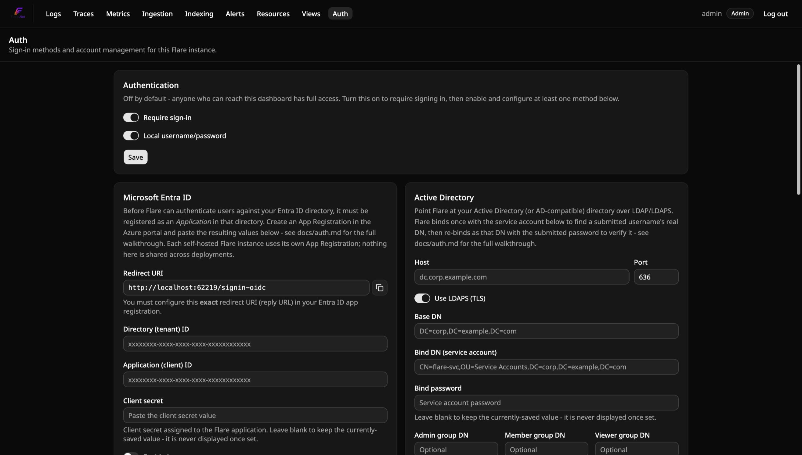

<!-- Translated (fr) from docs/how-to/configure-authentication.md · source-sha256:688bf7340446d492 · hand-translated by Claude, not generated by scripts/translate-docs.py - edit the source file and retranslate if it changes, don't machine-retranslate over this. -->

# Comment configurer l'authentification

Activez la connexion et configurez une ou plusieurs des cinq méthodes
d'authentification de Flare. Pour ce que fait réellement chaque méthode et
pourquoi elle est conçue ainsi, voir
[`../explanation/authentication-model.md`](../explanation/authentication-model.fr.md) ;
pour les clés de configuration exactes et le tableau des rôles, voir
[`../reference/authentication-config.md`](../reference/authentication-config.fr.md#référence-de-configuration).

Tout ce qui suit se passe sur une seule page réservée aux administrateurs,
**`/auth`** :

## Activer la connexion

1. Ouvrez `/auth` (accessible à tous tant que l'authentification est
   désactivée, comme toute autre page tant qu'elle l'est).
2. Basculez le commutateur général **« Require sign-in »** sur activé.
   Cela révèle cinq sections de méthodes — Local / Microsoft Entra ID /
   Active Directory / OpenID Connect / Reverse proxy — chacune avec son
   propre commutateur d'activation et sa configuration intégrée, plus un
   tableau Users en dessous.
3. Créez votre premier compte **Local**, dans la section Local. Le premier
   compte Local que vous créez est toujours `Admin` — il n'y a pas de
   « mode de configuration » séparé au-delà de cela ; dès qu'au moins un
   compte Local existe, la connexion fonctionne normalement. Faites-le
   même si votre plan réel est SSO/AD/proxy — c'est votre voie de secours
   (« break-glass ») si un mappage groupe→rôle venait à être mal
   configuré.

Vous pouvez activer n'importe quelle combinaison des cinq méthodes en même
temps — elles coexistent par conception, elles ne s'excluent pas.

## Configurer Microsoft Entra ID (SSO)

1. Dans Entra ID → **App registrations → New registration**. Mono-tenant
   (« Accounts in this organizational directory only »).
2. **Redirect URI**, plateforme « Web » : connectez-vous à Flare avec
   votre compte Admin local et ouvrez `/auth` — il affiche l'URI de
   redirection *exacte* à coller ici, calculée à partir de l'hôte/port
   que vous utilisez réellement pour atteindre `Flare.Api`. Pour un
   `docker compose up` local, c'est par défaut
   `http://localhost:8080/signin-oidc` ; utilisez `https://` dès que c'est
   accessible au-delà de votre propre machine (voir la mise en garde HTTPS
   ci-dessous).
3. **Certificates & secrets → New client secret.** Copiez la valeur
   immédiatement — comme pour la valeur brute d'une clé API d'ingestion,
   Azure ne l'affiche qu'une seule fois.
4. **App roles** : ajoutez trois entrées `appRoles` avec `"value"` réglé
   exactement sur `Admin`, `Member` et `Viewer` (correspondance
   insensible à la casse, mais gardez-les exactes) et
   `"allowedMemberTypes": ["User"]`. Puis, dans **Enterprise applications
   → your app → Users and groups**, attribuez à chaque personne (ou
   groupe) l'App Role qui doit devenir son rôle Flare. Aucun App Role
   attribué (ou rien configuré du tout) provisionne à la place
   `Auth:Entra:DefaultRole` (`Viewer` sauf surcharge).
5. Notez l'**Application (client) ID** et le **Directory (tenant) ID**
   depuis la page Overview de l'inscription.
6. De retour sur la page `/auth` de Flare, section Microsoft Entra ID :
   collez le Directory (tenant) ID, l'Application (client) ID et le
   client secret, activez **Enabled**, et **Save**.
7. **Redémarrez `Flare.Api`** (`docker compose restart api`, ou un
   `aspire resource restart` en développement local) — les changements de
   paramètres Entra prennent effet au redémarrage, pas à chaud.
8. Déconnectez-vous et vérifiez que « Sign in with Microsoft » apparaît
   sur la page de connexion ; connectez-vous avec un vrai compte pour
   confirmer que tout fonctionne de bout en bout.

**Mise en garde HTTPS :** les cookies de corrélation que le gestionnaire
OIDC d'ASP.NET Core définit pendant l'aller-retour de redirection vers
Microsoft doivent survivre à une navigation intersite, ce que les
navigateurs n'autorisent de façon fiable que via HTTPS (Chrome/Edge font
une exception spéciale pour `http://localhost` en clair, c'est pourquoi le
développement local fonctionne). Tout déploiement réel accessible
au-delà de votre propre machine a besoin de HTTPS pour que la connexion
Entra ID fonctionne.

## Configurer Active Directory (LDAP)

1. Sur `/auth`, dans la section Active Directory, remplissez :
   - **Host** / **Port** — l'adresse de votre contrôleur de domaine. Par
     défaut, le port 636 (LDAPS).
   - **Use LDAPS (TLS)** — activé par défaut ; laissez-le activé pour
     tout ce qui dépasse un annuaire de test jetable.
   - **Pinned server certificate** (optionnel) — collez un certificat
     encodé en PEM pour épingler la confiance TLS de cette connexion sur
     exactement ce certificat, en contournant le magasin de confiance de
     l'OS. Utilisez le certificat racine de votre AC interne si le
     certificat du contrôleur de domaine est signé par une AC privée, ou
     le propre certificat du contrôleur de domaine s'il est auto-signé.
     Vous pouvez coller plusieurs certificats à la suite — une racine
     plus l'intermédiaire qui a réellement signé le certificat feuille du
     contrôleur de domaine, ou deux certificats de contrôleur de domaine
     côte à côte pour traverser une fenêtre de rotation — la même
     convention de PEM concaténés que n'importe quel fichier de paquet
     d'AC ; au moins un certificat du paquet doit être auto-signé pour
     servir d'ancre de confiance. Obtenez-le avec
     `openssl s_client -connect dc.corp.example.com:636 -showcerts`, dont
     la sortie inclut déjà la chaîne complète. Laissez vide pour continuer
     à vous appuyer sur le magasin de confiance de l'OS/du conteneur (par
     défaut).
   - **Base DN** — la racine de recherche, par ex.
     `DC=corp,DC=example,DC=com`.
   - **Bind DN (service account)** / **Bind password** — un compte
     d'annuaire avec accès en lecture pour rechercher des utilisateurs
     sous le Base DN. N'a pas besoin d'être un compte Admin dans AD
     lui-même.
   - **Admin / Member / Viewer group DN** (optionnel) et **Default
     role** — trois DN de groupe ; l'attribut `memberOf` d'un utilisateur
     (y compris l'appartenance imbriquée sur un véritable Microsoft AD)
     est vérifié contre chacun, la correspondance au plus haut privilège
     l'emporte, aucune correspondance retombe sur le rôle par défaut.
   - **Advanced** (replié par défaut) — ne surchargez **User search
     filter** (par défaut `(&(objectClass=user)(sAMAccountName={0}))`, la
     propre convention d'AD) ou **Unique ID attribute** (par défaut
     `objectGUID`) que si vous pointez cela vers autre chose qu'une
     structure AD standard, par exemple le filtre OpenLDAP
     `(&(objectClass=inetOrgPerson)(uid={0}))` avec `entryUUID` comme
     attribut d'identifiant unique.
2. Activez **Enabled** et **Save** — prend effet immédiatement, sans
   redémarrage. Le mot de passe de liaison n'est jamais réaffiché une fois
   enregistré — laissez ce champ vide lors d'une modification ultérieure
   pour conserver la valeur actuellement enregistrée.
3. Déconnectez-vous et vérifiez que l'option « Active Directory » apparaît
   maintenant à côté de « Local » sur la page de connexion ; connectez-vous
   avec un vrai compte d'annuaire pour confirmer que tout fonctionne de
   bout en bout.

**Limitations connues, énoncées clairement :**
- L'appartenance aux groupes imbriqués ne se résout que contre un
  véritable Microsoft AD, pas d'autres annuaires.
- Conçu et nommé pour les annuaires Microsoft AD/compatibles AD — les
  surcharges avancées sont suffisamment flexibles pour pointer aussi vers
  un annuaire OpenLDAP simple, comme l'a fait le propre test de
  vérification de cette fonctionnalité.
- **Les conteneurs Linux ont besoin de la bibliothèque cliente LDAP
  native installée** (`libldap2` — déjà présente dans la propre image
  Docker `Flare.Api` de Flare, mais un déploiement Linux
  personnalisé/non-Docker doit aussi l'avoir).

## Configurer OpenID Connect

Utilisez ceci pour tout fournisseur OIDC conforme aux standards qui n'est
pas Microsoft Entra ID — Okta, Auth0, Keycloak, Authentik, et autres.

1. Enregistrez Flare comme application/client auprès de votre fournisseur
   OIDC. Chaque fournisseur a besoin de :
   - **Redirect/callback URI** — connectez-vous à Flare avec votre compte
     Admin local et ouvrez `/auth` ; la section OpenID Connect affiche
     l'URL de callback *exacte* à coller.
   - Un **client secret** — copiez la valeur immédiatement ; la plupart
     des fournisseurs ne l'affichent qu'une fois.
2. De retour sur la page `/auth` de Flare, section OpenID Connect,
   remplissez :
   - **Display name** — affiché sur la page de connexion comme « Sign in
     with {Display name} ».
   - **Authority** — l'URL d'émetteur de votre fournisseur, par ex.
     `https://your-tenant.okta.com`. Flare récupère
     `{Authority}/.well-known/openid-configuration` pour le reste.
   - **Client ID** / **Client secret**.
   - **Scopes** — par défaut `openid profile email`.
   - **Role claim name** (par défaut `roles`) — réglez-le sur ce que votre
     fournisseur émet réellement ; celui d'Okta est `groups` par défaut,
     par exemple.
   - **Default role** — utilisé quand le claim est absent ou n'a aucune
     valeur reconnue.
3. Activez **Enabled** et **Save**, puis **redémarrez `Flare.Api`**
   (`docker compose restart api`, ou `aspire resource restart` en
   développement local) — prend effet au redémarrage, pas à chaud.
4. Déconnectez-vous et vérifiez que « Sign in with {Display name} »
   apparaît sur la page de connexion ; connectez-vous avec un vrai compte
   chez votre fournisseur pour confirmer que tout fonctionne de bout en
   bout.

**Mise en garde HTTPS :** identique à Entra ID — les cookies de
corrélation doivent survivre à une navigation intersite, ce qui nécessite
HTTPS au-delà de `http://localhost`.

**Limitation connue :** la v1 ne fait que la connexion — Flare ne propage
pas encore la déconnexion vers le propre point de terminaison de fin de
session du fournisseur ; `/api/auth/logout` se contente d'effacer la
session locale.

## Configurer l'authentification par proxy inverse (en-tête de confiance)

Utilisez ceci si un proxy inverse déjà placé devant Flare — Authelia,
Authentik, oauth2-proxy, Cloudflare Access, Tailscale Serve, ou similaire
— a déjà authentifié la requête et peut transmettre l'identité sous forme
d'en-tête.

**Avant de commencer**, assurez-vous que `Flare.Api` n'est pas accessible
autrement que via ce proxy — si votre configuration compose/réseau expose
directement le port de `Flare.Api`, il n'est pas sûr d'activer cette
méthode (voir
[l'explication](../explanation/authentication-model.fr.md#proxy-inverse-en-tête-de-confiance)
pour comprendre pourquoi).

1. Configurez votre proxy inverse pour authentifier les requêtes et
   transmettre l'identité connectée sous forme d'en-tête — les étapes
   exactes varient selon le proxy. Les configurations de type
   Authelia/oauth2-proxy appellent typiquement cela `Remote-User` (la
   valeur par défaut de Flare) ou `X-Forwarded-User` ; vérifiez la
   documentation de votre proxy pour le nom exact de l'en-tête et s'il
   émet aussi un en-tête de groupes.
2. Trouvez le sous-réseau réel de votre réseau Docker
   (`docker network inspect <network>` — ne devinez pas `172.18.0.0/16`,
   confirmez-le) ou la ou les adresses spécifiques depuis lesquelles votre
   proxy se connecte.
3. Sur `/auth`, dans la section Reverse proxy, remplissez **Header name**
   (correspondant à ce que votre proxy envoie réellement) et **Trusted
   proxy CIDRs** (un par ligne — obligatoire ; un CIDR valide est
   requis, il n'y a pas de valeur par défaut « faire confiance à tout le
   monde »). Réglez **Groups header name** / les champs de groupe /
   **Default role** si vous voulez un mappage de rôle basé sur les
   groupes. Optionnellement, sous **Advanced: logout**, réglez **Logout
   redirect URL** vers l'URL de déconnexion propre de votre proxy (ou de
   votre IdP) — voir « Limitations connues » ci-dessous pour comprendre
   pourquoi c'est une étape manuelle.
4. Activez **Enabled** et **Save** — prend effet immédiatement, sans
   redémarrage.
5. Atteignez Flare **à travers le proxy** (pas directement) et vérifiez
   que `/login` vous connecte silencieusement. Puis vérifiez qu'atteindre
   `Flare.Api` directement (en contournant le proxy, si cela est même
   accessible dans votre configuration) avec un en-tête défini à la main
   renvoie un `403`, pas une session.

Les appelants directs d'API/scripts (n'ayant jamais chargé le tableau de
bord) doivent eux-mêmes appeler une fois `POST /api/auth/proxy/login` à
travers le proxy pour obtenir une session — cette méthode n'authentifie
pas chaque requête de façon ambiante.

**Limitations connues, énoncées clairement :**
- **La déconnexion ne se propage pas automatiquement au proxy/IdP** —
  tant que le proxy continue d'envoyer l'en-tête, `/login` rétablit
  silencieusement une session juste après une déconnexion manuelle.
  Réglez **Logout redirect URL** (Advanced: logout) comme échappatoire
  manuelle — le « Log out » de Flare envoie alors le navigateur là-bas
  plutôt que de retour vers `/login`.
- **Une plage CIDR de confiance mal configurée ou trop large est un vrai
  trou de sécurité, pas théorique.** Flare rejette d'emblée le cas le plus
  catastrophique (`0.0.0.0/0`/`::/0` ne peut pas être enregistré), mais
  tout ce qui est en deçà — par exemple tout un `10.0.0.0/8` alors qu'un
  seul conteneur proxy avait besoin d'être approuvé — reste de votre
  responsabilité ; Flare n'a aucun moyen de savoir ce que devrait être
  votre topologie réseau réelle.

## Clés API d'ingestion

Les clés API d'ingestion authentifient les exportateurs OTLP (des
machines), séparément des comptes utilisateurs.

- **En créer une** : réservé à `Admin`, depuis la page **Ingest keys** du
  tableau de bord (le menu `⋯`, en haut à droite) ou `POST /api/ingest-keys`
  (nommez-la quelque chose comme `"prod-collector"`). La valeur brute de la clé est
  affichée **exactement une fois** — copiez-la immédiatement en lieu sûr.
- **L'utiliser** : envoyez `Authorization: Bearer <key>` sur votre
  exportateur OTLP (gRPC ou HTTP — tous deux vérifiés de la même façon).
- **La révoquer** : `DELETE /api/ingest-keys/{id}`. Prend effet dans les
  30 secondes — `Flare.Ingest` met en cache l'ensemble des clés actives
  en mémoire et le rafraîchit sur une minuterie plutôt que d'interroger
  SQLite à chaque requête d'ingestion.
- **La limiter** (facultatif) : sur la page **Ingest keys**, ou via
  `PUT /api/ingest-keys/{id}/limits`, plafonnez les événements et/ou les
  octets d'une clé par minute UTC et par jour UTC, avec un interrupteur
  d'activation. Les événements sont les enregistrements de journal, les
  spans et les points de données de métriques. Une clé qui atteint son
  plafond reçoit une réponse de limitation OTLP réessayable — HTTP `429`
  avec `Retry-After`, ou gRPC `RESOURCE_EXHAUSTED` avec un délai
  `RetryInfo` — afin que les exportateurs temporisent et réessaient au
  lieu de perdre des données. La même page affiche l'utilisation de
  chaque clé pour la minute et le jour en cours. Les limites ne
  s'appliquent que lorsque `Auth:IngestKeyRequired=true` (sinon un
  exportateur pourrait simplement omettre la clé), jamais à
  `Auth:StaticIngestApiKey`, et une modification prend effet dans les
  mêmes 30 secondes qu'une révocation. Il s'agit d'un plafond souple : un
  lot est admis tant que l'utilisation reste sous le plafond, donc une
  fenêtre peut le dépasser légèrement du volume des lots déjà en cours.
- **Activer l'application stricte** une fois que vous avez migré chaque
  exportateur : créez au moins une clé, mettez à jour vos exportateurs
  pour qu'ils l'envoient, *puis* réglez
  `Auth:IngestKeyRequired=true` (par défaut `false`, afin que la mise à
  niveau d'un déploiement existant ne rejette pas soudainement
  l'ingestion anonyme). Cet indicateur est indépendant du commutateur
  « Require sign-in » du tableau de bord — l'application de l'ingestion
  et l'authentification des utilisateurs du tableau de bord/de l'API
  sont des portes séparées.
- **Pour les configurations automatisées** (un AppHost câblant un graphe
  de ressources avant que l'un ou l'autre des processus n'ait démarré, où
  « cliquer sur un bouton dans le tableau de bord » ne convient pas) :
  `Auth:StaticIngestApiKey` est une clé fixe définie via la configuration,
  valide aux côtés de toute clé créée via l'interface. C'est ce
  qu'utilisent `Flare.AppHost` (développement local) et
  `AddFlare(..., apiKey: ...)` d'`Aspire.Hosting.Flare`.

## Jetons d'accès personnels

Les jetons d'accès personnels authentifient l'API de requêtes
(`/api/logs`, `/api/alerts`, etc.) en tant qu'*utilisateur* spécifique,
séparément des clés API d'ingestion ci-dessus. En libre-service — tout
utilisateur connecté (`Viewer` et au-dessus) peut créer le sien ; aucune
étape d'administration n'est nécessaire.

- **En créer un** : `POST /api/access-tokens` une fois connecté, par
  exemple depuis le terminal du tableau de bord (ouvrez-le, exécutez
  `help` pour la commande exacte) —
  `{"name": "ci-pipeline", "expiresInDays": 90}` (`expiresInDays` est
  optionnel ; omettez-le pour un jeton qui n'expire jamais). La valeur
  brute du jeton est affichée **exactement une fois** — copiez-la
  immédiatement en lieu sûr.
- **L'utiliser** : envoyez `Authorization: Bearer <token>` sur toute
  requête à l'API de requêtes. Il s'authentifie comme celui qui l'a
  créé, avec le rôle existant de cet utilisateur — il n'accorde aucune
  permission que l'utilisateur n'avait pas déjà.
- **Lister/révoquer** : `GET /api/access-tokens` liste vos propres
  jetons ; `DELETE /api/access-tokens/{id}` en révoque un immédiatement
  (un `Admin` peut aussi révoquer un jeton appartenant à quelqu'un
  d'autre, par id, sans avoir besoin de désactiver tout le compte de cet
  utilisateur).
- **Ne fonctionne pas pour le WebSocket du live tail** — un navigateur
  ne peut pas attacher un en-tête personnalisé à une mise à niveau
  WebSocket comme il envoie automatiquement le cookie de session.
  Utilisez une session (c'est-à-dire restez connecté) pour le live tail ;
  les PAT sont pour les appels requête/réponse classiques.

## Comptes de service

Un compte de service est un compte non humain pour la CI, les scripts et les
intégrations partagées (comme le [point d'accès `/mcp`](connect-ai-assistants.fr.md)),
afin qu'ils ne dépendent pas du jeton d'une personne. Réservé aux `Admin`, dans
la section Comptes de service de `/auth` :

- **En créer un** : nom et rôle (`POST /api/service-accounts`). Il ne peut pas
  se connecter par mot de passe ni SSO.
- **Émettre un jeton** : `POST /api/service-accounts/{id}/access-tokens`
  (`{"name": "ci", "expiresInDays": 90}`), ou le bouton **Jetons** du tableau de
  bord. Le jeton brut n'est affiché qu'une fois. Il s'utilise comme n'importe
  quel [jeton d'accès personnel](#jetons-daccès-personnels) et porte le rôle du
  compte.
- **Renouveler ou révoquer** : émettez un nouveau jeton, puis
  `DELETE /api/access-tokens/{id}` sur l'ancien. Un compte de service ne peut
  pas créer de jetons lui-même : chaque émission apparaît dans le
  [journal d'audit](#journal-daudit) sous un Admin.
- **Changer le rôle ou désactiver** : dans le tableau Utilisateurs, comme pour
  tout utilisateur. La désactivation coupe ses jetons immédiatement.

## Gérer les utilisateurs

Réservé à `Admin`, dans la section Users de `/auth`
(`GET`/`PATCH /api/users/*`) — lister chaque compte (tout fournisseur
confondu), changer un rôle, ou activer/désactiver un compte. C'est aussi
là que vous promouvez un compte Entra/AD/OIDC/proxy inverse
nouvellement auto-provisionné au-delà de son rôle initial, ou que vous en
désactivez un sans attendre que quelqu'un retire son attribution de
groupe/rôle en amont. Flare refuse de rétrograder ou de désactiver le
**dernier Admin activé** — cela entraînerait un verrouillage récupérable
uniquement en modifiant directement le fichier SQLite.

### Inviter des utilisateurs et réinitialiser les mots de passe

**Inviter un utilisateur** dans le tableau des utilisateurs (`POST /api/users/invite`, nom + rôle) crée un compte local auquel personne ne peut encore se connecter et affiche un lien à usage unique `/set-password?token=…`. Transmettez-le à la personne : elle choisit son mot de passe sur cette page. Le lien ne fonctionne qu'une fois et expire après 3 jours. Si SMTP et `Alerting:PublicUrl` sont configurés et que le nom d'utilisateur est une adresse e-mail, Flare l'envoie aussi par e-mail ; dans tous les cas, copiez-le depuis la boîte de dialogue, qui ne l'affiche qu'une seule fois.

**Lien de réinitialisation** sur la ligne d'un compte local (`POST /api/users/{id}/password-reset`) émet un nouveau lien (valable 24 heures), remplace tout lien précédent non utilisé et déconnecte immédiatement ce compte partout. Utiliser l'un ou l'autre type de lien déconnecte aussi toutes les sessions existantes. Seuls les comptes locaux ont un mot de passe géré par Flare ; les comptes SSO n'ont pas ces contrôles.

Un utilisateur local connecté peut changer son propre mot de passe via `POST /api/auth/password` (`currentPassword`, `newPassword`, 8 caractères minimum) ; ses autres sessions sont révoquées et la session courante reste ouverte.

**Mot de passe oublié ?** Lorsque `Email:Host`, `Email:From` et `Alerting:PublicUrl` sont tous définis, la page de connexion affiche un lien « Mot de passe oublié ? ». Il envoie par e-mail un lien de définition de mot de passe à usage unique, valable 1 heure (`POST /api/auth/forgot-password`), à un compte local dont le nom d'utilisateur est son adresse e-mail ; les autres comptes ont toujours besoin d'un lien de réinitialisation d'un administrateur. La réponse est identique que le compte existe ou non, et les demandes répétées pour un même nom dans la minute sont ignorées.

## Journal d'audit

Flare enregistre qui a modifié quoi. Chaque modification réussie d'une règle d'alerte, d'un canal de notification, d'une fenêtre de maintenance, d'une règle de pipeline, d'un tableau de bord, d'une vue enregistrée, du rôle ou de l'état désactivé d'un utilisateur, d'un jeton d'accès personnel, d'une clé d'ingestion, d'un paramètre d'authentification, d'un seuil Apdex, d'un remplacement de métadonnées de métrique ou d'un attribut promu devient un événement d'audit : heure, acteur, action, type et identifiant de la ressource, route, adresse IP source, et si l'acteur a utilisé une session ou un jeton d'accès personnel.

Les administrateurs le consultent via **Journal d'audit** dans le menu utilisateur (`/audit-log`), du plus récent au plus ancien, filtrable par type de ressource, ou via `GET /api/audit-events` (filtres `from`, `to`, `actorId`, `resourceType`, `action` ; pagination avec `before`). Les événements sont en ajout seul et supprimés après `Audit:RetentionDays` jours (365 par défaut ; `0` les conserve indéfiniment), voir la [référence de configuration](../reference/authentication-config.fr.md).

Les modifications d'une règle d'alerte, d'un canal de notification, d'une fenêtre de maintenance, d'une règle de pipeline, d'un tableau de bord, d'une vue enregistrée, d'un utilisateur, des limites d'une clé d'ingestion ou d'un paramètre d'authentification enregistrent aussi **les champs modifiés**, sous forme de paires `avant → après` affichées dans la colonne **Modifications** de la page et dans le tableau `changes` de `GET /api/audit-events`. Les valeurs des champs secrets (tout nom évoquant une URL, une clé, un jeton, un secret ou un mot de passe) sont remplacées par `[redacted]` : le journal indique qu'une URL de webhook ou un secret client a changé, jamais sa valeur. Les valeurs longues sont coupées à 300 caractères. Les créations, suppressions et les autres changements audités n'enregistrent pas de liste de champs.

Les lectures, envois de test, aperçus et connexions ne sont pas enregistrés. Les événements ne contiennent pas encore de différence avant/après.

## Sauvegardes

Le fichier SQLite d'identité n'est sauvegardé par aucun outillage
spécial — incluez le volume `identity-data` (docker-compose) ou le
répertoire `.data/identity/` (développement local Aspire) dans le
dispositif de sauvegarde que vous avez déjà pour les volumes
`clickhouse-data`/`redis-data`.
