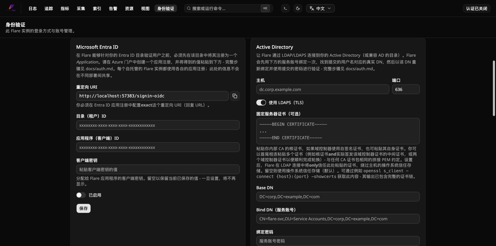
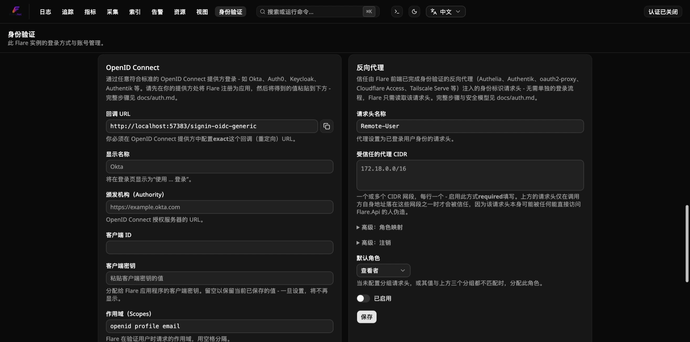

<!-- Auto-translated (zh-CN) from docs/how-to/configure-authentication.md · source-sha256:23272170c1464d61 · generated by scripts/translate-docs.py - edit the source file and rerun the script, don't hand-edit this one. -->

# 如何配置身份验证

打开登录并设置 Flare 的五种身份验证方法中的一种或多种。有关每个方法的实际用途以及为什么以这种方式构建，请参阅 [`../explanation/authentication-model.md`](../explanation/authentication-model.md)；有关确切的配置键和角色表，请参阅 [`../reference/authentication-config.md`](../reference/authentication-config.md)。

以下所有内容都发生在一个仅限管理员的页面 **`/auth`** 上：

## 开启登录功能

1. 打开 `/auth`（身份验证关闭时任何人都可以访问，与关闭时的所有其他页面相同）。
2. 打开顶层**“需要登录”**开关。这显示了五个方法部分 - Local / Microsoft Entra ID / Active Directory / OpenID Connect / Reverse proxy - 每个部分都有自己的启用切换和内联配置，以及下面的用户表。
3. 在“本地”部分中创建您的第一个 **本地** 帐户。您创建的第一个本地帐户始终是 `Admin` — 除此之外没有单独的“设置模式”；一旦存在至少一个本地帐户，即可正常登录。即使您的真正计划是 SSO/AD/代理，也请执行此操作 — 如果组→角色映射配置错误，这就是您的突破路径。

您可以同时启用这五种方法的任意组合 - 根据设计，它们是共存的，而不是排斥的。

## 设置 Microsoft Entra ID (SSO)

1. 在 Entra ID → **应用程序注册 → 新注册**。单个租户（“仅限此组织目录中的帐户”）。
2. **重定向 URI**，平台“Web”：使用本地管理员帐户登录 Flare 并打开 `/auth` — 它显示要粘贴到此处的*精确*重定向 URI，该 URI 根据您实际到达 `Flare.Api` 的任何主机/端口计算得出。对于本地 `docker compose up`，默认为 `http://localhost:8080/signin-oidc`；一旦超出您自己的机器，请使用 `https://`（请参阅下面的 HTTPS 警告）。
3. **证书和机密 → 新客户端机密。** 立即复制该值 - 就像摄取 API 密钥的原始值一样，Azure 仅显示一次。
4. **应用程序角色**：添加三个 `appRoles` 条目，其中 `"value"` 设置为完全 `Admin`、`Member` 和 `Viewer`（不区分大小写的匹配，但保持精确）和 `"allowedMemberTypes": ["User"]`。然后，在**企业应用程序→您的应用程序→用户和组**中，为每个人（或组）分配应成为其 Flare 角色的应用程序角色。未分配应用程序角色（或根本没有配置）规定 `Auth:Entra:DefaultRole` 代替（`Viewer` 除非被覆盖）。
5. 记下注册概述页面中的 **应用程序（客户端）ID** 和 **目录（租户）ID**。
6. 返回 Flare 的 `/auth` 页面，Microsoft Entra ID 部分：粘贴目录（租户）ID、应用程序（客户端）ID 和客户端密钥，打开 **启用**，然后**保存**。
7. **重新启动 `Flare.Api`**（`docker compose restart api` 或本地开发中的 `aspire resource restart`）— Entra 设置更改在重新启动时生效，而不是实时生效。
8. 注销并确认登录页面上出现“使用 Microsoft 登录”；使用真实帐户登录以进行端到端确认。

**HTTPS 警告：** ASP.NET Core 的 OIDC 处理程序在到 Microsoft 的重定向往返期间设置的相关 cookie 需要在跨站点导航中幸存下来，浏览器仅可靠地允许通过 HTTPS（Chrome/Edge 特殊情况普通 `http://localhost`，这就是本地开发工作的原因）。超出您自己的计算机范围的任何实际部署都需要 HTTPS 才能使 Entra ID 登录正常工作。

## 设置 Active Directory (LDAP)

1. 在 `/auth` 的 Active Directory 部分中，填写：
   - **主机** / **端口** — 您的域控制器的地址。默认为端口 636 (LDAPS)。
   - **使用 LDAPS (TLS)** — 默认开启；除了一次性测试目录之外，将其保留为任何内容。
   - **固定服务器证书**（可选）- 粘贴 PEM 编码的证书以将此连接的 TLS 信任固定到该证书，绕过操作系统信任存储。如果 DC 的证书由私有 CA 签名，则使用内部 CA 的根证书；如果是自签名，则使用 DC 自己的证书。您可以背靠背粘贴多个证书 - 根证书加上实际签署 DC 叶证书的中间证书，或者并排粘贴两个 DC 证书以度过轮换窗口 - 与任何 CA 捆绑文件相同的串联 PEM 约定；捆绑包中至少有一个证书必须经过自签名才能充当信任锚。使用 `openssl s_client -connect dc.corp.example.com:636 -showcerts` 获取它，其输出已经包含完整的链。留空以继续依赖操作系统/容器信任存储（默认）。
   - **基本 DN** — 搜索根，例如`DC=corp,DC=example,DC=com`。
   - **绑定 DN（服务帐户）** / **绑定密码** — 具有读取权限的目录帐户，用于在基本 DN 下搜索用户。不需要是 AD 本身的管理员帐户。
   - **管理员/成员/查看者组 DN**（可选）和 **默认角色** — 三个组 DN；针对每个用户的 `memberOf`（包括真实 Microsoft AD 上的嵌套成员身份）进行检查，最高权限匹配获胜，没有匹配属于默认角色。
   - **高级**（默认折叠）- 仅当将其指向标准 AD 布局以外的其他内容（例如， OpenLDAP 的 `(&(objectClass=inetOrgPerson)(uid={0}))` 过滤器以 `entryUUID` 作为唯一 ID 属性。
2. 翻转**启用**并**保存** — 立即生效，无需重新启动。绑定密码一旦保存就永远不会回显 - 在以后的编辑中将该字段留空以保留当前保存的值。
3. 注销并确认“Active Directory”选项现在出现在登录页面上“本地”旁边；使用真实目录帐户登录以进行端到端确认。

**已知的限制，明确说明：**
- 嵌套组成员资格仅针对真实的 Microsoft AD 进行解析，而不针对其他目录进行解析。
- 为 Microsoft AD/AD 兼容目录构建和命名 - 高级覆盖足够灵活，也可以将其指向普通的 OpenLDAP 目录，正如此功能自己的验证测试所做的那样。
- **Linux 容器需要安装本机 LDAP 客户端库**（`libldap2` — 已经在 Flare 自己的 `Flare.Api` Docker 映像中，但自定义/非 Docker Linux 部署也需要它）。

## 设置 OpenID 连接

将此用于任何非 Microsoft Entra ID 的符合标准的 OIDC 提供程序 — Okta、Auth0、Keycloak、Authentik 等。

1. 将 Flare 注册为您的 OIDC 提供商的应用程序/客户端。每个提供商都需要：
   - **重定向/回调 URI** — 使用您的本地管理员帐户登录 Flare 并打开 `/auth`； OpenID Connect 部分显示要粘贴的*准确*回调 URL。
   - **客户端机密** — 立即复制该值；大多数提供商只显示一次。
2. 回到Flare的`/auth`页面，OpenID Connect部分，填写：
   - **显示名称** — 在登录页面上显示为“使用 {显示名称} 登录”。
   - **权威** — 您的提供商的发行者 URL，例如`https://your-tenant.okta.com`。 Flare 获取 `{Authority}/.well-known/openid-configuration` 来完成其余部分。
   - **客户端 ID** / **客户端秘密**。
   - **范围** — 默认为 `openid profile email`。
   - **角色声明名称**（默认 `roles`）— 设置为您的提供商实际发布的内容；例如，Okta 的默认值是 `groups`。
   - **默认角色** — 当声明不存在或没有公认的价值时使用。
3. 打开**启用**并**保存**，然后**重新启动 `Flare.Api`**（本地开发中的 `docker compose restart api` 或 `aspire resource restart`）- 在重新启动时生效，而不是实时生效。
4. 退出并确认登录页面上出现“使用{显示名称}登录”；使用提供商的真实帐户登录以进行端到端确认。

**HTTPS 警告：** 与 Entra ID 相同 — 相关 cookie 需要在跨站点导航中幸存下来，这需要 HTTPS 超出 `http://localhost`。

**已知限制：** v1 仅限登录 - Flare 尚未将注销传播到提供商自己的最终会话端点； `/api/auth/logout` 只是清除本地会话。

## 设置反向代理（可信标头）身份验证

如果 Flare 前面的反向代理（Authelia、Authentik、oauth2-proxy、Cloudflare Access、Tailscale Serve 或类似的）已经对请求进行了身份验证，并且可以将身份作为标头转发，请使用此选项。

**开始之前**，请确保除通过该代理之外无法访问 `Flare.Api` — 如果您的撰写/网络设置直接公开 `Flare.Api` 的端口，则启用此方法并不安全（请参阅 [the explanation](../explanation/authentication-model.md#reverse-proxy-trusted-header) 了解原因）。

1. 配置反向代理以验证请求并将登录身份作为标头转发 - 具体步骤因代理而异。 Authelia/oauth2-proxy-style 设置通常将此称为 `Remote-User`（Flare 自己的默认值）或 `X-Forwarded-User`；检查代理自己的文档以获取确切的标头名称以及它是否还发出组标头。
2. 找到您的 Docker 网络的实际子网（`docker network inspect <network>` - 不要猜测 `172.18.0.0/16`，确认它）或您的代理连接的特定地址。
3. 在 `/auth` 的“反向代理”部分中，填写 **标头名称**（与您的代理实际发送的内容匹配）和 **受信任的代理 CIDR**（每行一个 - 必需；有效的 CIDR 是强制性的，没有“信任所有人”默认值）。如果您想要基于组的角色映射，请设置 **组标头名称** / 组字段 / **默认角色**。或者，在 **高级：注销** 下，将 **注销重定向 URL** 设置为您的代理（或 IdP）自己的注销 URL - 请参阅下面的“已知限制”，了解为什么这是一个手动步骤。
4. 翻转**启用**并**保存** — 立即生效，无需重新启动。
5. **通过代理**（不是直接）到达 Flare 并确认 `/login` 以静默方式登录。然后确认使用手持设备标头直接点击 `Flare.Api`（绕过代理，如果您的设置中可以访问）将获得 `403`，而不是会话。

直接 API/脚本调用者（从未加载仪表板）需要通过代理调用一次 `POST /api/auth/proxy/login` 来获取会话 - 此方法不会在环境中对每个请求进行身份验证。

**已知的限制，明确说明：**
- **注销不会自动传播到代理/IdP** — 只要代理继续发送标头，`/login` 就会在手动注销后立即以静默方式重新建立会话。将**注销重定向 URL**（高级：注销）设置为手动逃生舱口 - Flare 的“注销”然后将浏览器发送到那里，而不是返回到 `/login`。
- **配置错误或过于宽泛的可信 CIDR 范围是一个真正的安全漏洞，而不是理论上的安全漏洞。** Flare 完全拒绝一种最具灾难性的情况（`0.0.0.0/0`/`::/0` 无法保存），但除此之外的任何情况 - 例如当只有一个代理容器需要信任时，整个 `10.0.0.0/8` 仍然是您的正确选择； Flare 无法知道您的实际网络拓扑应该是什么。

## 摄取 API 密钥

摄取 API 密钥可对 OTLP 导出器（计算机）进行身份验证，与用户帐户分开。

- **创建一个**：仅 `Admin`、`POST /api/ingest-keys`（将其命名为 `"prod-collector"`）。原始密钥**仅显示一次** - 立即将其复制到安全的地方。
- **使用它**：在您的 OTLP 导出器上发送 `Authorization: Bearer <key>`（gRPC 或 HTTP - 两者检查方式相同）。
- **撤销它**：`DELETE /api/ingest-keys/{id}`。在 30 秒内生效 - `Flare.Ingest` 将活动密钥集缓存在内存中并在计时器上刷新它，而不是在每个摄取请求时点击 SQLite。
- **迁移每个导出器后，启用强制执行：创建至少一个密钥，更新导出器以发送它，*然后*设置 `Auth:IngestKeyRequired=true`（默认为 `false`，因此升级现有部署不会突然拒绝匿名摄取）。该标志独立于仪表板的“需要登录”开关 - 摄取强制和仪表板/API 用户身份验证是单独的门。
- **对于自动化设置**（AppHost 在任一进程开始之前连接资源图，其中“单击仪表板中的按钮”不适合）：`Auth:StaticIngestApiKey` 是通过配置设置的固定键，与通过 UI 创建的任何键一起有效。这是 `Flare.AppHost`（本地开发）和 `Aspire.Hosting.Flare` 的 `AddFlare(..., apiKey: ...)` 使用的。

## 管理用户

仅 `Admin`，在 `/auth` (`GET`/`PATCH /api/users/*`) 的用户部分中 — 列出每个帐户（任何提供商）、更改角色或启用/禁用帐户。您也可以在此处将新自动配置的 Entra/AD/OIDC/反向代理帐户升级到其初始角色，或者禁用一个帐户，而无需等待某人删除其上游的组/角色分配。 Flare 拒绝降级或禁用**最后启用的管理员** - 这将是只能通过直接编辑 SQLite 文件才能恢复的锁定。

## 备份

身份 SQLite 文件不由任何特殊工具备份 - 将 `identity-data` 卷 (docker-compose) 或 `.data/identity/` 目录（本地 Aspire dev）包含在您已有的 `clickhouse-data`/`redis-data` 卷的任何备份故事中。