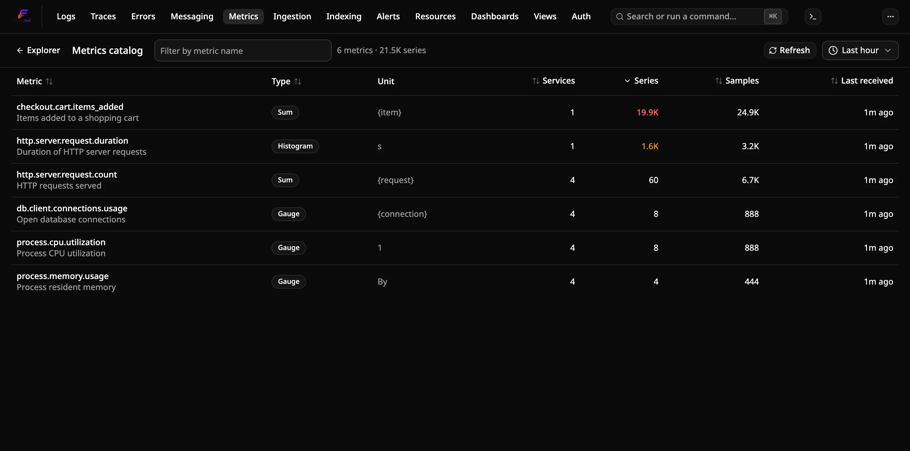
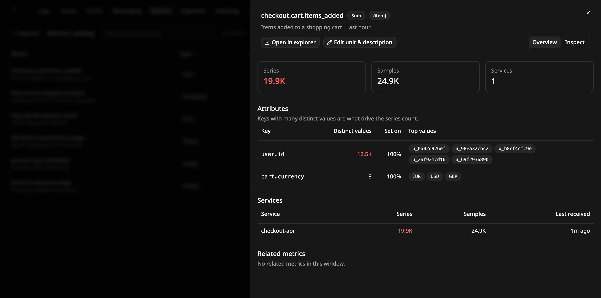
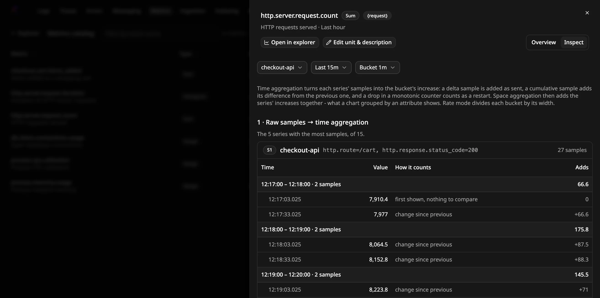

# Comment trouver les métriques à forte cardinalité

Utilisez le **catalogue de métriques** pour voir toutes les métriques que Flare
reçoit et repérer celle dont le nombre de séries a explosé, généralement parce
qu'une valeur non bornée, comme un identifiant utilisateur ou une URL brute, a
été enregistrée comme attribut. Le repérer ici coûte moins cher que de le
découvrir par des graphiques lents ou un disque qui se remplit.

## Prérequis

- Une instance Flare en cours d'exécution qui reçoit des métriques via OTLP
  ([autonome](run-standalone.fr.md), [Aspire](run-with-aspire.fr.md) ou la
  [CLI](run-with-cli.fr.md)).

## Ouvrir le catalogue

Ouvrez **Metrics** dans la barre de navigation, puis cliquez sur **Catalog**
dans la barre d'outils. Vous pouvez aussi aller directement sur
`/metrics/catalog`.

Le tableau liste toutes les métriques reçues dans la fenêtre choisie, triées
par nombre de séries décroissant :

| Colonne | Signification |
|---|---|
| Metric | Nom de la métrique, avec sa description en dessous si l'émetteur en a fourni une |
| Type | Gauge, Sum, Histogram ou Exp. Histogram |
| Unit | Unité indiquée par l'émetteur, le cas échéant |
| Services | Nombre de services qui émettent la métrique |
| Series | Séries actives : combinaisons distinctes de service et d'attributs de point de données |
| Samples | Points de données reçus |
| Last received | Arrivée du point de données le plus récent |

Un nombre de séries de 1 000 ou plus s'affiche en orange, de 10 000 ou plus en
rouge. Les comptes sont exacts pour les petites valeurs et approximatifs
au-delà de quelques milliers.

- **Filtrez** par nom de métrique (sous-chaîne, insensible à la casse).
- **Triez** en cliquant sur un en-tête de colonne.
- **Changez la fenêtre** avec le sélecteur de temps (5 minutes à 24 heures).
- **Refresh** relance la requête. La page ne se rafraîchit pas d'elle-même.

Le catalogue affiche jusqu'à 1 000 métriques. S'il y en a davantage, celles à
plus faible cardinalité sont écartées : les métriques à surveiller restent
toujours visibles.

## Trouver l'attribut à l'origine d'un nombre de séries élevé

Cliquez sur le nom d'une métrique. Le panneau qui s'ouvre affiche :

- **Attributes** : chaque clé d'attribut de point de données avec son nombre
  de valeurs distinctes, la part des points qui la portent (**Set on**) et ses
  valeurs les plus fréquentes. La clé qui a le plus de valeurs distinctes est
  généralement la cause. Des identifiants, des horodatages ou des URL
  complètes indiquent qu'elle ne devrait pas être un attribut.
- **Services** : le nombre de séries, de points et la dernière réception pour
  chaque service qui émet la métrique. Vous voyez ainsi quel service corriger.
- **Related metrics** : les métriques qui partagent un préfixe de nom (par
  exemple `http.server`), des clés d'attributs ou des services avec celle-ci.
  Cliquez sur l'une d'elles pour l'ouvrir dans le même panneau.

**Open in explorer** trace la métrique dans l'explorateur de métriques sur la
même fenêtre.

## Corriger une métrique à forte cardinalité

Supprimez l'attribut non borné là où la métrique est enregistrée, ou
remplacez-le par une valeur bornée, par exemple un modèle de route au lieu du
chemin brut. Si vous ne pouvez pas modifier l'application, supprimez ou
réécrivez l'attribut dans un processeur de l'OpenTelemetry Collector (par
exemple `attributes` ou `transform`) avant qu'il n'atteigne Flare. Les séries
qui ne sont plus émises quittent le catalogue une fois sorties de la fenêtre
choisie.

Vous pouvez aussi retirer des attributs dans Flare avec une
[règle d'ingestion](reduce-metric-attributes.fr.md), qui affiche un aperçu des
séries supprimées avant l'enregistrement.

## Voir comment les échantillons d'une métrique deviennent un graphique

Dans le panneau de la métrique, passez de **Overview** à **Inspect**. Il
affiche les échantillons bruts des séries les plus actives de la métrique
(jusqu'à cinq) et les deux étapes que l'explorateur de métriques leur applique :

1. **Agrégation temporelle** : les échantillons de chaque série sont regroupés
   par intervalle. Pour une Gauge, un intervalle vaut la moyenne de ses
   échantillons. Pour une Sum ou un histogramme, c'est l'augmentation : les
   échantillons delta sont ajoutés tels quels, les échantillons cumulatifs
   ajoutent leur variation depuis l'échantillon précédent, et une baisse d'un
   compteur monotone est traitée comme un redémarrage. **How it counts** indique
   la règle appliquée à chaque échantillon. Pour un histogramme, la valeur de
   l'échantillon est son nombre d'observations.
2. **Agrégation spatiale** : les séries sont fusionnées par intervalle, comme
   dans un graphique groupé par attribut. Les augmentations sont additionnées ;
   les échantillons de Gauge sont moyennés sur toutes les séries.

Choisissez en haut le service, la fenêtre (5 minutes à 1 heure) et la largeur
d'intervalle. Le service par défaut est celui qui a le plus de séries. Une
série qui a plus d'échantillons que ce qui peut être affiché garde les plus
récents et porte la mention **Latest only**.

## Voir quels tableaux de bord utilisent une métrique

Avant de renommer, supprimer ou remplacer une métrique, ouvrez son panneau et
consultez **Dashboards using this metric** (Tableaux de bord utilisant cette
métrique). La liste contient chaque tableau de bord ayant un panneau Metrics
qui trace la métrique, y compris les panneaux qui l'utilisent dans une formule
(marqués **formula**), avec un lien vers chaque tableau de bord.

## Corriger l'unité ou la description d'une métrique

Les administrateurs peuvent remplacer ce qu'envoie l'instrumentation. Dans le
panneau de la métrique, cliquez sur **Edit unit & description**, remplissez
l'un des champs et enregistrez. Un champ vide conserve la valeur envoyée. Les
nouvelles valeurs s'affichent pour tous dans le catalogue et l'explorateur de
métriques, et la métrique est marquée **Edited**. **Reset to sent values**
annule la modification.

## Tracer une jauge comme un compteur

Certains compteurs arrivent sous forme de Gauge. Une métrique Prometheus
`*_total` sans type en est un cas courant. Son graphique montre alors le total
cumulé au lieu de sa hausse. Pour corriger cela, un administrateur ouvre le
panneau de la métrique, clique sur **Edit unit & description**, coche **Chart
as a counter** et enregistre.

Les graphiques de cette métrique fonctionnent alors comme ceux d'une Sum.
Chaque intervalle montre la hausse, avec les modes **Rate**, **Sum** et
**Count**. Une baisse de la valeur compte comme un redémarrage, pas comme une
diminution. La métrique est marquée **Counter**. Les alertes sur cette
métrique utilisent toujours sa valeur de jauge.
