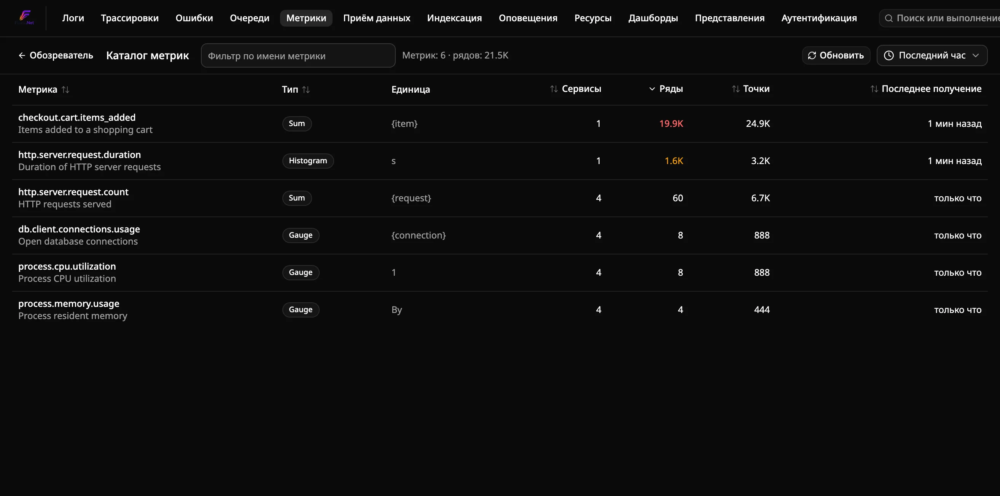
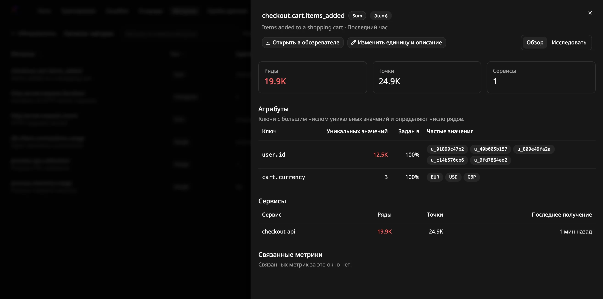
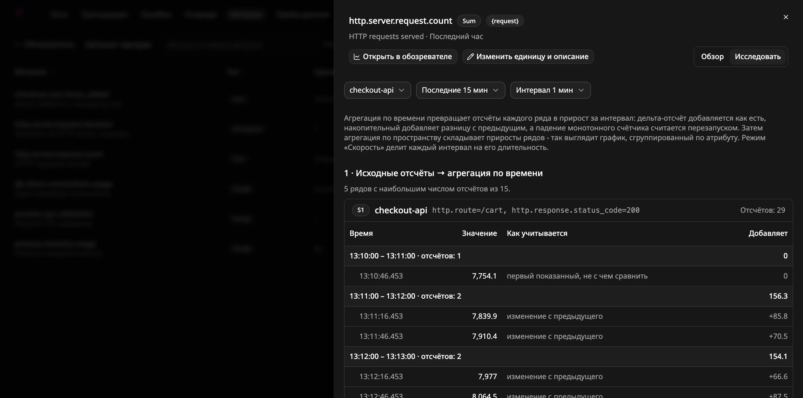

# Как найти метрики с высокой кардинальностью

Используйте **каталог метрик**, чтобы увидеть все метрики, которые получает
Flare, и найти ту, у которой резко выросло число рядов. Обычно причина в том,
что неограниченное значение, например ID пользователя или полный URL, записано
как атрибут. Заметить это здесь дешевле, чем узнать по медленным графикам или
заполняющемуся диску.

## Предварительные требования

- Работающий экземпляр Flare, принимающий метрики по OTLP
  ([автономно](run-standalone.ru.md), [с Aspire](run-with-aspire.ru.md) или
  [через CLI](run-with-cli.ru.md)).

## Откройте каталог

Откройте **Metrics** в верхнем меню и нажмите **Каталог** на панели
инструментов. Можно также перейти прямо на `/metrics/catalog`.

В таблице перечислены все метрики, полученные за выбранное окно, по убыванию
числа рядов:

| Столбец | Значение |
|---|---|
| Метрика | Имя метрики и под ним описание, если отправитель его задал |
| Тип | Gauge, Sum, Histogram или Exp. Histogram |
| Единица | Единица измерения, если отправитель её указал |
| Сервисы | Сколько сервисов отправляют метрику |
| Ряды | Активные ряды: уникальные сочетания сервиса и атрибутов точки данных |
| Точки | Полученные точки данных |
| Последнее получение | Когда пришла самая новая точка |

Число рядов от 1 000 выделяется жёлтым, от 10 000 — красным. Для небольших
значений счётчики точные, свыше нескольких тысяч — приблизительные.

- **Фильтр** по имени метрики (подстрока, без учёта регистра).
- **Сортировка** — щелчком по заголовку любого столбца.
- **Окно** меняется селектором времени (от 5 минут до 24 часов).
- **Обновить** повторно выполняет запрос. Сама страница не обновляется.

Каталог показывает до 1 000 метрик. Если их больше, отбрасываются метрики с
наименьшей кардинальностью, поэтому метрики, которые стоит проверить, всегда
видны.

## Найдите атрибут, из-за которого много рядов

Щёлкните имя метрики. Откроется панель с разделами:

- **Атрибуты**: каждый ключ атрибута точки данных с числом уникальных
  значений, долей точек, в которых он есть (**Задан в**), и самыми частыми
  значениями. Обычно причина — ключ с наибольшим числом уникальных значений.
  Если значения похожи на ID, временные метки или полные URL, такому ключу не
  место в атрибутах.
- **Сервисы**: число рядов, точек и время последнего получения для каждого
  сервиса, отправляющего метрику. Так видно, какой сервис нужно исправить.
- **Связанные метрики**: метрики с общим префиксом имени (например
  `http.server`), общими ключами атрибутов или сервисами. Щелчок открывает
  метрику в той же панели.

**Открыть в обозревателе** строит график метрики в обозревателе метрик за то
же окно.

## Исправьте метрику с высокой кардинальностью

Уберите неограниченный атрибут там, где метрика записывается, или замените его
ограниченным значением, например шаблоном маршрута вместо полного пути. Если
изменить приложение нельзя, удалите или перепишите атрибут процессором
OpenTelemetry Collector (например `attributes` или `transform`) до того, как
данные попадут во Flare. Ряды, которые перестали поступать, исчезают из
каталога, когда выходят за пределы выбранного окна.

## Как отсчёты метрики превращаются в график

В панели метрики переключитесь с **Обзор** на **Исследовать**. Там показаны
исходные отсчёты самых активных рядов метрики (до пяти) и два шага, которые
к ним применяет обозреватель метрик:

1. **Агрегация по времени**: отсчёты каждого ряда группируются в интервалы.
   Для Gauge значение интервала - среднее его отсчётов. Для Sum и гистограмм
   это прирост: дельта-отсчёты добавляются как есть, накопительные добавляют
   изменение с предыдущего отсчёта, а падение монотонного счётчика считается
   перезапуском. Колонка **Как учитывается** показывает правило для каждого
   отсчёта. Для гистограммы значение отсчёта - число наблюдений.
2. **Агрегация по пространству**: ряды объединяются по интервалам так же, как
   на графике, сгруппированном по атрибуту. Приросты складываются; отсчёты
   Gauge усредняются по всем рядам.

Сверху выберите сервис, окно (от 5 минут до 1 часа) и ширину интервала.
Сначала выбран сервис с наибольшим числом рядов. Если у ряда больше отсчётов,
чем можно показать, остаются самые свежие, и ряд помечается
**Только последние**.

## Как исправить единицу или описание метрики

Администраторы могут заменить то, что присылает инструментация. В панели
метрики нажмите **Изменить единицу и описание**, заполните любое из полей и
сохраните. Пустое поле означает, что показывается присланное значение. Новые
значения видят все пользователи в каталоге и обозревателе метрик, а метрика
помечается **Изменено**. **Вернуть присланные** отменяет изменение.

## Как строить gauge как счётчик

Некоторые счётчики приходят как Gauge. Частый пример — нетипизированная
метрика Prometheus `*_total`. Её график показывает накопленное значение, а
не прирост. Чтобы это исправить, администратор открывает панель такой
метрики, нажимает **Изменить единицу и описание**, отмечает **Строить как
счётчик** и сохраняет.

После этого графики метрики работают как у Sum. Каждый интервал показывает
прирост, доступны режимы **Rate**, **Sum** и **Count**. Падение значения
считается перезапуском, а не уменьшением. Метрика помечается **Счётчик**.
Оповещения по метрике по-прежнему используют её значение gauge.
