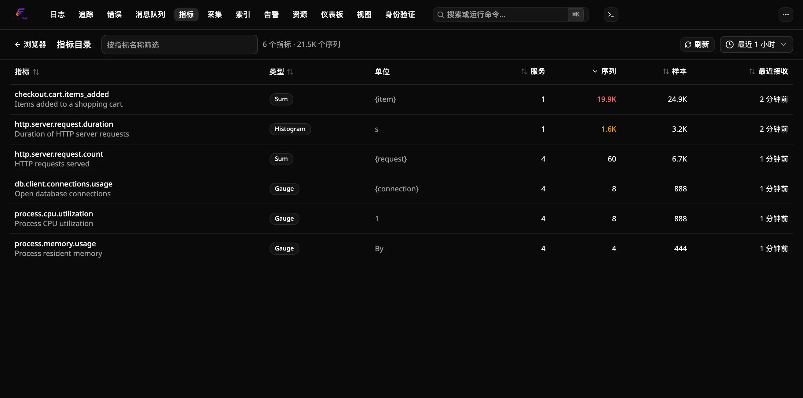
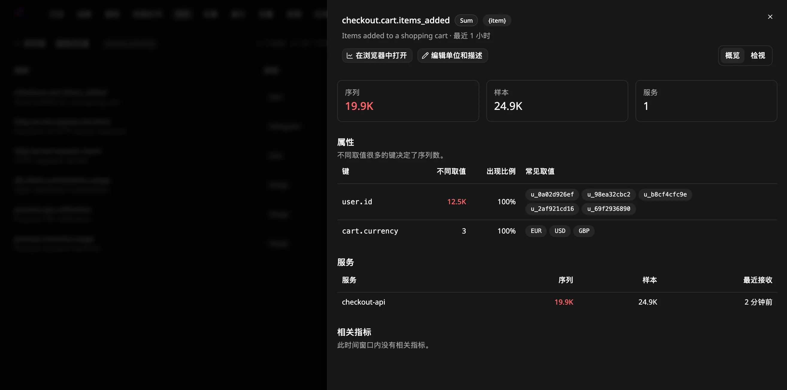
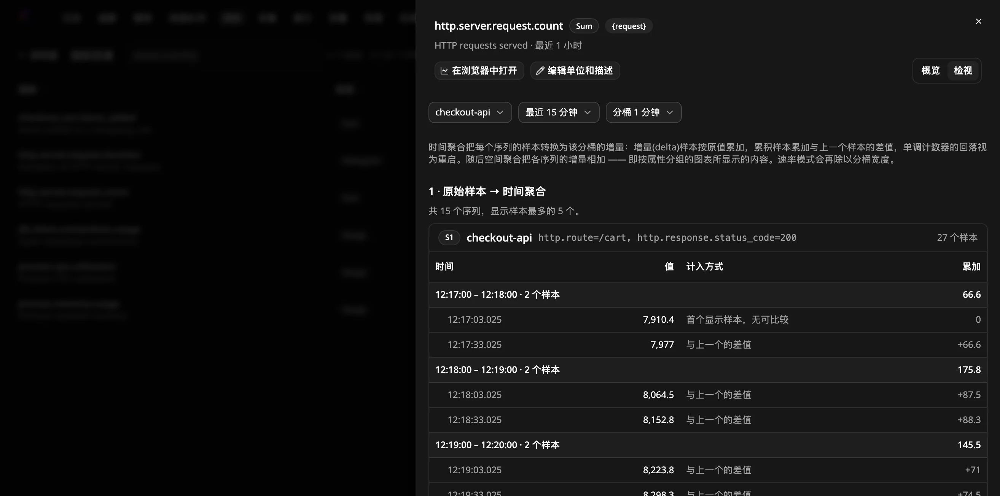

# 如何找出高基数指标

使用**指标目录**查看 Flare 正在接收的所有指标，并找出序列数暴增的那个指标。
这通常是因为某个无界取值（如用户 ID 或原始 URL）被记录成了属性。在这里发现问题，
比等到图表变慢或磁盘被占满再发现要省事得多。

## 前提条件

- 一个正在运行、通过 OTLP 接收指标的 Flare 实例
  （[独立运行](run-standalone.zh-CN.md)、[Aspire](run-with-aspire.zh-CN.md) 或
  [CLI](run-with-cli.zh-CN.md)）。

## 打开目录

在顶部导航中打开 **Metrics**，然后点击工具栏中的**目录**。也可以直接访问
`/metrics/catalog`。

表格列出所选时间窗口内收到的所有指标，按序列数从高到低排序：

| 列 | 含义 |
|---|---|
| 指标 | 指标名称；如果发送方设置了描述，会显示在名称下方 |
| 类型 | Gauge、Sum、Histogram 或 Exp. Histogram |
| 单位 | 发送方报告的单位（如有） |
| 服务 | 发送该指标的服务数量 |
| 序列 | 活跃序列：服务与数据点属性的不同组合数 |
| 样本 | 收到的数据点数 |
| 最近接收 | 最新数据点到达的时间 |

序列数达到 1,000 显示为琥珀色，达到 10,000 显示为红色。数值较小时计数是精确的，
超过几千时为近似值。

- **筛选**：按指标名称筛选（子串匹配，不区分大小写）。
- **排序**：点击任意列标题。
- **更改时间窗口**：使用时间选择器（5 分钟到 24 小时）。
- **刷新**：重新执行查询。页面不会自动刷新。

目录最多列出 1,000 个指标。如果匹配的更多，会舍弃基数最低的指标，因此值得检查的
指标始终会显示。

## 找出导致序列数过高的属性

点击指标名称，打开的面板中包含：

- **属性**：每个数据点属性键的不同取值数、带有该键的样本比例（**出现比例**）
  以及最常见的取值。不同取值最多的键通常就是原因。如果取值是 ID、时间戳或完整 URL，
  说明它不应作为属性。
- **服务**：发送该指标的每个服务的序列数、样本数和最近接收时间，可据此判断需要
  修复哪个服务。
- **相关指标**：与当前指标共享名称前缀（例如 `http.server`）、属性键或服务的指标。
  点击即可在同一面板中打开。

**在浏览器中打开**会在指标浏览器中按相同时间窗口绘制该指标。

## 修复高基数指标

在记录指标的位置移除无界属性，或替换为有界取值，例如用路由模板代替原始路径。
如果无法修改应用，可以在数据到达 Flare 之前，用 OpenTelemetry Collector 处理器
（例如 `attributes` 或 `transform`）删除或改写该属性。停止上报的序列在超出所选
时间窗口后会从目录中消失。

## 查看指标样本如何变成图表

在指标面板中，从**概览**切换到**检视**。它会显示该指标最活跃的序列（最多五个）的原始样本，
以及指标浏览器对它们执行的两个步骤：

1. **时间聚合**：每个序列的样本按分桶分组。对于 Gauge，分桶值是其样本的平均值。对于 Sum
   或直方图，分桶值是增量：增量(delta)样本按原值累加，累积样本累加与上一个样本的差值，
   单调计数器的回落视为重启。**计入方式**列说明每个样本适用的规则。对于直方图，样本值为其观测次数。
2. **空间聚合**：各序列按分桶合并，方式与按属性分组的图表相同。增量相加；Gauge 样本在所有序列间取平均。

在顶部选择服务、时间窗口（5 分钟到 1 小时）和分桶宽度。默认选中序列最多的服务。
如果某个序列的样本多于可显示数量，只保留最新的样本，并标记为**仅最新**。

## 修正指标的单位或描述

管理员可以替换埋点上报的内容。在指标面板中点击**编辑单位和描述**，填写任一字段后保存。
字段留空则继续显示上报的值。新值会在目录和指标浏览器中对所有人显示，指标会标记为**已编辑**。
**恢复为上报值**会撤销修改。

## 将仪表按计数器绘制

有些计数器以 Gauge 上报，常见的例子是无类型的 Prometheus `*_total` 指标。
这时图表显示的是累计总数，而不是增量。要修正这一点，管理员打开该指标的面板，
点击**编辑单位和描述**，勾选**按计数器绘制**并保存。

之后该指标的图表会像 Sum 一样工作：每个区间显示增量，并提供 **Rate**、**Sum** 和 **Count** 模式。
数值下降被视为重启，而不是减少。指标会标记为**计数器**。针对该指标的告警仍使用其仪表值。
