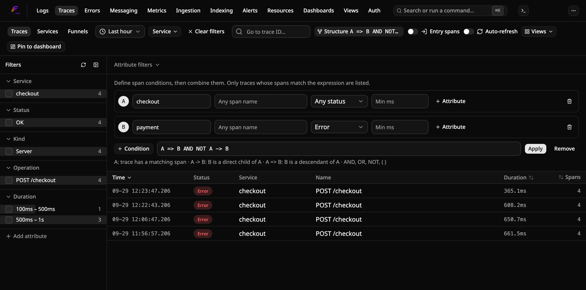
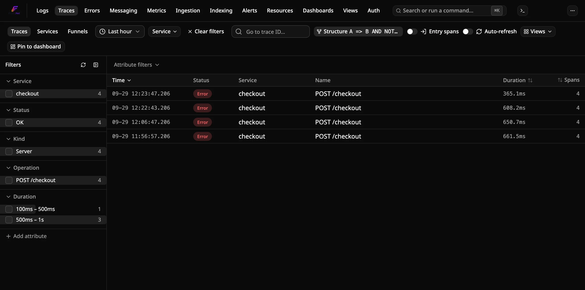

# Comment trouver des traces selon les relations entre leurs spans

Une requête structurelle liste les traces dont les spans sont liés de la
manière que vous décrivez. Par exemple : « un span `checkout` qui appelle
`payment`, et ce span `payment` est en erreur », ou « les traces où `api`
atteint la base de données sans passer par le cache ». Les filtres
ordinaires testent un span à la fois et ne peuvent pas exprimer cela.

Les requêtes structurelles portent sur les spans que Flare stocke déjà, y
compris ceux stockés avant l'écriture de la requête.

## Prérequis

- Une instance Flare en fonctionnement qui reçoit les traces de vos
  applications.
- Les spans à relier doivent appartenir à **une seule trace**, avec des
  liens parent entre eux. Les instrumentations OpenTelemetry HTTP, gRPC et
  de messagerie propagent le contexte de trace entre services par défaut.

## Définir les conditions

1. Ouvrez **Traces** dans la barre de navigation et choisissez une plage de
   temps.
2. Cliquez sur **Structure** dans la barre d'outils.
3. Chaque carte lettrée (**A**, **B**, ...) est une condition sur un span.
   Renseignez au choix :
   - **Service** : le `service.name` exact du span.
   - **Span name** : le nom exact du span (l'opération).
   - **Status** : Error, OK ou Unset.
   - **Min ms** : le span a duré au moins ce nombre de millisecondes.
   - Des filtres **Attribute**, avec les mêmes opérateurs que l'explorateur
     de traces.

   Un span correspond à la condition quand tous ses réglages sont vérifiés.
   **Condition** ajoute une carte, jusqu'à six. Les champs de service et de
   nom de span suggèrent des valeurs de la plage de temps sélectionnée.



## Écrire l'expression

Combinez les lettres dans le champ **Expression** :

| Écrire | Traces retenues |
|---|---|
| `A` | un span correspond à A |
| `A -> B` | un span correspondant à B est un **enfant direct** d'un span correspondant à A |
| `A => B` | un span correspondant à B est un **descendant** d'un span correspondant à A, à n'importe quelle profondeur |
| `X AND Y`, `X && Y` | les deux sont vrais |
| `X OR Y`, `X \|\| Y` | l'un ou l'autre est vrai |
| `NOT X`, `!X` | X est faux |

`->` et `=>` sont prioritaires, puis `NOT`, puis `AND`, puis `OR`. Utilisez
des parenthèses pour grouper. Les lettres et les mots-clés ne sont pas
sensibles à la casse.

Cliquez sur **Apply** ou appuyez sur Entrée. La liste, les compteurs des
facettes et le filtre Service ne couvrent plus que les traces
correspondantes. L'expression reste affichée sur le bouton **Structure**
une fois l'éditeur fermé. Cliquez sur **Remove** dans l'éditeur, ou sur
**Clear filters**, pour la retirer.



### Exemples

Avec **A** = service `checkout`, **B** = service `payment` et statut Error :

- `A => B` : checkout a mené à un paiement en échec, directement ou via
  d'autres services.
- `A -> B` : checkout a appelé lui-même le span de paiement en échec.
- `A => B AND NOT A -> B` : l'échec s'est produit plus bas, pas dans un span
  appelé directement par checkout.

Avec **A** = service `api`, **B** = service `postgres`, **C** = service
`redis` :

- `A => B AND NOT A => C` : les requêtes qui ont atteint la base de données
  sans toucher au cache.

## Enregistrer et partager

La structure fait partie de l'état de la vue Traces. **Views** → **Save
current view** la conserve, le lien d'une vue enregistrée la restaure, et
**Pin to dashboard** en fait un panneau.

## Depuis la CLI

`flare traces` accepte les mêmes conditions avec `--span` et l'expression
avec `--where` :

```bash
flare traces --since 24h \
  --span "A:service=checkout" \
  --span "B:service=payment,status=error" \
  --where "A => B"
```

Une valeur `--span` est une lettre, deux-points, puis des paires `clé=valeur`
séparées par des virgules. Les clés sont `service`, `name`, `status` (`ok`,
`error`, `unset`) et `min-duration` (par exemple `500ms`). Les conditions sur
attributs ne sont disponibles que dans le tableau de bord. Voir
[`flare traces`](../reference/cli-commands.fr.md).

## Dépannage

**« The expression uses condition D, which isn't defined. »** Chaque lettre
de l'expression doit avoir une carte. Les cartes non utilisées par
l'expression sont ignorées.

**« The expression also matches traces with none of its spans. »** Une
expression comme `NOT A` seule correspondrait à toutes les autres traces de
la plage. Combinez-la avec une condition que la trace doit remplir, par
exemple `B AND NOT A`.

**« Chains like 'A -> B -> C' aren't supported. »** Écrivez chaque paire
séparément : `A -> B AND B -> C`. Cette forme vérifie les deux paires
indépendamment, donc le B de chaque paire peut être un span différent.

**Une trace attendue manque.** Seuls les spans qui commencent dans la plage
de temps sont pris en compte. Une trace à cheval sur la limite de la plage
peut perdre le span qui relie les deux conditions ; élargissez la plage.
`=>` a aussi besoin de chaque span intermédiaire. Si un saut n'était pas
instrumenté, ou si son span a été échantillonné, la chaîne s'y rompt.

**La requête est lente.** `=>` lit tous les spans de chaque trace
susceptible de correspondre. Rendez les conditions plus précises (un service
et un nom de span plutôt qu'un simple statut), ou raccourcissez la plage.

Pour l'évaluation des requêtes et leur coût, voir
[ADR-0069](../../docs-internal/adr/0069-structural-trace-queries.md).
