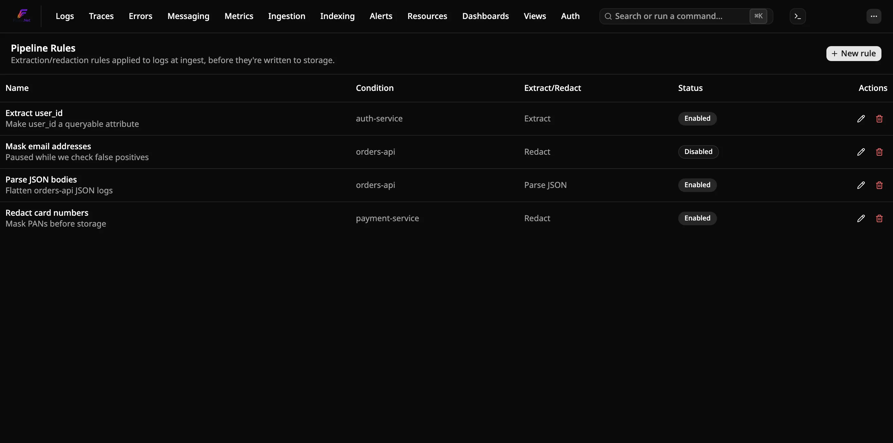
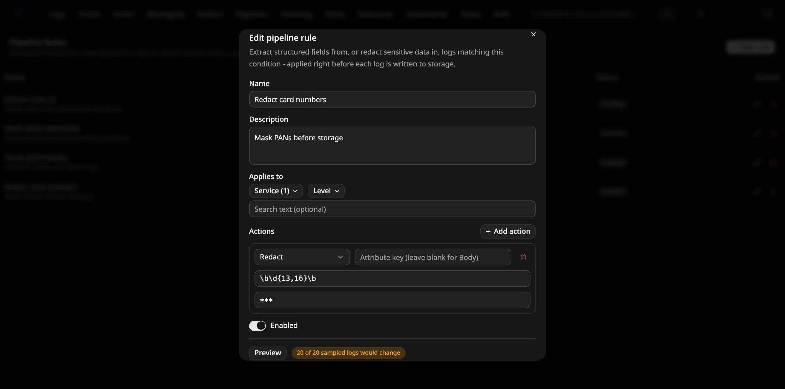
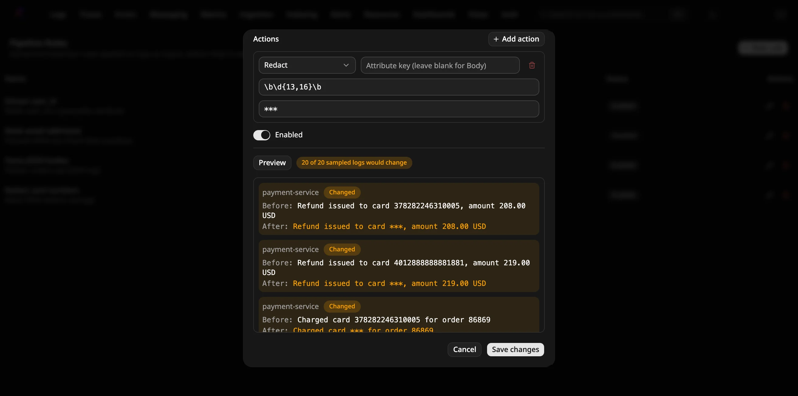

# How to extract or redact fields at ingest

Set up **pipeline rules** — regex-based extraction and redaction, and JSON
body parsing, applied to logs before they're written to storage. Use extraction to pull structured
fields (like a user ID or status code) out of a log's message into a proper,
queryable attribute. Use redaction to mask sensitive data (like a credit
card number or an email address) so it's never stored in the clear. For the
design behind this, see
[ADR-0033](../../docs-internal/adr/0033-pipeline-rules-extraction-redaction.md)
and [ADR-0034](../../docs-internal/adr/0034-pipeline-rules-preview.md)
(preview mode).

Pipeline rules run once, at ingest — before Drain's pattern clustering, and
before anything lands in ClickHouse. Preview a rule before saving it (see
[Preview a rule before saving](#preview-a-rule-before-saving) below) to
confirm it behaves the way you expect, rather than saving it blind.

## Prerequisites

- A running Flare instance you can reach in a browser (any of
  [standalone](run-standalone.md), [Aspire](run-with-aspire.md), or the
  [CLI](run-with-cli.md)) with some data already flowing in.

## Create a redaction rule

1. Open the **⋯** menu at the top right and pick **Pipeline Rules**.
2. Click **New rule**. Give it a name (e.g. "Redact card numbers").
3. Under **Applies to**, optionally narrow the rule to specific services or
   log levels, or leave it unscoped (see [Scope a rule](#scope-a-rule-dont-leave-it-unscoped)).
4. Under **Actions**, pick **Redact** and enter a regex pattern to match
   (e.g. `\d{16}` for a 16-digit card number). Leave the source field blank
   to redact `Body`, or enter an attribute key to redact that attribute's
   value instead. The replacement text defaults to `***`.
5. Click **Create rule**.

From here on, any log matching this rule has the matched text replaced
before it's written — including the pattern template Drain's log-clustering
feature computes, so a redacted body never leaks into a cluster template
either.

## Create an extraction rule

1. Open **Pipeline Rules** → **New rule**.
2. Under **Actions**, pick **Extract fields** and enter a regex pattern with
   **named capture groups** — the group name becomes the new attribute key
   directly. For example, `user_id=(?<user_id>\d+)` against a body like
   `"...for user_id=42..."` adds a `user_id: "42"` log attribute.
3. Click **Create rule**.

Extracted attributes show up like any other log attribute — filterable in
the Logs Explorer, usable as an alert rule condition, the same as an
attribute the source application set directly.

## Turn a JSON log body into attributes

If an app logs a JSON string as its body (Serilog's JSON formatter, the
.NET console JSON formatter, most Node and Python structured loggers),
one rule turns every field into a log attribute. You don't need a regex.

1. Open **Pipeline Rules** → **New rule**, and scope it to the services
   that log JSON.
2. Under **Actions**, pick **Parse JSON**. Leave the source field blank
   to parse `Body`, or enter an attribute key whose value is JSON.
3. Optionally set:
   - **Key prefix** — prepended to every key (e.g. `json.` gives
     `json.user.id`). Without one, a parsed key overwrites an attribute
     of the same name.
   - **Max depth** — how many object levels to flatten (default 5, at
     most 10).
   - **Max keys** — the most attributes to write per log (default 100,
     at most 500).
4. Click **Create rule**.

A body like `{"msg":"login","user":{"id":7,"name":"ada"},"tags":["a","b"]}`
adds `msg=login`, `user.id=7`, `user.name=ada` and `tags=["a","b"]`.
Nested keys are joined with `.`. Arrays, and objects deeper than
**Max depth**, are kept whole as JSON text. `null` values are skipped.
A body that isn't a JSON object is left alone, and the body itself is
never changed. For the design behind this, see
[ADR-0070](../../docs-internal/adr/0070-pipeline-rules-parse-json.md).

## Preview a rule before saving

Click **Preview** in the create/edit dialog at any point while you're
filling it in — it's not gated on saving first. Flare pulls up to 20 of
the most recent logs already matching the rule's **Applies to** condition
and runs the actions you've configured against each one, in-process,
without saving anything or touching real ingest traffic. You'll see a
summary ("N of 20 sampled logs would change") and each sampled log's
before/after text, with changed ones marked.

Preview always runs against the dialog's current, unsaved field values —
even while editing an already-saved rule — so it reflects whatever pattern
you're actively typing, not the last-saved version. If no logs currently
match the condition, preview says so rather than showing an empty list;
try widening the condition or picking a service you know is actively
logging.

## Scope a rule (don't leave it unscoped)

A rule with no service, level, or search filter set matches **every** log —
the create/edit form shows an explicit warning banner when this is the
case, so it's a decision you make on purpose rather than something that
happens by accident. Prefer narrowing to the specific service(s) a pattern
is meant for, especially while you're still confirming a new pattern
behaves the way you expect.

## Ordering, when more than one rule applies

Rules run in the order they were created, each seeing the previous rule's
output. If you need a field extracted from the *original* body before
another rule redacts it, create the extraction rule first.

## Turn a rule off without deleting it

Toggle **Enabled** off in the create/edit dialog (or the rule's row in the
table shows a **Disabled** badge once you do). A disabled rule stays saved
but stops being applied — useful for pausing a rule while you investigate
without losing its configuration.

## Changes take a little time to apply

A newly created, edited, or disabled rule takes up to 30 seconds to take
effect — `Flare.Ingest` polls for rule changes on that interval rather than
being notified instantly. This is a fixed interval, not currently
configurable from the dashboard.
