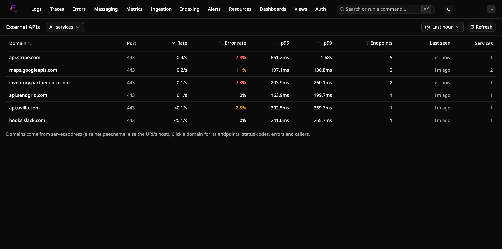
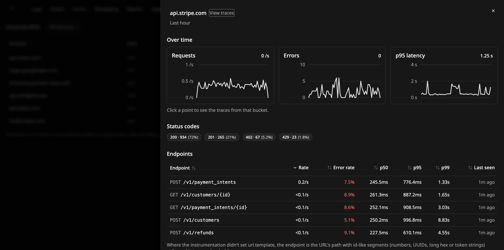
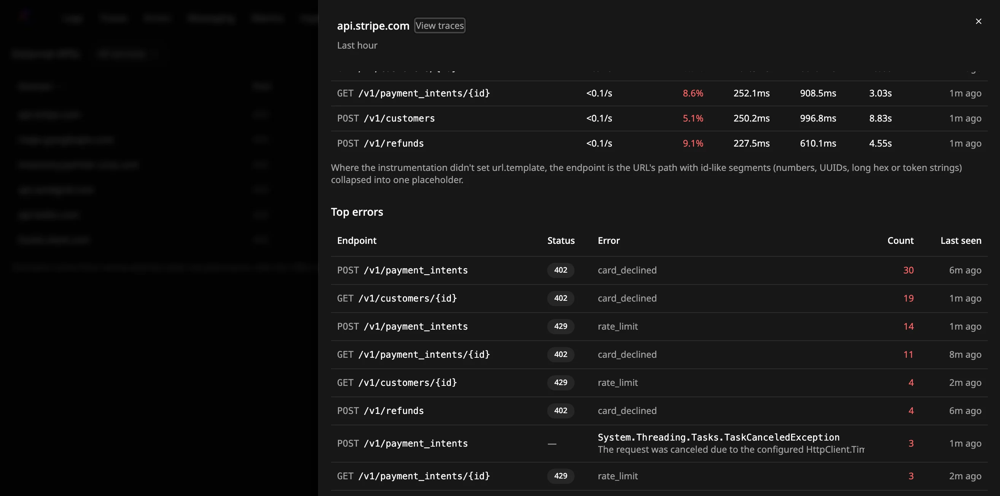
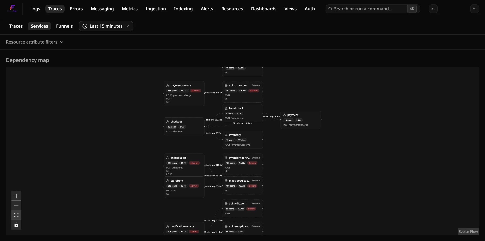

# How to monitor external APIs

See every external host your services call, such as Stripe, Twilio or
another team's API, on Flare's **External APIs** page. For each domain
you get request rate, error rate and latency, then per-endpoint figures,
status codes, the most frequent errors, and which of your services make
the calls.

The page uses the client spans your applications already send. Flare
doesn't need an agent or an ingest change, and it works on spans stored
before you opened the page.

## Prerequisites

- A running Flare instance receiving traces from your applications.
- Outgoing HTTP or gRPC calls instrumented with OpenTelemetry. The spans
  must be `CLIENT` spans that carry `server.address` (current semantic
  conventions), `net.peer.name` (older ones) or a full URL (`url.full` or
  `http.url`).

## Send client spans

For `HttpClient`, add the HTTP instrumentation to your tracer:

```csharp
builder.Services.AddOpenTelemetry()
    .WithTracing(tracing => tracing
        .AddAspNetCoreInstrumentation()
        .AddHttpClientInstrumentation()
        .AddOtlpExporter());
```

Point the exporter at Flare's OTLP endpoint as usual. If your project uses
the .NET Aspire service defaults template, `HttpClient` instrumentation is
already on. gRPC clients built on `HttpClient`
(`Grpc.Net.Client`) are covered by the same instrumentation.

## Read the External APIs page



Open the **⋯** menu at the top right and pick **External APIs**. Each row is one domain:

| Column | Meaning |
|---|---|
| Domain | `server.address`, else `net.peer.name`, else the host in the URL. |
| Port | The ports called: `server.port`, else `net.peer.port`, else the port in the URL, else 443 for `https` and 80 for `http`. At most five are listed. |
| Rate | Calls per second over the window. Hover for the total. |
| Error rate | Share of calls whose span status is `Error`. |
| p95 / p99 | Call duration percentiles, as the caller measured them. |
| Endpoints | Distinct method and endpoint pairs called on this domain. |
| Last seen | When the latest call in the window started. |
| Services | How many of your services called it. |

Use **Calling service** to show only one service's calls, and the window
picker to choose 5 minutes to 24 hours. The page loads on demand; select
**Refresh** to update it.

Database calls (`db.system` set) and messaging calls (`messaging.system`
set) aren't listed, even though they carry `server.address`. They appear
in the Services breakdown's **Database calls** tab and on the
[Messaging page](monitor-message-queues.md).

### Drill into a domain



Select a domain to open its details:

- **Over time**: three charts across the window: requests per second,
  errors, and p95 latency. Select a point to open **Traces** for the calls
  in that one bucket. From the p95 chart, the traces are listed slowest
  first. Buckets are about a minute wide for a one-hour window and scale
  with the window (10 seconds at 5 minutes, 24 minutes at 24 hours).
- **Status codes**: calls per HTTP status code (`http.response.status_code`,
  else `http.status_code`).
- **Endpoints**: rate, error rate, p50/p95/p99 and last seen per method
  and endpoint. You can sort any column.
- **Top errors**: failed calls grouped by endpoint, status code and
  `error.type`, with one sample status message. A row with no status code
  never got a response, for example because of a timeout or a refused
  connection.
- **Calling services**: which of your services call this domain, and how
  their calls perform.

Select a domain name, endpoint, status code, error-rate figure, error row
or service to open **Traces** filtered to traces containing matching
calls. The filter is a structural query (**Structure A**), because the
call is a child span of each trace. See
[Find traces by structure](find-traces-by-structure.md).



### How endpoints are named

Flare names an endpoint with the first rule that applies:

1. The span's `url.template` attribute, verbatim. Only some
   instrumentations set it.
2. The path of `url.full` (or `http.url`), with each path segment that
   looks like an id replaced by `{id}`. A segment counts as an id if it is
   all digits, a UUID, a hex string of 16 or more characters, or any
   segment of 16 or more characters containing a digit. For example,
   `/v1/customers/cus_NffrFeUfNV2Hib` becomes `/v1/customers/{id}`. The
   query string is ignored.
3. `rpc.service/rpc.method`, for gRPC.
4. The span name.

Rule 2 is a heuristic. An id that doesn't match it, such as a short slug
or a username, stays in the path, and each value becomes its own endpoint.
If that makes the list noisy, set `url.template` in your instrumentation.

## The Services breakdown uses the same domains

On **Traces > Services > Map**, clicking a service opens a breakdown of
what it calls. Its **External calls** tab groups by `peer.service` when a
span sets it, and otherwise by the domain, found the same way as above.
Before this change, `HttpClient` calls, which never set `peer.service`,
didn't appear in that tab at all. Only calls stored after the upgrade are
grouped by domain in the breakdown's pre-aggregated data; older rows keep
their `peer.service`-only grouping until they age out.

## External hosts on the Service Map



**Traces > Services > Map** also draws external hosts, as leaf nodes with
a globe icon marked **External**. A host gets a node when your services
call it and no instrumented span answers the call. A call to one of your
own instrumented services is answered by that service's server span, so
it stays a normal service-to-service edge and never becomes a hostname
node. Calls that set `peer.service` keep appearing under that name, as
before.

A host node counts the calls to it, which are also counted in the calling
service's own node. Select it to open the host on the **External APIs**
page for the same window. The Map shows at most 50 caller-to-host edges,
busiest first.

Only calls stored after the upgrade appear, so the Map's 24-hour window
fills in over the first day. With resource attribute filters set, the Map
finds hosts by scanning `spans` directly, which is slower on a large
store.

## Troubleshooting

- **The page is empty.** Check that your calls produce `CLIENT` spans:
  open a trace in **Traces** and look for a child span with kind `Client`
  and a `server.address` attribute. If there isn't one, the HTTP
  instrumentation isn't registered with the tracer that exports to Flare.
- **A domain is missing from the drill-down's traces link.** The link
  filters on `server.address`. Spans that only name their host through
  `net.peer.name` or the URL are counted on the page, but the link won't
  find them.
- **Calls to my own services are listed.** That's expected. The page lists
  every host your services call, including internal ones. The Service Map
  shows the service-to-service view.
- **An internal service appears as a host on the Service Map.** Its server
  span was missing for those calls: it was sampled out, it wasn't flushed
  yet (calls in the last few seconds of the window), or the callee isn't
  instrumented.
