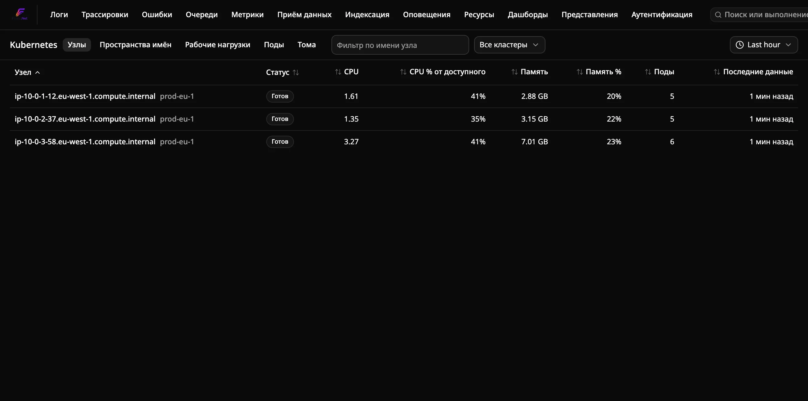
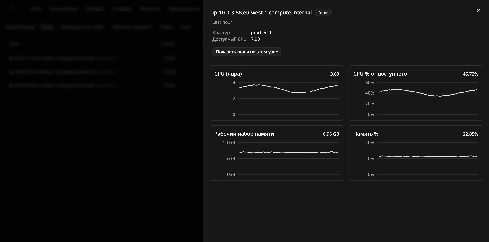
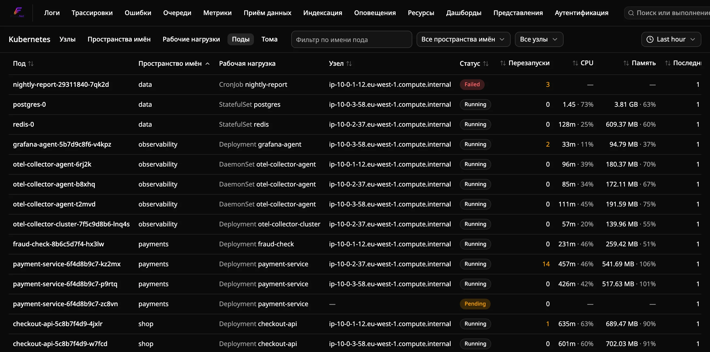
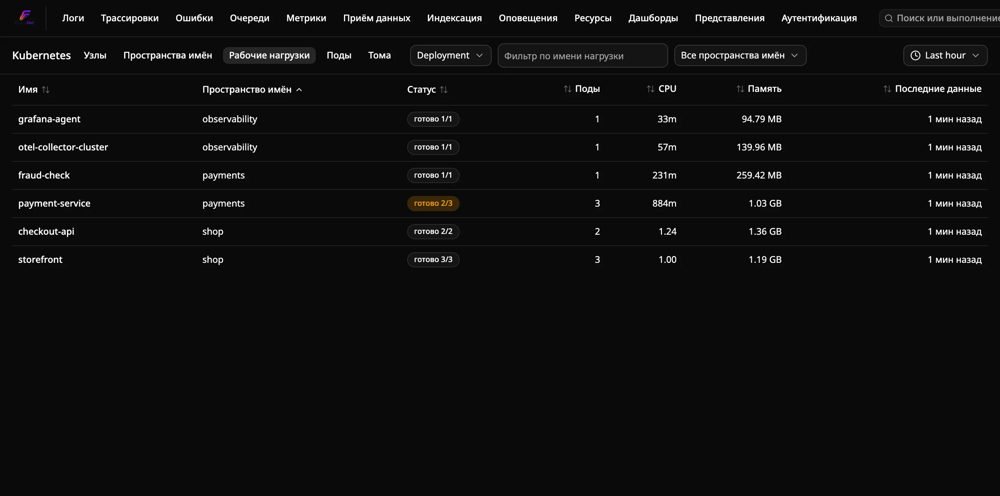

# Как отслеживать кластеры Kubernetes

Отправляйте метрики кластера во Flare с помощью приёмников `kubeletstats` и
`k8s_cluster` из OpenTelemetry Collector и просматривайте их на странице
**Kubernetes**. На странице пять вкладок: **Nodes**, **Namespaces**,
**Workloads** (Deployment, StatefulSet, DaemonSet, Job и CronJob), **Pods** и
**Volumes**. У узлов, рабочих нагрузок, подов и томов есть детальные графики.

Страница **Kubernetes** отличается от **Resources**. Resources опрашивает API
Kubernetes и показывает только собственные поды Flare. Страница Kubernetes
показывает весь ваш кластер так, как его передаёт коллектор по OTLP.

## Предварительные требования

- Запущенный экземпляр Flare, порт OTLP которого (`4317` gRPC или `4318` HTTP)
  доступен из кластера.
- Дистрибутив [OpenTelemetry Collector Contrib](https://github.com/open-telemetry/opentelemetry-collector-contrib)
  (`otelcol-contrib`), развёрнутый в кластере. Проще всего развернуть его через
  [Helm-чарт OpenTelemetry](https://github.com/open-telemetry/opentelemetry-helm-charts).

## Настройка коллектора

Два приёмника передают разные данные, и каждый заполняет свои столбцы:

| Приёмник | Запускается как | Передаёт |
|---|---|---|
| `kubeletstats` | DaemonSet (по коллектору на узел) | Использование CPU и памяти узлами и подами, заполнение томов подов |
| `k8s_cluster` | Deployment с одной репликой | Готовность узлов, выделяемый CPU, фазу подов, перезапуски контейнеров, число реплик и заданий рабочих нагрузок, фазу пространств имён |

В Helm-чарте пресет `kubeletMetrics` добавляет `kubeletstats` в коллектор-
DaemonSet, а пресет `clusterMetrics` добавляет `k8s_cluster` в коллектор-
Deployment. Можно запустить только один из них; столбцы, которые заполняет
другой, покажут **—**.

### Коллектор-DaemonSet (`kubeletstats`)

```yaml
receivers:
  kubeletstats:
    auth_type: serviceAccount
    endpoint: "https://${env:K8S_NODE_NAME}:10250"
    insecure_skip_verify: true
    collection_interval: 60s
    metric_groups: [node, pod, container, volume]

processors:
  k8sattributes: {}

exporters:
  otlp:
    endpoint: flare.example.internal:4317   # ваш хост Flare.Ingest
    tls:
      insecure: true                        # или настройте TLS

service:
  pipelines:
    metrics:
      receivers: [kubeletstats]
      processors: [k8sattributes]
      exporters: [otlp]
```

Рекомендуется процессор `k8sattributes`. Он добавляет к каждому поду имя узла и
владеющую рабочую нагрузку (Deployment, StatefulSet, DaemonSet, Job или
CronJob), которые таблица Pods показывает в столбцах **Node** и **Workload**.
Он нужен и таблице Workloads, чтобы посчитать поды рабочей нагрузки и сложить
их CPU и память.

`metric_groups` необязателен. Группа `volume` по умолчанию выключена; добавьте
её, чтобы заполнить вкладку **Volumes**.

### Коллектор-Deployment (`k8s_cluster`)

```yaml
receivers:
  k8s_cluster:
    collection_interval: 60s
    allocatable_types_to_report: [cpu]

service:
  pipelines:
    metrics:
      receivers: [k8s_cluster]
      exporters: [otlp]
```

`allocatable_types_to_report: [cpu]` необязателен. Без него столбец
**CPU % alloc.** остаётся пустым.

Чтобы различать кластеры, задайте атрибут ресурса `k8s.cluster.name` на обоих
коллекторах, например процессором `resource`. Тогда в таблице Nodes появится
фильтр по кластеру.

Если вы включили [ключи API приёма данных](configure-authentication.ru.md#ключи-api-приёма-данных),
добавьте ключ в `headers` экспортёра.

## Чтение таблицы Nodes



Откройте меню **⋯** в правом верхнем углу и выберите **Kubernetes**. Узлы появляются в течение одного
интервала сбора.

| Столбец | Исходная метрика | Значение |
|---|---|---|
| Status | `k8s.node.condition_ready` | Последнее переданное состояние готовности |
| CPU | `k8s.node.cpu.usage` | Используемый CPU, среднее за окно, в миллиядрах (`250m`) или ядрах |
| CPU % alloc. | `k8s.node.allocatable_cpu` | CPU как доля выделяемого CPU узла |
| Memory | `k8s.node.memory.working_set` | Рабочий набор памяти, среднее за окно |
| Memory % | `k8s.node.memory.available` | Рабочий набор как доля рабочего набора плюс доступной памяти |
| Pods | любая метрика `k8s.pod.*` | Число разных подов, передававших данные с этого узла за окно |
| Last seen | любая метрика `k8s.node.*` | Когда узел передавал данные в последний раз |

Flare также читает `k8s.node.cpu.utilization` — прежнее имя той же метрики CPU,
которое отправляют старые коллекторы.

- **Детализация**: щёлкните имя узла. Откроются графики CPU, CPU %, памяти и
  памяти % за выбранное окно.
- **Поды узла**: щёлкните число в столбце **Pods** или кнопку **View pods on
  this node** в детализации.



## Чтение таблицы Pods



Переключитесь на вкладку **Pods** или откройте `/kubernetes?tab=pods`.

| Столбец | Исходная метрика | Значение |
|---|---|---|
| Workload | `k8s.deployment.name` и похожие атрибуты ресурса | Владеющий Deployment, StatefulSet, DaemonSet, CronJob, Job или ReplicaSet |
| Node | `k8s.node.name` | Узел, с которого под передавал данные в последний раз |
| Status | `k8s.pod.phase` | Последняя фаза: Pending, Running, Succeeded, Failed или Unknown |
| Restarts | `k8s.container.restarts` | Последнее число перезапусков, суммированное по контейнерам пода |
| CPU | `k8s.pod.cpu.usage` | Используемый CPU, среднее за окно, плюс доля от лимита пода, если она передаётся |
| Memory | `k8s.pod.memory.working_set` | Рабочий набор памяти, среднее за окно, плюс доля от лимита пода, если она передаётся |

Доля от лимита берётся из необязательных метрик приёмника `kubeletstats`
`k8s.pod.cpu_limit_utilization` и `k8s.pod.memory_limit_utilization`. Как их
включить, см. в разделе [Как отслеживать хосты](monitor-hosts.ru.md#метрики-хоста-рядом-с-записью-журнала).

Фильтруйте поды по имени (подстрока, без учёта регистра), пространству имён или
узлу. Щёлкните имя пода, чтобы увидеть его графики CPU и памяти.

Кнопка **View logs** в детализации пода открывает **Logs** с фильтром по
атрибутам ресурса `k8s.namespace.name` и `k8s.pod.name` этого пода. Находятся
только журналы с этими атрибутами, поэтому запустите процессор `k8sattributes`
и в конвейере журналов.

## Чтение таблицы Namespaces

Переключитесь на вкладку **Namespaces** или откройте
`/kubernetes?tab=namespaces`. Пространство имён появляется, когда любая метрика
`k8s.*` несёт его `k8s.namespace.name`.

| Столбец | Исходная метрика | Значение |
|---|---|---|
| Status | `k8s.namespace.phase` | Active или Terminating |
| Pods | любая метрика `k8s.pod.*` | Число разных подов, передававших данные в этом пространстве имён за окно |
| CPU, Memory | `k8s.pod.cpu.usage`, `k8s.pod.memory.working_set` | Суммарное потребление подов пространства имён (см. ниже) |

Щёлкните пространство имён, чтобы открыть вкладку Pods с фильтром по нему.
Вкладки Workloads, Pods и Volumes используют один общий фильтр по пространству
имён.

## Чтение таблицы Workloads



Переключитесь на вкладку **Workloads** или откройте `/kubernetes?tab=workloads`
и выберите тип. Столбец **Status** зависит от типа:

| Тип | Status | Исходные метрики |
|---|---|---|
| Deployment | Доступные реплики из желаемых | `k8s.deployment.available`, `k8s.deployment.desired` |
| StatefulSet | Готовые поды из желаемых | `k8s.statefulset.ready_pods`, `k8s.statefulset.desired_pods` |
| DaemonSet | Готовые узлы из желаемых, плюс красный бейдж, если есть неверно размещённые узлы | `k8s.daemonset.ready_nodes`, `k8s.daemonset.desired_scheduled_nodes`, `k8s.daemonset.misscheduled_nodes` |
| Job | Успешные поды из желаемых, сбойные поды, активные поды | `k8s.job.successful_pods`, `k8s.job.desired_successful_pods`, `k8s.job.failed_pods`, `k8s.job.active_pods` |
| CronJob | Активные задания | `k8s.cronjob.active_jobs` |

Все эти значения поступают от приёмника `k8s_cluster`; показывается последнее
значение за окно. Flare также читает более новые имена из семантических
соглашений, например `k8s.deployment.pod.desired`. Отсортируйте по **Status**,
чтобы наверху оказались самые деградировавшие нагрузки: с наибольшей нехваткой
реплик или с наибольшим числом сбойных подов.

**Pods**, **CPU** и **Memory** берутся из подов с именем рабочей нагрузки,
которое добавляет процессор `k8sattributes`. CPU и память — суммарное
потребление подов: сумма по подам в каждый момент, затем среднее за окно.
Старые и новые поды при плавающем обновлении складываются только тогда, когда
они действительно работают одновременно.

Щёлкните имя рабочей нагрузки, чтобы увидеть графики её счётчиков, CPU и
памяти. **View pods** открывает вкладку Pods с фильтром по этой нагрузке. Поды
Job находятся, даже если Job принадлежит CronJob.

## Чтение таблицы Volumes

Переключитесь на вкладку **Volumes** или откройте `/kubernetes?tab=volumes`.
Каждая строка — один том, смонтированный одним подом, из группы метрик `volume`
приёмника `kubeletstats`.

| Столбец | Исходная метрика | Значение |
|---|---|---|
| Volume | `k8s.volume.name`, `k8s.persistentvolumeclaim.name` | Том, а для тома на основе PVC — ещё и его заявка |
| Type | `k8s.volume.type` | Например, `persistentVolumeClaim`, `emptyDir` или `configMap` |
| Used, Capacity | `k8s.volume.capacity`, `k8s.volume.available` | Ёмкость минус доступное место, и ёмкость |
| Used % | те же | Занятое место как доля ёмкости |
| Inodes % | `k8s.volume.inodes`, `k8s.volume.inodes.used` (или `.free`) | Занятые inode как доля всех inode |

Значения томов — последнее показание за окно, а не среднее, поэтому
заполняющийся том показывает текущий уровень. Таблица отсортирована по
**Used %**, самые заполненные сверху. Поиск ищет по имени тома или заявки.
Щёлкните том, чтобы увидеть графики занятых байтов, занятого процента и inode.

## Ограничения и устаревание

**—** означает, что Flare не получил данных по этой метрике за окно. Это
никогда не отображается как 0.

Узел или под, не передававший данные больше пяти минут, помечается как
**stale**. Удалённый под остаётся в списке с этой пометкой, пока не выйдет за
пределы выбранного окна.

Таблицы Nodes и Namespaces показывают до 500 строк, таблицы Workloads, Pods и
Volumes — до 1 000. Если совпадений больше, появится предложение сузить фильтр.

## Устранение неполадок

**Не появляются ни узлы, ни поды.** Проверьте журналы коллектора на ошибки
экспорта. Flare определяет узлы по атрибуту ресурса `k8s.node.name`, а поды —
по `k8s.pod.name` и `k8s.namespace.name`; оба приёмника задают их по умолчанию.

**У некоторых подов пуст столбец Node или Workload.** `kubeletstats` сам не
задаёт узел и владельца пода. Добавьте процессор `k8sattributes` или запустите
приёмник `k8s_cluster`, который передаёт узел каждого пода.

**Пусты Status, Restarts и CPU % alloc.** Эти значения поступают от приёмника
`k8s_cluster`. Разверните его, как описано выше.

**У рабочей нагрузки пуст Status, но Pods, CPU и Memory заполнены.** Нагрузка
найдена только по атрибутам её подов. Разверните приёмник `k8s_cluster`, чтобы
получить число реплик и заданий.

**У рабочей нагрузки пусты Pods, CPU и Memory.** Её поды не несут её имя.
Добавьте процессор `k8sattributes` в конвейер `kubeletstats`.

**Вкладка Volumes пуста.** Добавьте `volume` в `metric_groups` приёмника
`kubeletstats`.
