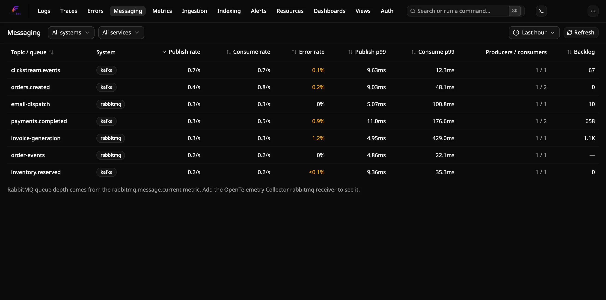
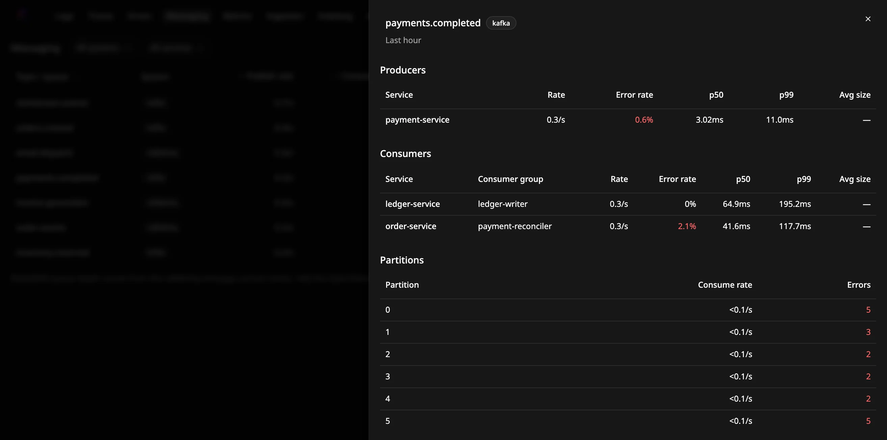
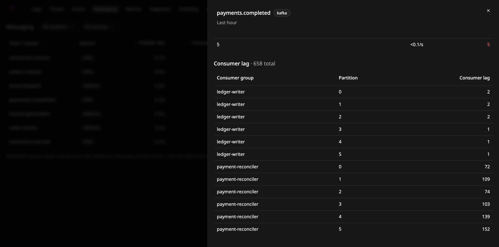

# Comment surveiller des files de messages

Voyez comment se comportent vos topics Kafka, vos files RabbitMQ et vos entités
Azure Service Bus sur la page **Messaging** de Flare : débits de publication et
de consommation, taux d'erreur, latence et (pour Kafka) retard des
consommateurs, par topic ou par file.

La page utilise les spans que vos applications envoient déjà. Flare n'a besoin
d'aucun agent supplémentaire ni d'aucune modification de l'ingestion, et la
page fonctionne sur des spans stockés avant que vous l'ouvriez.

## Prérequis

- Une instance Flare en cours d'exécution qui reçoit les traces de vos
  applications.
- Des producteurs et consommateurs instrumentés avec une instrumentation
  OpenTelemetry de messagerie, par exemple
  [`OpenTelemetry.Instrumentation.ConfluentKafka`](https://www.nuget.org/packages/OpenTelemetry.Instrumentation.ConfluentKafka),
  RabbitMQ.Client 7+, Azure.Messaging.ServiceBus ou MassTransit. Leurs spans
  doivent porter les attributs `messaging.system` et
  `messaging.destination.name`.

## Envoyer des spans de messagerie

Enregistrez la source d'activités de l'instrumentation auprès de votre traceur.
Par exemple, avec Confluent.Kafka :

```csharp
var producerBuilder = new InstrumentedProducerBuilder<string, string>(
    new ProducerConfig { BootstrapServers = "localhost:9092" });
var consumerBuilder = new InstrumentedConsumerBuilder<string, string>(
    new ConsumerConfig { BootstrapServers = "localhost:9092", GroupId = "orders-worker" });

builder.Services.AddOpenTelemetry()
    .WithTracing(tracing => tracing
        .AddKafkaProducerInstrumentation(producerBuilder)
        .AddKafkaConsumerInstrumentation(consumerBuilder)
        .AddOtlpExporter());

// After the host starts:
using var producer = producerBuilder.Build();
using var consumer = consumerBuilder.Build();
```

Construisez vos producteurs et consommateurs avec `InstrumentedProducerBuilder`
et `InstrumentedConsumerBuilder` du paquet, comme l'explique son README. Les
clients construits avec les builders Confluent classiques n'émettent pas de
spans.

Pour RabbitMQ.Client 7+, ajoutez plutôt ses sources d'activités :
`tracing.AddSource("RabbitMQ.Client.*")`.

Pour MassTransit 8 (licence Apache), ajoutez sa source d'activités :
`tracing.AddSource("MassTransit")`. Rien d'autre n'est nécessaire, bien que
MassTransit ne renseigne `messaging.system` que sur ses spans d'envoi : Flare
déduit le système et la destination de l'adresse de point de terminaison de
MassTransit. Chaque type de message a une ligne, nommée d'après l'exchange où
MassTransit le publie (par exemple `Orders.Contracts:SubmitOrder`), avec
producteurs et consommateurs réunis. Les fautes de consommateurs sont publiées
sur une ligne `MassTransit:Fault--...`. La colonne Backlog reste vide, car le
nom de la file diffère de celui de la ligne. MassTransit 9 est commercial et
exige une clé de licence ; il n'a pas été testé.

Pour NATS, ajoutez la source d'activités de NATS.Net : `tracing.AddSource("NATS.Net")`.
Flare ignore le trafic propre au client (appels à l'API JetStream, acquittements
par message et boîtes de réponse temporaires) : les lignes sont donc les sujets
de votre application. Vérifié avec NATS.Net 3.3 sur nats-server 2.x.

Pour Azure Service Bus, ajoutez les sources d'activités du SDK Azure :
`tracing.AddSource("Azure.Messaging.ServiceBus.*")`. Le SDK garde son
traçage derrière un commutateur expérimental : appelez
`AppContext.SetSwitch("Azure.Experimental.EnableActivitySource", true)` au
démarrage, ou définissez la variable d'environnement
`AZURE_EXPERIMENTAL_ENABLE_ACTIVITY_SOURCE=true`. Sans cela, le SDK n'émet
aucun span. Chaque file ou rubrique (topic) donne une ligne. Le span
`Message` de chaque message et le span `send` décrivent la même publication ;
Flare ne compte donc que les spans `send`, et un envoi par lot compte une fois
par appel, non par message. Le SDK ne marque pas un span comme échoué quand
votre gestionnaire lève une exception : le nombre d'erreurs de consommation
reste à 0, et les nouvelles tentatives apparaissent comme des consommations
supplémentaires. Vérifié avec Azure.Messaging.ServiceBus 7.21 sur l'émulateur
Service Bus de Microsoft.

## Lire la page Messaging



Ouvrez **Messaging** dans la barre de navigation. Chaque ligne correspond à un
topic ou à une file :

| Colonne | Signification |
|---|---|
| Publish rate / Consume rate | Spans de publication et de consommation par seconde sur la fenêtre |
| Error rate | Part des spans de publication et de consommation en erreur |
| Publish p99 / Consume p99 | Durée de span au 99e centile |
| Producers / consumers | Nombre de services qui y ont publié et qui l'ont consommé |
| Backlog | Messages en attente : retard des consommateurs Kafka, profondeur des files RabbitMQ messages en attente NATS JetStream ou messages actifs Service Bus, voir [Kafka](#voir-le-retard-des-consommateurs-kafka), [RabbitMQ](#voir-la-profondeur-des-files-rabbitmq), [NATS](#voir-le-retard-backlog-dun-consommateur-nats-jetstream) et [Service Bus](#voir-le-backlog-service-bus) |

La latence de consommation est la durée du span de consommation lui-même : le
temps de traitement pour un span `process`, ou le temps de récupération pour un
consommateur qui n'émet que des spans `receive`. Ce n'est pas le temps passé par un message dans la file.

- **Filtrez** par système de messagerie ou par service.
- **Triez** en cliquant sur un en-tête de colonne.
- **Changez la fenêtre** avec le sélecteur de temps (de 5 minutes à 24 heures).
- **Explorez le détail** en cliquant sur le nom d'un topic ou d'une file. Le
  panneau liste les services producteurs, les services consommateurs avec leurs
  groupes de consommateurs, le trafic par partition et le retard par groupe et
  par partition. Cliquez sur le nom d'un service pour ouvrir ses traces.

La page ne se rafraîchit pas d'elle-même. Cliquez sur **Refresh** pour la
recharger.



### Comment les spans sont classés

Un span compte comme une publication quand son opération
(`messaging.operation.type`, ou l'ancien `messaging.operation`) vaut `publish`,
`create` ou `send`, et comme une consommation quand elle vaut `receive`,
`process` ou `deliver`. Si un span ne définit aucun de ces attributs, un span
`PRODUCER` compte comme une publication et un span `CONSUMER` comme une
consommation. Les autres spans, comme `settle`, sont ignorés.

Certaines instrumentations, dont celle de Confluent.Kafka, émettent à la fois
un span `receive` et un span `process` pour chaque message. Quand un
consommateur émet des spans `process`, Flare ne compte que ceux-là : chaque
message est compté une seule fois. Ses spans `receive` ne comptent que pour les
consommateurs qui n'émettent aucun span `process`.

La partition et le groupe de consommateurs proviennent de
`messaging.destination.partition.id` et `messaging.consumer.group.name`, ou des
anciens attributs `messaging.kafka.destination.partition` et
`messaging.kafka.consumer.group`.

## Voir le retard des consommateurs Kafka

Le retard des consommateurs ne vient pas des spans. Flare le lit dans la
métrique `kafka.consumer_group.lag`, exportée par le récepteur `kafkametrics`
de l'OpenTelemetry Collector. Ajoutez ce récepteur à un collecteur qui peut
joindre vos brokers :

```yaml
receivers:
  kafkametrics:
    brokers: [kafka:9092]
    protocol_version: 2.0.0
    scrapers: [consumers]
    collection_interval: 30s

exporters:
  otlp:
    endpoint: flare.example.internal:4317   # your Flare.Ingest host
    tls:
      insecure: true

service:
  pipelines:
    metrics:
      receivers: [kafkametrics]
      exporters: [otlp]
```

À partir de la version 0.161, le collecteur nomme ce récepteur
`kafka_metrics`. L'ancien nom `kafkametrics` fonctionne toujours mais journalise
un avertissement de dépréciation.

Pour un topic Kafka, la colonne **Backlog** affiche le dernier retard sur la
fenêtre, additionné sur tous les groupes de consommateurs et partitions. Un
**—** signifie que la métrique n'est pas collectée pour ce topic. Elle n'est
jamais affichée comme 0.



## Voir la profondeur des files RabbitMQ

RabbitMQ.Client nomme chaque ligne d'après l'exchange sur lequel il a
publié, pas d'après la file. Les messages envoyés par l'exchange par défaut
font exception : Flare affiche chacun d'eux sous sa clé de routage, qui est
le nom de la file.

La profondeur des files provient de la métrique `rabbitmq.message.current`,
exportée par le récepteur `rabbitmq` de l'OpenTelemetry Collector. Il lit
l'API de gestion de RabbitMQ : activez le plugin `rabbitmq_management` et
donnez au récepteur un utilisateur doté du tag `monitoring` :

```yaml
receivers:
  rabbitmq:
    endpoint: http://rabbitmq:15672
    username: otel
    password: ${env:RABBITMQ_PASSWORD}
    collection_interval: 30s

exporters:
  otlp:
    endpoint: flare.example.internal:4317   # votre hôte Flare.Ingest
    tls:
      insecure: true

service:
  pipelines:
    metrics:
      receivers: [rabbitmq]
      exporters: [otlp]
```

Flare associe les files à une ligne par leur nom. Il utilise le nom de la
ligne et chaque clé de routage portée par ses spans. Cela couvre les files
sur lesquelles on publie directement, les exchanges nommés d'après leur file
et les exchanges directs dont la clé de
routage est le nom de la file. La colonne **Backlog** affiche le dernier
total prêts + non acquittés des files associées. Ouvrez la ligne pour voir
ces deux compteurs pour chaque file. Un exchange topic ou fanout dont les
clés de routage ne nomment aucune file affiche **—**.

## Voir le retard (backlog) d'un consommateur NATS JetStream

Le retard d'un consommateur JetStream n'est pas dans les spans.
`prometheus-nats-exporter` le publie sous `jetstream_consumer_num_pending` et
`jetstream_consumer_num_ack_pending`, et le récepteur `prometheus` de
l'OpenTelemetry Collector peut interroger l'exporteur puis envoyer les métriques
à Flare. Lancez l'exporteur à côté du serveur, avec `-jsz=all` pour qu'il
rapporte les consommateurs :

```bash
prometheus-nats-exporter -jsz=all -varz http://nats:8222
```

```yaml
receivers:
  prometheus:
    config:
      scrape_configs:
        - job_name: nats
          scrape_interval: 15s
          static_configs:
            - targets: ['natsexp:7777']
exporters:
  otlp_grpc/flare:
    endpoint: flare-ingest:4317
    tls:
      insecure: true
service:
  pipelines:
    metrics:
      receivers: [prometheus]
      exporters: [otlp_grpc/flare]
```

Flare retrouve les consommateurs d'un sujet à partir de ses spans de réception :
NATS.Net place sur chaque message JetStream le sujet d'acquittement, qui nomme le
flux et le consommateur. La colonne **Backlog** est la somme des messages en
attente et en attente d'acquittement du consommateur. Ouvrez la ligne pour voir
chaque flux et consommateur ; « Ready » est le nombre en attente (pas encore
livrés) et « Unacked » le nombre livré mais non acquitté. Un consommateur qui
dessert plusieurs sujets affiche son unique retard sur chacun. Les abonnements
NATS de base n'ont pas de retard : ces lignes affichent **—**.

## Voir le backlog Service Bus

Le backlog d'une file ou d'un abonnement n'est pas dans les spans. Azure le publie
comme la métrique `ActiveMessages`, et le récepteur `azuremonitor` de l'OpenTelemetry
Collector (distribution contrib) lit Azure Monitor et l'envoie à Flare. Configurez la
métrique avec la dimension `EntityName`, pour que chaque file et chaque abonnement soit
sa propre série :

```yaml
receivers:
  azuremonitor:
    subscription_ids: ["${env:AZURE_SUBSCRIPTION_ID}"]
    auth: service_principal
    tenant_id: ${env:AZURE_TENANT_ID}
    client_id: ${env:AZURE_CLIENT_ID}
    client_secret: ${env:AZURE_CLIENT_SECRET}
    services:
      - Microsoft.ServiceBus/namespaces
    metrics:
      "microsoft.servicebus/namespaces":
        ActiveMessages: [Average]
    dimensions:
      enabled: true
      overrides:
        "Microsoft.ServiceBus/namespaces":
          ActiveMessages: [EntityName]
exporters:
  otlp_grpc/flare:
    endpoint: flare-ingest:4317
    tls:
      insecure: true
service:
  pipelines:
    metrics:
      receivers: [azuremonitor]
      exporters: [otlp_grpc/flare]
```

Le principal de service a besoin du rôle **Monitoring Reader** sur l'espace de noms.
Flare lit `azure_activemessages_average` : gardez l'agrégation Average. La colonne
**Backlog** est le dernier nombre de messages actifs de la file, ou de l'abonnement pour
une ligne de réception `topic/Subscriptions/nom`. Les messages en file de lettres mortes
ne sont pas comptés. Azure Monitor publie une fois par minute, le backlog accuse donc
ce retard. Les entités que le récepteur ne remonte pas affichent **—**.

## Dépannage

**Un topic ou une file n'apparaît pas.** Ouvrez l'une de ses traces et vérifiez
les attributs du span producteur ou consommateur. Il lui faut
`messaging.system`, et soit un attribut d'opération, soit un type de span
`PRODUCER`/`CONSUMER`.

**Le nom du topic ou de la file est « (unnamed) ».** L'instrumentation n'a pas
défini `messaging.destination.name`.
