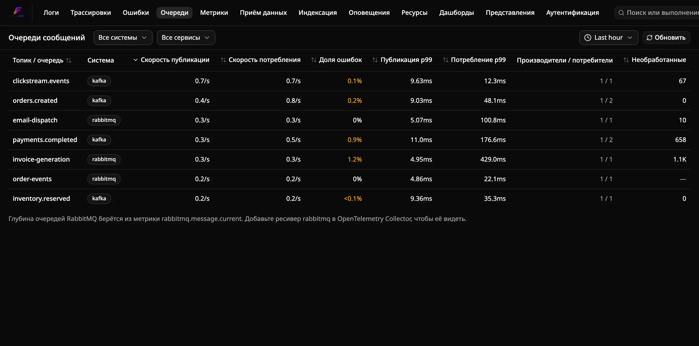
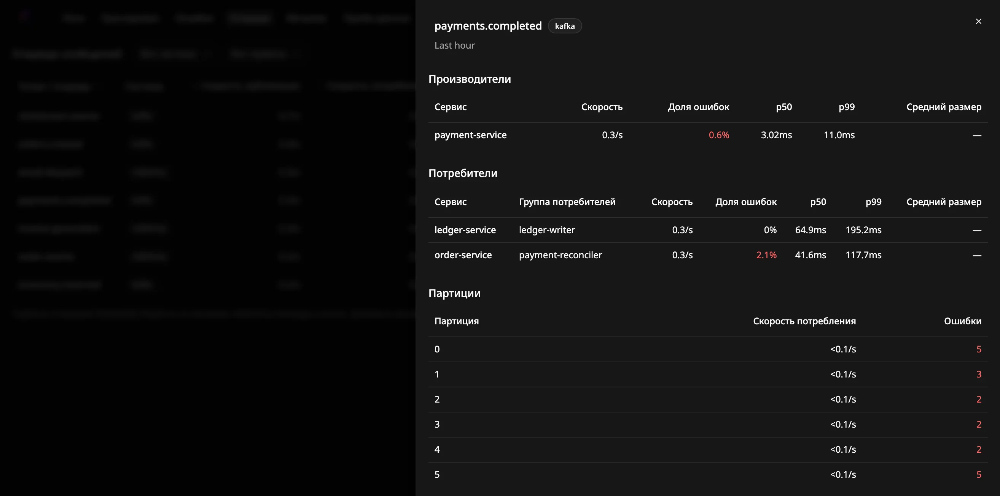
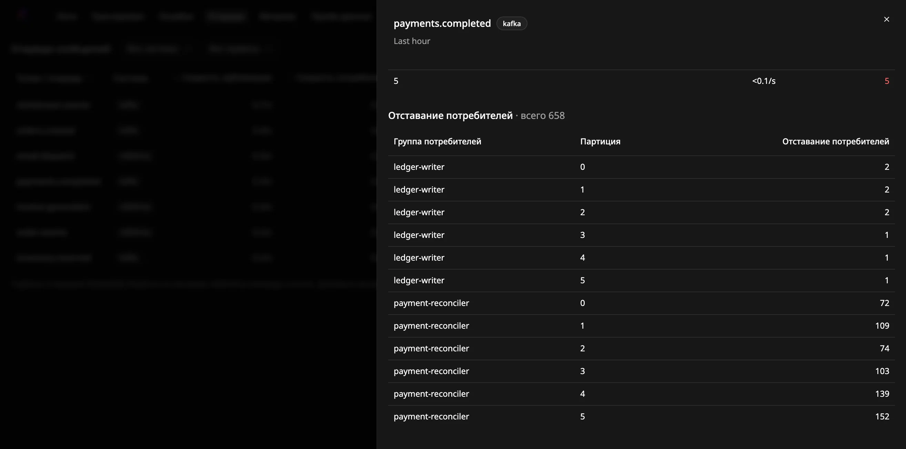

# Как отслеживать очереди сообщений

Страница **Messaging** во Flare показывает, как работают ваши топики Kafka,
очереди RabbitMQ и сущности Azure Service Bus: скорость публикации и
потребления, долю ошибок, задержку и (для Kafka) отставание потребителей —
для каждого топика или очереди.

Страница строится по спанам, которые ваши приложения уже отправляют. Отдельный
агент или изменения в приёме данных не нужны, и она работает и на спанах,
сохранённых до того, как вы её открыли.

## Предварительные требования

- Работающий экземпляр Flare, получающий трассировки от ваших приложений.
- Производители и потребители, инструментированные через OpenTelemetry для
  обмена сообщениями, например
  [`OpenTelemetry.Instrumentation.ConfluentKafka`](https://www.nuget.org/packages/OpenTelemetry.Instrumentation.ConfluentKafka),
  RabbitMQ.Client 7+, Azure.Messaging.ServiceBus или MassTransit. Их спаны
  должны содержать атрибуты `messaging.system` и `messaging.destination.name`.

## Отправка спанов обмена сообщениями

Зарегистрируйте источник активностей инструментирования в трассировщике.
Например, для Confluent.Kafka:

```csharp
var producerBuilder = new InstrumentedProducerBuilder<string, string>(
    new ProducerConfig { BootstrapServers = "localhost:9092" });
var consumerBuilder = new InstrumentedConsumerBuilder<string, string>(
    new ConsumerConfig { BootstrapServers = "localhost:9092", GroupId = "orders-worker" });

builder.Services.AddOpenTelemetry()
    .WithTracing(tracing => tracing
        .AddKafkaProducerInstrumentation(producerBuilder)
        .AddKafkaConsumerInstrumentation(consumerBuilder)
        .AddOtlpExporter());

// After the host starts:
using var producer = producerBuilder.Build();
using var consumer = consumerBuilder.Build();
```

Создавайте производителей и потребителей через `InstrumentedProducerBuilder` и
`InstrumentedConsumerBuilder` из этого пакета, как описано в его README.
Клиенты, созданные обычными билдерами Confluent, спаны не отправляют.

Для RabbitMQ.Client 7+ вместо этого добавьте его источники активностей:
`tracing.AddSource("RabbitMQ.Client.*")`.

Для MassTransit 8 (лицензия Apache) добавьте его источник активностей:
`tracing.AddSource("MassTransit")`. Больше ничего не нужно, хотя MassTransit
указывает `messaging.system` только в спанах отправки: Flare берёт систему и
получателя из адреса конечной точки MassTransit. Каждому типу сообщения
соответствует одна строка с именем exchange, в который MassTransit его
публикует (например, `Orders.Contracts:SubmitOrder`); производители и
потребители показываются вместе. Сбои потребителей публикуются в строку
`MassTransit:Fault--...`. Колонка Backlog остаётся пустой, потому что имя
очереди отличается от имени строки. MassTransit 9 коммерческий и требует
ключ лицензии; он не проверялся.

Для NATS добавьте источник активностей NATS.Net: `tracing.AddSource("NATS.Net")`.
Flare пропускает собственный трафик клиента (вызовы API JetStream, подтверждения
по каждому сообщению и временные ящики ответов), поэтому строки — это темы
вашего приложения. Проверено на NATS.Net 3.3 с nats-server 2.x.

Для Azure Service Bus добавьте источники активностей Azure SDK:
`tracing.AddSource("Azure.Messaging.ServiceBus.*")`. SDK держит трассировку
за экспериментальным переключателем: вызовите при старте
`AppContext.SetSwitch("Azure.Experimental.EnableActivitySource", true)` или
задайте переменную окружения `AZURE_EXPERIMENTAL_ENABLE_ACTIVITY_SOURCE=true`.
Без этого SDK не создаёт спаны. Каждая очередь или топик — одна строка. Спан
`Message` каждого сообщения и спан `send` описывают одну и ту же публикацию,
поэтому Flare считает только спаны `send`: пакетная отправка учитывается один
раз за вызов, а не за сообщение. SDK не помечает спан как неудачный, когда
ваш обработчик выбрасывает исключение, поэтому число ошибок потребления
остаётся 0, а повторные попытки видны как дополнительные потребления.
Проверено на Azure.Messaging.ServiceBus 7.21 с эмулятором Service Bus от
Microsoft.

## Страница Messaging



Откройте **Messaging** в верхней навигации. Каждая строка — один топик или
очередь:

| Столбец | Значение |
|---|---|
| Publish rate / Consume rate | Спаны публикации и потребления в секунду за период |
| Error rate | Доля спанов публикации и потребления со статусом ошибки |
| Publish p99 / Consume p99 | 99-й перцентиль длительности спана |
| Producers / consumers | Сколько сервисов публиковали в него и потребляли из него |
| Backlog | Ожидающие сообщения: отставание потребителей Kafka, глубина очередей RabbitMQ ожидающие сообщения NATS JetStream или активные сообщения Service Bus или видимые сообщения Amazon SQS, см. [Kafka](#отставание-потребителей-kafka), [RabbitMQ](#глубина-очередей-rabbitmq), [NATS](#backlog-потребителя-nats-jetstream) [Service Bus](#backlog-service-bus) и [SQS](#backlog-amazon-sqs) |

Задержка потребления — это длительность самого спана потребления: время
обработки для спана `process` или время получения для потребителя, который
создаёт только спаны `receive`. Это не
время, которое сообщение провело в очереди.

- **Фильтруйте** по системе обмена сообщениями или по сервису.
- **Сортируйте**, нажимая на заголовок столбца.
- **Меняйте период** селектором времени (от 5 минут до 24 часов).
- **Детализация**: нажмите на имя топика или очереди. Панель покажет
  сервисы-производители, сервисы-потребители с их группами потребителей,
  трафик по партициям и отставание по группам и партициям. Нажмите на имя
  сервиса, чтобы открыть его трассировки.

Страница не обновляется сама. Нажмите **Refresh**, чтобы перезагрузить её.



### Как классифицируются спаны

Спан считается публикацией, если его операция (`messaging.operation.type` или
более старый `messaging.operation`) — `publish`, `create` или `send`, и
потреблением, если это `receive`, `process` или `deliver`. Если ни один из этих
атрибутов не задан, спан `PRODUCER` считается публикацией, а спан `CONSUMER` —
потреблением. Остальные спаны, например `settle`, игнорируются.

Некоторые инструментирования, включая Confluent.Kafka, создают для каждого
сообщения и спан `receive`, и спан `process`. Если потребитель создаёт спаны
`process`, Flare учитывает только их, поэтому каждое сообщение считается один
раз. Спаны `receive` учитываются только для потребителей без спанов `process`.

Партиция и группа потребителей берутся из `messaging.destination.partition.id`
и `messaging.consumer.group.name` или из более старых атрибутов
`messaging.kafka.destination.partition` и `messaging.kafka.consumer.group`.

## Отставание потребителей Kafka

Отставание потребителей берётся не из спанов. Flare читает его из метрики
`kafka.consumer_group.lag`, которую экспортирует ресивер `kafkametrics`
OpenTelemetry Collector. Добавьте ресивер в коллектор, у которого есть доступ к
вашим брокерам:

```yaml
receivers:
  kafkametrics:
    brokers: [kafka:9092]
    protocol_version: 2.0.0
    scrapers: [consumers]
    collection_interval: 30s

exporters:
  otlp:
    endpoint: flare.example.internal:4317   # your Flare.Ingest host
    tls:
      insecure: true

service:
  pipelines:
    metrics:
      receivers: [kafkametrics]
      exporters: [otlp]
```

Начиная с версии 0.161 коллектор называет этот ресивер `kafka_metrics`. Старое
имя `kafkametrics` по-прежнему работает, но выводит предупреждение об
устаревании.

Для топика Kafka столбец **Backlog** показывает последнее значение отставания
за период, суммированное по всем группам потребителей и партициям. **—**
означает, что метрика для этого топика не собирается. Как 0 она никогда не
показывается.



## Глубина очередей RabbitMQ

RabbitMQ.Client называет каждую строку по exchange, в который он
публиковал, а не по очереди. Исключение — сообщения, отправленные через
exchange по умолчанию: Flare показывает каждое из них под его ключом
маршрутизации, то есть под именем очереди.

Глубина очередей берётся из метрики `rabbitmq.message.current`, которую
экспортирует ресивер `rabbitmq` в OpenTelemetry Collector. Он читает
management API RabbitMQ, поэтому включите плагин `rabbitmq_management` и дайте
ресиверу пользователя с тегом `monitoring`:

```yaml
receivers:
  rabbitmq:
    endpoint: http://rabbitmq:15672
    username: otel
    password: ${env:RABBITMQ_PASSWORD}
    collection_interval: 30s

exporters:
  otlp:
    endpoint: flare.example.internal:4317   # ваш хост Flare.Ingest
    tls:
      insecure: true

service:
  pipelines:
    metrics:
      receivers: [rabbitmq]
      exporters: [otlp]
```

Flare сопоставляет очереди со строкой по имени. Он использует имя самой
строки и каждый ключ маршрутизации из её спанов. Так находятся очереди, в
которые публикуют напрямую, exchange, названные по своей очереди, и direct exchange, у которых ключ маршрутизации совпадает с
именем очереди. Столбец **Backlog** показывает последнюю сумму готовых и
неподтверждённых сообщений найденных очередей. Откройте строку, чтобы увидеть
оба счётчика для каждой очереди. Topic- или fanout-exchange, ключи которых не
совпадают ни с одной очередью, показывают **—**.

## Backlog потребителя NATS JetStream

Backlog потребителя JetStream в спанах отсутствует. `prometheus-nats-exporter`
публикует его как `jetstream_consumer_num_pending` и
`jetstream_consumer_num_ack_pending`, а приёмник `prometheus` в OpenTelemetry
Collector может опрашивать экспортёр и отправлять метрики во Flare. Запустите
экспортёр рядом с сервером с флагом `-jsz=all`, чтобы он отдавал потребителей:

```bash
prometheus-nats-exporter -jsz=all -varz http://nats:8222
```

```yaml
receivers:
  prometheus:
    config:
      scrape_configs:
        - job_name: nats
          scrape_interval: 15s
          static_configs:
            - targets: ['natsexp:7777']
exporters:
  otlp_grpc/flare:
    endpoint: flare-ingest:4317
    tls:
      insecure: true
service:
  pipelines:
    metrics:
      receivers: [prometheus]
      exporters: [otlp_grpc/flare]
```

Flare находит потребителей темы по её спанам получения: NATS.Net кладёт в
каждое сообщение JetStream тему подтверждения, в которой указаны поток и
потребитель. Столбец **Backlog** — это сумма ожидающих доставки и ожидающих
подтверждения сообщений потребителя. Откройте строку, чтобы увидеть каждый поток
и потребителя: «Ready» — ожидающие (ещё не доставленные), «Unacked» — доставленные,
но не подтверждённые. Потребитель, обслуживающий несколько тем, показывает свой
единственный backlog в каждой из них. У обычных подписок NATS backlog нет, такие
строки показывают **—**.

## Backlog Service Bus

Backlog очереди или подписки в спанах отсутствует. Azure публикует его как метрику
`ActiveMessages`, а ресивер `azuremonitor` OpenTelemetry Collector (дистрибутив contrib)
читает Azure Monitor и отправляет её во Flare. Настройте метрику с измерением
`EntityName`, чтобы каждая очередь и подписка была отдельным рядом:

```yaml
receivers:
  azuremonitor:
    subscription_ids: ["${env:AZURE_SUBSCRIPTION_ID}"]
    auth: service_principal
    tenant_id: ${env:AZURE_TENANT_ID}
    client_id: ${env:AZURE_CLIENT_ID}
    client_secret: ${env:AZURE_CLIENT_SECRET}
    services:
      - Microsoft.ServiceBus/namespaces
    metrics:
      "microsoft.servicebus/namespaces":
        ActiveMessages: [Average]
    dimensions:
      enabled: true
      overrides:
        "Microsoft.ServiceBus/namespaces":
          ActiveMessages: [EntityName]
exporters:
  otlp_grpc/flare:
    endpoint: flare-ingest:4317
    tls:
      insecure: true
service:
  pipelines:
    metrics:
      receivers: [azuremonitor]
      exporters: [otlp_grpc/flare]
```

Сервисному принципалу нужна роль **Monitoring Reader** на пространстве имён.
Flare читает `azure_activemessages_average`, поэтому оставьте агрегацию Average.
Колонка **Backlog** — последнее число активных сообщений очереди или, для строки
получения `topic/Subscriptions/имя`, подписки. Сообщения в очереди недоставленных
(dead-letter) не учитываются. Azure Monitor публикует раз в минуту, так что backlog
отстаёт примерно на это время. Сущности, о которых ресивер не сообщает, показывают **—**.

## Backlog Amazon SQS

Backlog очереди в спанах отсутствует. CloudWatch публикует его как
`ApproximateNumberOfMessagesVisible`. Ресивер `awscloudwatch` OpenTelemetry Collector
читает *логи* CloudWatch, поэтому для метрик нужен CloudWatch Metric Stream в
Kinesis Data Firehose, а ресивер `awsfirehose` Collector (дистрибутив contrib) служит
HTTP-эндпоинтом Firehose. Создайте metric stream в формате вывода **JSON**, с фильтром
по пространству имён `AWS/SQS`, и направьте его Firehose на Collector. Firehose
требует HTTPS-эндпоинт, поэтому поставьте Collector за балансировщик или прокси,
который терминирует TLS, и задайте один и тот же ключ доступа с обеих сторон.

Ресивер превращает каждую запись в summary, который Flare не хранит. Процессор
`transform` конвертирует его в gauge с именем
`ApproximateNumberOfMessagesVisible_avg`:

```yaml
receivers:
  awsfirehose:
    endpoint: 0.0.0.0:4433
    record_type: cwmetrics
    access_key: ${env:FIREHOSE_ACCESS_KEY}
processors:
  transform/sqs:
    metric_statements:
      - context: metric
        statements:
          - extract_avg_metric() where name == "ApproximateNumberOfMessagesVisible"
exporters:
  otlp_grpc/flare:
    endpoint: flare-ingest:4317
    tls:
      insecure: true
service:
  pipelines:
    metrics:
      receivers: [awsfirehose]
      processors: [transform/sqs]
      exporters: [otlp_grpc/flare]
```

Колонка **Backlog** — последнее число видимых сообщений очереди, имя которой указано
в назначении строки (или, если инструментирование передаёт URL очереди, в последнем
сегменте URL). Сообщения в обработке и отложенные не учитываются. Metric Streams
добавляют пару минут к минутной отчётности SQS. Очереди, о которых CloudWatch не
сообщает, показывают **—**. Проверено только по исходному коду ресиверов, не на
реальном аккаунте AWS.

## Устранение неполадок

**Топик или очередь не отображается.** Откройте одну из её трассировок и
проверьте атрибуты спана производителя или потребителя. Нужен
`messaging.system`, а также либо атрибут операции, либо вид спана
`PRODUCER`/`CONSUMER`.

**Имя топика или очереди — «(unnamed)».** Инструментирование не задало
`messaging.destination.name`.
