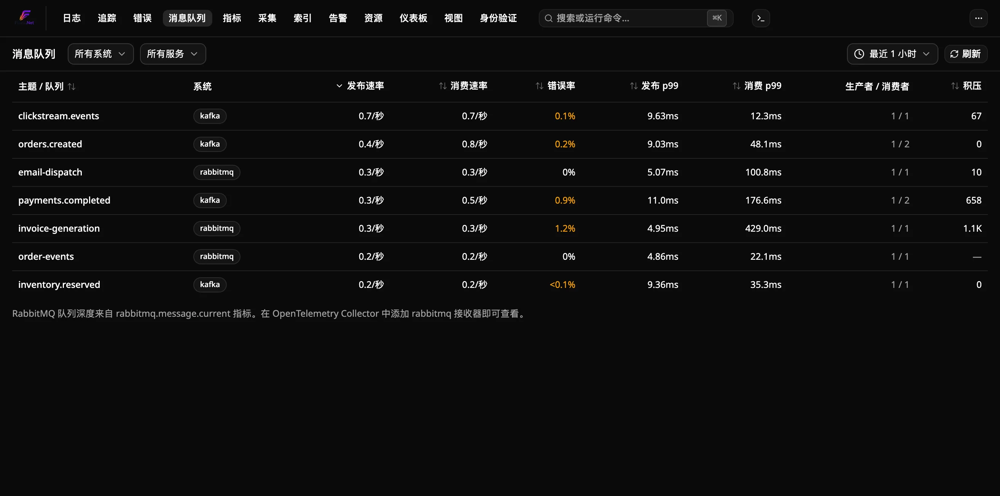
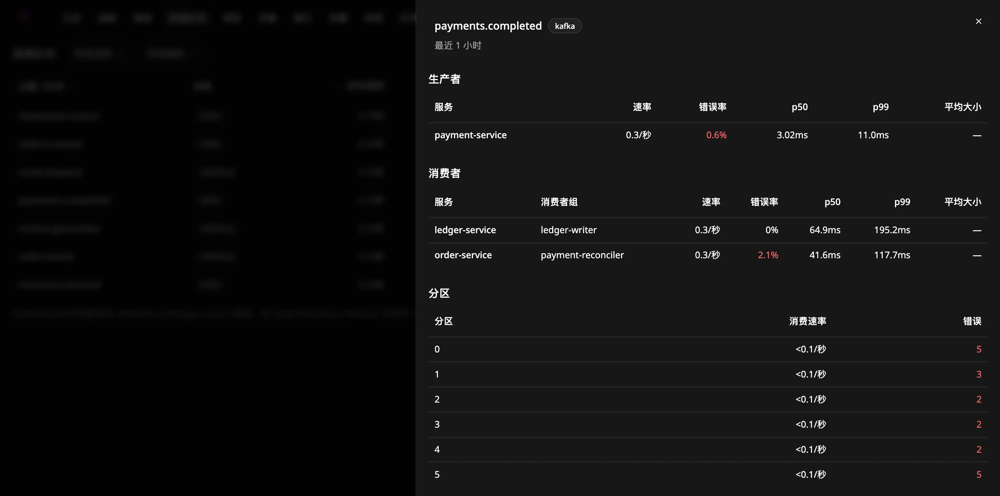
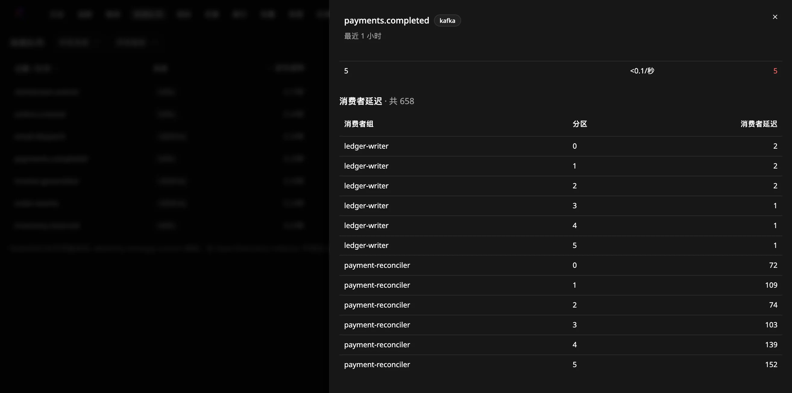

# 如何监控消息队列

在 Flare 的 **Messaging** 页面查看 Kafka 主题、RabbitMQ 队列和 Azure Service Bus 实体的运行情况：按主题或队列显示发布和消费速率、错误率、延迟，以及（Kafka 的）消费者延迟。

该页面使用应用已经发送的 span。Flare 不需要额外的代理，也不需要修改数据接入；在打开页面之前存储的 span 同样适用。

## 前提条件

- 一个正在运行、并接收应用追踪数据的 Flare 实例。
- 使用 OpenTelemetry 消息插桩的生产者和消费者，例如
  [`OpenTelemetry.Instrumentation.ConfluentKafka`](https://www.nuget.org/packages/OpenTelemetry.Instrumentation.ConfluentKafka)、RabbitMQ.Client 7+、Azure.Messaging.ServiceBus 或 MassTransit。它们的 span 必须带有 `messaging.system` 和 `messaging.destination.name` 属性。

## 发送消息 span

在追踪器中注册插桩的活动源。以 Confluent.Kafka 为例：

```csharp
var producerBuilder = new InstrumentedProducerBuilder<string, string>(
    new ProducerConfig { BootstrapServers = "localhost:9092" });
var consumerBuilder = new InstrumentedConsumerBuilder<string, string>(
    new ConsumerConfig { BootstrapServers = "localhost:9092", GroupId = "orders-worker" });

builder.Services.AddOpenTelemetry()
    .WithTracing(tracing => tracing
        .AddKafkaProducerInstrumentation(producerBuilder)
        .AddKafkaConsumerInstrumentation(consumerBuilder)
        .AddOtlpExporter());

// After the host starts:
using var producer = producerBuilder.Build();
using var consumer = consumerBuilder.Build();
```

使用该包的 `InstrumentedProducerBuilder` 和 `InstrumentedConsumerBuilder` 创建生产者和消费者，具体见其 README。使用普通 Confluent 构建器创建的客户端不会发出 span。

对于 RabbitMQ.Client 7+，改为添加它的活动源：`tracing.AddSource("RabbitMQ.Client.*")`。

对于 MassTransit 8（Apache 许可），添加它的活动源：`tracing.AddSource("MassTransit")`。无需其他配置。尽管 MassTransit 只在发送 span 上设置 `messaging.system`，Flare 会从 MassTransit 的端点地址推断系统和目标。每种消息类型对应一行，以 MassTransit 发布它所用的 exchange 命名（例如 `Orders.Contracts:SubmitOrder`），生产者和消费者合并显示。消费者故障会发布到 `MassTransit:Fault--...` 行。Backlog 列保持为空，因为队列名与行名不同。MassTransit 9 是商业版，需要许可证密钥，未经测试。

对于 NATS，添加 NATS.Net 的活动源：`tracing.AddSource("NATS.Net")`。Flare 会忽略客户端自身的流量（JetStream API 调用、逐条消息确认和临时回复收件箱），因此每一行都是你应用的主题（subject）。已在 NATS.Net 3.3 配合 nats-server 2.x 上验证。

对于 Azure Service Bus，添加 Azure SDK 的活动源：`tracing.AddSource("Azure.Messaging.ServiceBus.*")`。SDK 将追踪功能放在实验性开关之后，因此需要在启动时调用 `AppContext.SetSwitch("Azure.Experimental.EnableActivitySource", true)`，或设置环境变量 `AZURE_EXPERIMENTAL_ENABLE_ACTIVITY_SOURCE=true`。否则 SDK 不会产生任何 span。每个队列或主题（topic）对应一行。SDK 为每条消息生成的 `Message` span 与 `send` span 描述的是同一次发布，因此 Flare 只统计 `send` span：批量发送按调用次数计一次，而不是按消息数。当处理程序抛出异常时，SDK 不会把 span 标记为失败，因此消费错误数保持为 0，重试会表现为额外的消费。已在 Azure.Messaging.ServiceBus 7.21 配合微软 Service Bus 模拟器上验证。

## 查看 Messaging 页面



在顶部导航中打开 **Messaging**。每一行对应一个主题或队列：

| 列 | 含义 |
|---|---|
| Publish rate / Consume rate | 时间窗口内每秒的发布和消费 span 数 |
| Error rate | 带错误状态的发布和消费 span 所占比例 |
| Publish p99 / Consume p99 | span 时长的第 99 百分位 |
| Producers / consumers | 向其发布和从中消费的服务数量 |
| Backlog | 等待处理的消息：Kafka 消费者延迟、RabbitMQ 队列深度NATS JetStream 待处理消息或 Service Bus 活动消息或 Amazon SQS 可见消息，见 [Kafka](#查看-kafka-消费者延迟)、[RabbitMQ](#查看-rabbitmq-队列深度)、[NATS](#查看-nats-jetstream-积压) [Service Bus](#查看-service-bus-积压) 和 [SQS](#查看-amazon-sqs-积压) |

消费延迟是消费 span 自身的时长：对 `process` span 是处理时间，对只发出 `receive` span 的消费者是拉取时间。它不是消息在队列中等待的时间。

- **筛选**：按消息系统或服务筛选。
- **排序**：点击列标题。
- **更改时间窗口**：使用时间选择器（5 分钟到 24 小时）。
- **下钻**：点击主题或队列名称。面板会列出生产者服务、消费者服务及其消费者组、各分区的流量，以及按消费者组和分区的延迟。点击服务名称可打开其追踪。

页面不会自动刷新。点击 **Refresh** 重新加载。



### span 如何分类

当 span 的操作（`messaging.operation.type`，或旧的 `messaging.operation`）为 `publish`、`create` 或 `send` 时计为发布，为 `receive`、`process` 或 `deliver` 时计为消费。如果两个属性都未设置，`PRODUCER` span 计为发布，`CONSUMER` span 计为消费。其他 span（例如 `settle`）会被忽略。

有些插桩（包括 Confluent.Kafka 的插桩）会为每条消息同时发出 `receive` span 和 `process` span。如果某个消费者发出了 `process` span，Flare 只统计这些 span，因此每条消息只计一次。只有不发出 `process` span 的消费者，其 `receive` span 才会被统计。

分区和消费者组取自 `messaging.destination.partition.id` 和 `messaging.consumer.group.name`，或旧的 `messaging.kafka.destination.partition` 和 `messaging.kafka.consumer.group` 属性。

## 查看 Kafka 消费者延迟

消费者延迟不是来自 span。Flare 从 `kafka.consumer_group.lag` 指标读取它，该指标由 OpenTelemetry Collector 的 `kafkametrics` 接收器导出。把该接收器添加到能访问你的 broker 的 Collector 中：

```yaml
receivers:
  kafkametrics:
    brokers: [kafka:9092]
    protocol_version: 2.0.0
    scrapers: [consumers]
    collection_interval: 30s

exporters:
  otlp:
    endpoint: flare.example.internal:4317   # your Flare.Ingest host
    tls:
      insecure: true

service:
  pipelines:
    metrics:
      receivers: [kafkametrics]
      exporters: [otlp]
```

从 0.161 版本起，Collector 将该接收器命名为 `kafka_metrics`。旧名称 `kafkametrics` 仍然可用，但会记录弃用警告。

对于 Kafka 主题，**Backlog** 列显示时间窗口内的最新延迟，按所有消费者组和分区求和。**—** 表示该主题的指标未被采集，绝不会显示为 0。



## 查看 RabbitMQ 队列深度

RabbitMQ.Client 按发布到的 exchange 而不是队列为每一行命名。通过默认 exchange 发送的消息例外：Flare 会把它们分别显示在各自的路由键下，也就是队列名。

队列深度来自 `rabbitmq.message.current` 指标，由 OpenTelemetry Collector 的 `rabbitmq` 接收器导出。该接收器读取 RabbitMQ 的管理 API，因此需要启用 `rabbitmq_management` 插件，并为接收器提供一个带 `monitoring` 标签的用户：

```yaml
receivers:
  rabbitmq:
    endpoint: http://rabbitmq:15672
    username: otel
    password: ${env:RABBITMQ_PASSWORD}
    collection_interval: 30s

exporters:
  otlp:
    endpoint: flare.example.internal:4317   # 你的 Flare.Ingest 主机
    tls:
      insecure: true

service:
  pipelines:
    metrics:
      receivers: [rabbitmq]
      exporters: [otlp]
```

Flare 按名称把队列匹配到某一行：使用该行自身的名称以及其 span 携带的每个路由键。这涵盖了直接发布到的队列、以其队列命名的 exchange，以及路由键等于队列名的 direct exchange。**Backlog** 列显示匹配队列最新的就绪 + 未确认消息数。打开该行可查看每个队列的这两个计数。路由键不对应任何队列的 topic 或 fanout exchange 显示 **—**。

## 查看 NATS JetStream 积压

JetStream 消费者的积压不在 span 中。`prometheus-nats-exporter` 将其发布为 `jetstream_consumer_num_pending` 和 `jetstream_consumer_num_ack_pending`，OpenTelemetry Collector 的 `prometheus` 接收器可以抓取该 exporter 并把指标发送到 Flare。在服务器旁运行 exporter，并加上 `-jsz=all` 让它上报消费者：

```bash
prometheus-nats-exporter -jsz=all -varz http://nats:8222
```

```yaml
receivers:
  prometheus:
    config:
      scrape_configs:
        - job_name: nats
          scrape_interval: 15s
          static_configs:
            - targets: ['natsexp:7777']
exporters:
  otlp_grpc/flare:
    endpoint: flare-ingest:4317
    tls:
      insecure: true
service:
  pipelines:
    metrics:
      receivers: [prometheus]
      exporters: [otlp_grpc/flare]
```

Flare 通过主题的接收 span 找到它的消费者：NATS.Net 会在每条 JetStream 消息上带上确认主题，其中包含流和消费者的名称。**Backlog** 列是该消费者待投递加待确认的消息数。打开该行可查看每个流和消费者，表中的 “Ready” 表示待投递（尚未投递），“Unacked” 表示已投递但未确认。服务多个主题的消费者会在每个主题上显示它唯一的积压。核心 NATS 订阅没有积压，这些行显示 **—**。

## 查看 Service Bus 积压

队列或订阅的积压不在 span 里。Azure 将它发布为 `ActiveMessages` 指标，OpenTelemetry
Collector（contrib 发行版）的 `azuremonitor` 接收器读取 Azure Monitor 并发送给 Flare。
配置该指标时带上 `EntityName` 维度，让每个队列和订阅成为独立的序列：

```yaml
receivers:
  azuremonitor:
    subscription_ids: ["${env:AZURE_SUBSCRIPTION_ID}"]
    auth: service_principal
    tenant_id: ${env:AZURE_TENANT_ID}
    client_id: ${env:AZURE_CLIENT_ID}
    client_secret: ${env:AZURE_CLIENT_SECRET}
    services:
      - Microsoft.ServiceBus/namespaces
    metrics:
      "microsoft.servicebus/namespaces":
        ActiveMessages: [Average]
    dimensions:
      enabled: true
      overrides:
        "Microsoft.ServiceBus/namespaces":
          ActiveMessages: [EntityName]
exporters:
  otlp_grpc/flare:
    endpoint: flare-ingest:4317
    tls:
      insecure: true
service:
  pipelines:
    metrics:
      receivers: [azuremonitor]
      exporters: [otlp_grpc/flare]
```

服务主体需要在命名空间上拥有 **Monitoring Reader** 角色。Flare 读取
`azure_activemessages_average`，所以请保留 Average 聚合。**Backlog** 列是队列最新的活动
消息数；对 `topic/Subscriptions/名称` 的接收行，则是该订阅的活动消息数。死信消息不计入。
Azure Monitor 每分钟上报一次，所以积压大约有这么长的延迟。接收器没有上报的实体显示 **—**。

## 查看 Amazon SQS 积压

队列的积压不在 span 里。CloudWatch 将它发布为 `ApproximateNumberOfMessagesVisible`。
OpenTelemetry Collector 的 `awscloudwatch` 接收器读取的是 CloudWatch *日志*，所以指标要走
CloudWatch Metric Stream → Kinesis Data Firehose，再由 Collector（contrib 发行版）的
`awsfirehose` 接收器充当 Firehose 的 HTTP 端点。创建输出格式为 **JSON**、命名空间过滤为
`AWS/SQS` 的 metric stream，并让其 Firehose 指向 Collector。Firehose 需要 HTTPS 端点，
所以请把 Collector 放在终止 TLS 的负载均衡器或代理之后，并在两端设置相同的访问密钥。

接收器会把每条记录转成 summary，而 Flare 不存储 summary。`transform` 处理器将它转换为名为
`ApproximateNumberOfMessagesVisible_avg` 的 gauge：

```yaml
receivers:
  awsfirehose:
    endpoint: 0.0.0.0:4433
    record_type: cwmetrics
    access_key: ${env:FIREHOSE_ACCESS_KEY}
processors:
  transform/sqs:
    metric_statements:
      - context: metric
        statements:
          - extract_avg_metric() where name == "ApproximateNumberOfMessagesVisible"
exporters:
  otlp_grpc/flare:
    endpoint: flare-ingest:4317
    tls:
      insecure: true
service:
  pipelines:
    metrics:
      receivers: [awsfirehose]
      processors: [transform/sqs]
      exporters: [otlp_grpc/flare]
```

**Backlog** 列是行目的地所指队列最新的可见消息数（如果你的埋点上报的是队列 URL，则按 URL 的最后一段匹配）。
处理中和延迟的消息不计入。Metric Streams 会在 SQS 一分钟的上报之外再增加几分钟延迟。CloudWatch 没有上报的队列显示 **—**。
仅依据接收器源码验证，未在真实 AWS 账号上验证。

## 故障排查

**某个主题或队列没有出现。** 打开它的一条追踪，检查生产者或消费者 span 的属性。它需要 `messaging.system`，以及操作属性或 `PRODUCER`/`CONSUMER` span 类型之一。

**主题或队列名称显示为 “(unnamed)”。** 插桩没有设置 `messaging.destination.name`。
